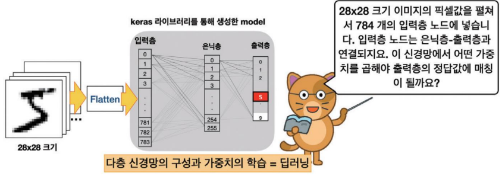
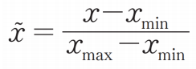
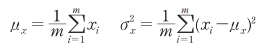

# MLP 구현

  

# 데이터 load
- Tensorflow 에서는 위의 이미지를 제공하는 keras라는 모듈을 가짐 `keras.datasets.mnist`
- 읽어들인 데이터는 (이미지, 레이블)의 묶음.
    - 이미지와 레이블, 테스트용 이미지와 레이블  

```python
import tensorflow as tf 
from tensorflow import keras
import numpy as np 
import matplotlib.pyplot as plt 

mnist = keras.datasets.mnist 
(train_images, train_labels),(test_images, test_labels) =\
     mnist.load_data()
```
=\ 한 다음에 enter로 다음 줄에 써야 함 
(*한 줄로 읽기 어려울 때 쓰는 방법*)  

위 코드를 실행하면 
```
기본 경로:
Linux/MacOS: ~/.keras/datasets/
Windows: C:\Users\사용자이름\.keras\datasets\
``` 
경로에 캐시되고 이후에는 캐시된 데이터를 사용한다.  
(*해당 경로에 `.npz` 파일을 찾아 직접 확인할 수 있지만, 일반적으로 Kears는 이를 내부적으로 관리하므로 사용자가 직접 접근할 필요없음*)  

```python
print('train_images= ', train_images.shape)
print('test images= ', test_images.shape)
print('train_labels.shape =', train_labels.shape)
print('test_labels.shape =', test_labels.shape)
```

```
train_images=  (60000, 28, 28)
test images=  (10000, 28, 28)
train_labels.shape = (60000,)
test_labels.shape = (10000,)
```

```python
num =train_images[0]
for i in range(28):
    for j in range(28):
        print('{:3d}'. format(num[i][j]), end='')
    print()
```

`i`는 행을 `j`는 열을 나타낸다.  
`{:46d}`는 오른쪽 정렬로 46칸을 차지하게 출력  
end=''는 줄바꿈 없이 출력


```python
fig = plt.figure()
ax1 = fig.add_subplot(1, 4, 1)
ax2 = fig.add_subplot(1, 4, 2)
ax3 = fig.add_subplot(1, 4, 3)
ax4 = fig.add_subplot(1, 4, 4)  

ax1.imshow(train_images[0], cmap='Greys')
ax2.imshow(train_images[1], cmap='Greys')
ax3.imshow(train_images[2], cmap='Greys')
ax4.imshow(train_images[3], cmap='Greys')
```

`fig = plt.figure()`는 새로운 빈 figure 객체를 생성  
`figure` 객체는 전체적인 플롯의 캔버스 역할을 하며, 그 위에 여러 개의 subplot을 배치할 수 있다.  

`add_subplot(1, 4, 1)`는 플롯을 1행 4열로 나누고, 첫 번째에 subplot을 생성하는 코드  

`ax1.imshow(train_images[0], cmap='Greys')`는 이미지를 ax1 subplot에 출력하는 함수  

train_images[0]는 이미지 데이터에서 첫 번째 이미지를 선택  

cmap='Greys'는 이미지를 흑백으로 표시  


```python
train_labels = keras.utils.to_categorical(train_labels, 10)
test_labels = keras.utils.to_categorical(test_labels, 10)
```
`keras.utils.to_categorical` 주어진 레이블 배열을 원-핫 인코딩 형식으로 변환  

`train_labels`는 레이블 데이터로, 각 레이블을 숫자 형태로 주어짐  
`10`은 레이블의 클래스 수  

```python
train_images, test_images = train_images / 255, test_images / 255
```

데이터의 잡음을 제거하거나 크기를 보정하는 작업
MNIST는 0에서 255 사이값을 가지는 gray-scale 이미지를 0에서 1 사이의 값으로 변환시키는 작업을 진행  

원래 픽셀이 가진 범위 0~255를 0에서 1사이의 값으로 조정하는 정규화  

### 데이터의 범위를 변경하는 이유
- 인공 신경망의 전체 수식에서 사용되는 값이 0,1,2,3과 같은 이산적인 값이 아닌 연속적인 값 -> 실수값을 입력으로 사용하는 것이 더 나은 결과를 얻을 수 있음  

- 큰 값과 작은 값의 영향의 차이가 커지기 때문에 이러한 영향을 줄이기 위하여 사용  

- 입력 데이터의 값이 작은 범위가 되므로 학습이 안정적이고 빠르게 진행되어 연산의 효율성을 가짐  
    - **기울기 폭주나 기울기 소실 문제 방지 가능**  

### 종류
-**정규화** : 모든 데이터를 0~1사이가 되도록 최대값과 최소값을 이용한 방식  
  

-**표준화** : 평균과 분산을 이용한 방식  
  
