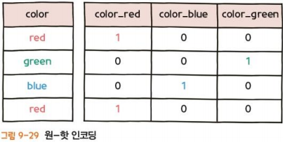

### 순환 신경망(RNN)
- 시계열 데이터가 딥러닝 신경망의 입력값으로 사용될 때, 데이터의 특성상 앞에 입력된 데이터가 뒤에 입력된 데이터에 영향을 미침  

- MLP로는 시계열 데이터를 정확히 예측할 수 없음  

- 신경망 층이 깊어질수록(*은닉층 수가 많을수록*) 먼 과거의 데이터가 현재에 영향을 미치지 못하는 문제가 발생함
    - 이를 **장기 의존성(Long-Term Dependency)** 문제라고 함
    - 이를 해결하기 위해 제안된게 LSTM

### RNN 구조와 MLP의 차이점  
- RNN은 은닉층의 각 뉴런에 순환 구조를 추가하여 이전에 입력된 데이터가 현재 데이터를 예측할 때 다시 사용될 수 있도록 함  

- 따라서 현재 데이터를 분석할 때 과거 데이터를 고려한 정확한 데이터 예측  

  

### LSTM(Long Short-Term Memory)
  
- RNN과는 다르게 신경망 내에 메모리를 두어 먼 과거의 데이터도 저장할 수 있도록 함 
- 입출력을 제어하기 위한 소자를 두었는데, 이것을 게이트(Gate)라고 함  
    - **입력 게이트**: 현재의 정보를 기억하기 위한 소자임. 과거와 현재 데이터가 시그모이드 함수와 하이퍼볼릭 탄젠트 함수를 거치면서 현재 정보에 대한 보존량을 결정
    - **망각 게이트**: 과거의 정보를 어느 정도까지 기억할지 결정하는 소자 
    - **출력 게이트**: 출력층으로 출력할 정보의 양을 결정하는 소자  

### 합성곱 신경망 (Convolutional Neural Network)

- 인간의 시각 처리 방식을 모방한 신경망
- 이미지 처리가 가능하도록 합성곱(Convolution) 연산 도입  

### CNN의 구조 
  

- 합성곱층  
- 풀리층
- 완전연결층 

### 합성곱층(Convolutional Layer)
  
- 이미지를 분류하는 데 필요한 특징(Feature) 정보들을 추출하는 역할
- 특징 정보는 필터를 이용해 추출  
- 합성곱층에 필터가 적용되면 이미지의 특징들이 추출된 '특성 맵'이라는 결과를 얻을 수 있다.  

### 풀링층(Pooling Layer)
  
- 합성곱층의 출력 데이터(특성 맵)를 입력으로 받아서 출력 데이터인 활성화 맵의 크기를 줄이거나 특정 데이터를 강조하는 용도로 사용  
- 풀링층을 처리하는 방법 : 최대 풀링, 평균 풀링, 최소 풀링(Min Pooling)
- 정사각행렬의 특정 영역에서 최댓값을 찾거나 평균값을 구하는 방식으로 동작함  

### 완전연결층(Fully-connected Layer)  
- 합성곱층과 풀링층으로 추출한 특징을 분류하는 역할  
- CNN은 합성곱층에서 특징만 학습하기 때문에 MLP나 RNN에 비해 학습해야 하는 가중치의 수가 적어 학습 및 예측이 빠르다는 장점이 있음  
- 최근에는 CNN의 강력한 예측 성능과 계산상의 효율성을 바탕으로 이미지뿐만 아니라 시계열 데이터에도 적용해 보는 연구가 활발히 진행되고 있음  

### 워드 임베딩(Word Embedding)  
- 단어를 벡터로 표현하는 방법  
- 기계가 사람의 언어를 이해할 수 있도록 변환

### 1) 원- 핫 인코딩(One- hot Encoding) 

- N개의 단어를 각각 N차원의 벡터로 표현하는 방식
- 단어가 포함되는 자리엔 1을 넣고 나머지 자리에는 0을 넣는 식
- 지도 학습에서 정답을 표기하는 방식

### 2) 워드 투벡터(Word2Vec)
- 비슷한 콘텍스트(context)에 등장하는 단어들은 유사한 의미를 지닌다는 이론에 기반하여 단어를 벡터로 표현해 주는 기법 
- '주변 단어를 알면 특정 단어를 유추할 수 있다'라는 원리를 기반  
- 대표적인 모델로는 CBOW와 Skip-gram이 있음  
- **CBOW**: 전체 콘텍스트로부터 특정 단어를 예측하는 것
- **Skip-gram**: 특정 단어로부터 전체 콘텍스트의 분포(확률)를 예측하는 것

### 적대적 생성 신경망(Generative Adversarial Network)
- 2개의 신경망 모델이 서로 경쟁하면서 더 나은 결과를 만들어 내는 강화학습  
- 이미지 생성분야에서 뛰어난 성능을 보인다
- 기존 인공신경망과는 다르게 두 개의 인공신경망이 서로 경쟁하며 학습 진행
- 이를 **생성 모델(Generator Model)**과 **판별 모델 (Discriminator Model)**이라고 하며, 각각은 서로 다른 목적을 가지고 학습 
    - **생성모델**: 주어진 데이터와 최대한 유사한 가짜 데이터를 생성
    - **판별 모델**: 진짜 데이터와 가짜 데이터 중 어떤 것이 진짜 데이터인지를 판별  
