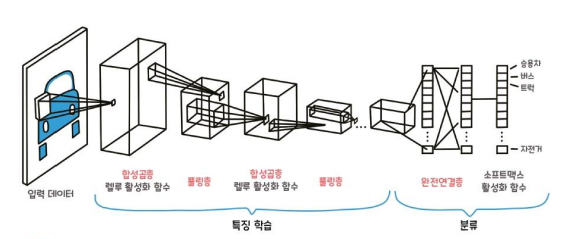
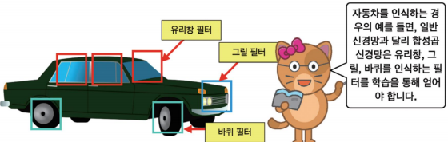
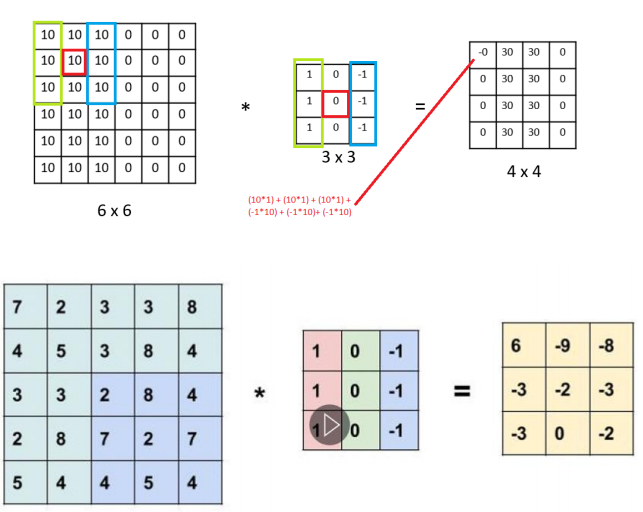

# 합성곱 신경망(Convolutional Neural Network)
- 인간의 시각 처리 방식을 모방한 신경망
- 대뇌 시각 피질 연구에서 싲가
- local receptive field
- 이미지 처리가 가능하도록 합성곱 연산 도입
- 객체 분류, 객체 탐지, 의미 분할, GAN등 다양한 딥 러닝 연구에 근간이 되는 가장 중요한  모델  

  

### 합섭곱층(Convolutional Layer)
- 이미지를 분류하는 데 필요한 특징 정보들을 추출하는 역할
- 특징 정보는 필터를 이용해 추출
- 합성곱층에 필터가 적용되면 이미지의 특징들이 추출된 '특성 맵'이라는 결과를 얻을 수 있음

  

### 풀링층(Pooling Layer) 
 
- 합성곱층의 출력 데이터(특성 맵)를 입력으로 받아서 출력 데이터인 활성화 맵의 크기를 줄이거나 특정 데이터를 강조하는 용도로 사용  
- 풀링층을 처리하는 방법: 최대 풀링, 평균 풀링, 최소 풀링
- 정사각행렬의 특정 영역에서 최댓값을 찾거나 평균값을 구하는 방식으로 동작함  

  
### 풀링을 하는 이유 
  

- 다수의 픽셀 정보를 통합하여 하나로 만드는 것으로 원래 신호에 존재하는 **잡음(noise)** 요소를 제거  
- 다수의 픽셀 정보를 통합하여 하나의 픽셀을 생성하여 **정보를 요약**  
- 입력의 변화에 대해 덜 민감한 신호를 다음 레이어로 전달-> **과적합**문제 해결 가능  
- 픽셀의 값을 일부 변경하여도 최대값 풀리으이 결과는 잘 바뀌지 않음 (**이동 불변성**) 
- 모델 파라미터 개수를 효율적으로 줄여주어 전체 모델 복잡도 감소 효과
    - 입력 이미지의 부표본(*subsample, 축소본*)을 만드는 것
    - 가중치 없이 합산 함수를 사용해 입력값을 더함

  

  

  

### 최대 풀링의 단점
- 많은 특징 정보의 손실(*크지 않은 특징 중에도 중요한 정보가 있을 수 있음*)  
- 특정 task에서는 불변성이 필요하지 않음  
    - Object Detection, Semantic Segmentation의 경우 정보의 손실이 큰 문제  

### 완전연결층(Fully-connected Layer)

- 합성곱층과 풀링층으로 추출한 특징을 분류하는 역할
- CNN은 합성곱층에서 특징만 학습하기 때문에 MLP나 RNN에 비해 학습해야 하는 가중치의 수가 적어 학습 및 예측이 빠르다는 장점이 있음
- 최근에는 CNN의 강력한 예측 성능과 계산산의 효율성을 바탕으로 이미지뿐만 아니라 시계열 데이터에도 적용해 보는 연구가 활발히 진행되고 있음  

  

### 연산과정  
  

- 다양한 필터를 이용하여 이미지에서의 다양한 특징을 찾기 위한 과정
- 하나의 이미지에 여러 모양의 필터를 이용해 컨볼루션 계산을 하고, 그 결과에 풀링을 거쳐 대표적인 특징을 얻음
- 이 과정을 계속해서 반복하여 이미지에서 대표적인 특징을 찾아냄  

### MLP의 입력 데이터 구조 문제
- 'ㄱ'모양의 2차원 데이터를 Flatten하여 1차원 데이터로 변경하면 이미지의 위상구조가 소멸  
    - 이를 해결하기 위한게 CNN
  

### 이미지 인식 과정
  

- 인간이나 동물이 어떤 방식으로 눈으로 본 사물을 '인식'하는가에 대한 연구  
- 하나의 뉴런을 활성하시키는 데에 영향을 미치는 시각 정보의 영역을 **수용장(receptive field)**  
- 수평선 이미지에 반응하는 뉴런, 수직선 이미지에 반응하는 뉴런 등을 이미지에서의 다양한 특징을 종합적으로 이해하여 이미지에 대해 반응한다  

### CNN 모델
 

- 그림과 같이 부분적인 영역에서 신호가 어느 방향으로 바뀌는지, 모서리가 있는지, 좁은 목이 있는지 등의 공간적인 특징을 파악하는 일이 중요  

### Convolution Filter  
  

- 공간적인(*기하적인*) 특징을 파악하기 위하여 **필터(*커널*)** 사용   

### 필터
- 이미지 영상에서 원하는 특징만 통과 시키기 위한 작업 
- 주변의 픽셀 정보를 반영하기 위하여 일정한 작은 크기의 행렬을 사용
- Filter= Windows=Kernel=Mask
- 다양한 형태의 필터가 있다  

  

- 필터에 따라 이미지에서 다양한 특징을 파악할 수 있음 
    - *ex) 스무딩(픽셀 사이에서 급격하게 변하는 부분을 감소시켜 전체적으로 부드러운 느낌이 나도록)*
    - *ex) 샤프닝(픽셀 사이를 급격하게 변화시켜 배경과 객체를 또렷하게 구분)*
    
- 수직 필터(vertical filter): 이미지에서 수직 특징을 파악  
  
- 수평 필터(HOrizontal Filter): 이미지에서 수평 특징을 파악  
  

  

### 필터를 이용한 컨볼루션 연산  
- 원본 이미지와 필터 사이의 수학적 계산을 통해 **이미지 특징 맵**을 생성한다.  

  

  

### 3x3 Filter
- 기본적으로 convolition 연산을 진행하면 Feature map의 사이즈는 줄어듦  
- 중심 픽셀을 기준으로 주변 픽셀을 계산하는 방식  

  

  

### padding
- Feature map의 사이즈가 줄어드는 것을 방지하기 위하여 zero padding 사용 

  

  

  

### 필터 연산  
- convolution

  

### Convolution 연산 과정  
- 하나의 필터만으로는 이미지의 특징을 다양하게 추출할 수 없으므로 다양한 필터를 이용하여 이미지에서의 특징을 얻음  
- 이미지 하나에 대해 필터의 개수만큼 특징을 얻음 -> **특징 맵**  
- 특징 맵의 채널 수 = Conv를 적용한 필터의 개수  
- Filter = Channel
- 이때 학습해야 할 파라미터는 필터가 가진 모든 요소들의 값  

  

### 합성곱 층
  

- 첫 번째 합성곱 층의 뉴런은 입력 이미지의 모든 픽셀에 연결되는 것이 아니라 합성곱 층 뉴런의 수용장 안에 있는 픽셀에만 연결됨
- 두 번째 합성곱층에 있는 각 뉴런은 첫 번째 층의 작은 사각 영역 안에 위치한 뉴런에 연결 
- 네트워크가 첫 번째 은닉 층에서는 작은 저수준 특성에 집중하고, 그 다음 은닉 층에서는 더 큰 고수준 특성으로 조합  

### 필터 이동(Stride)
  

  

- 한 수용장과 다음 수용장 사이의 수평 또는 수직 방향 스텝 크기  
- 수용장 사이에 간격을 두어 큰 입력 층을 훨씬 작은 층에 연결하면 모델의 계산 복잡도가 크게 낮아짐  

### MLP의 FC 이용

  
