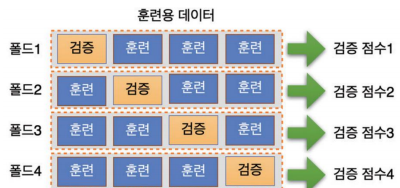
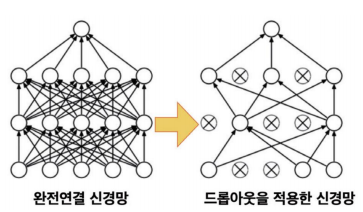
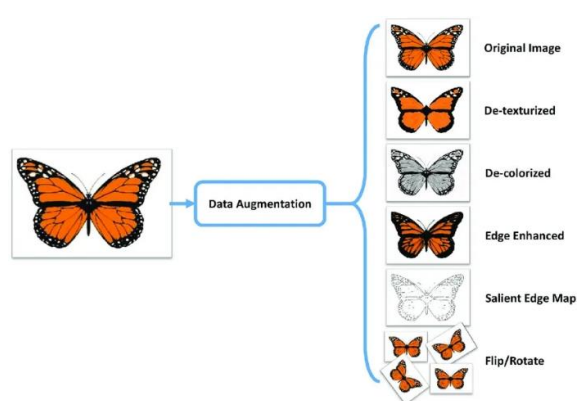
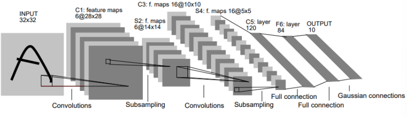
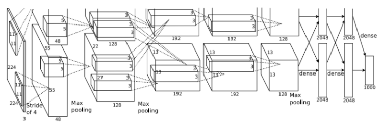
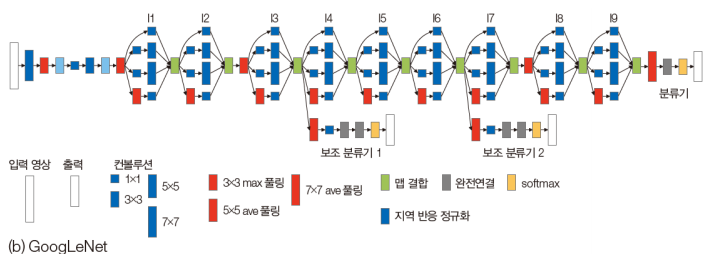
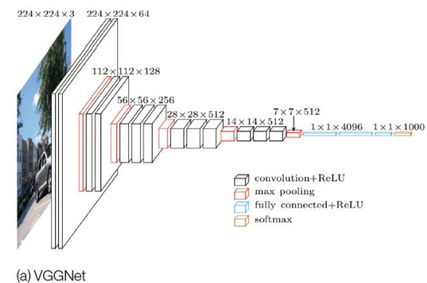
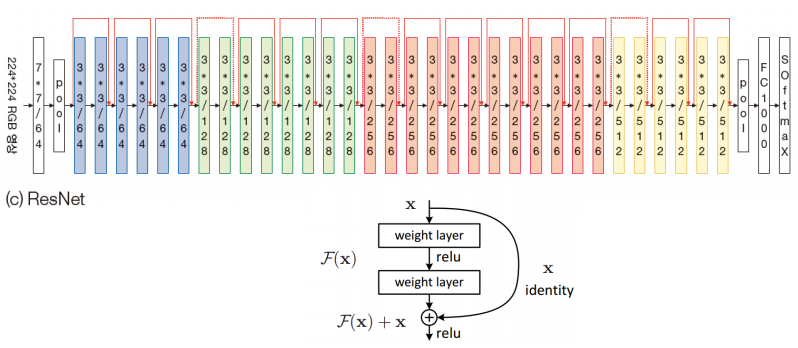
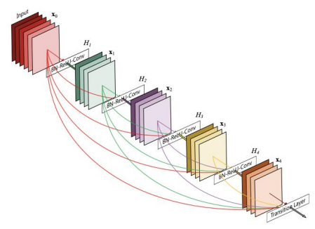
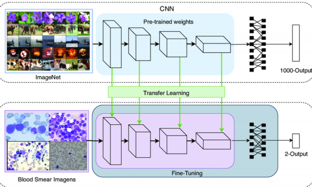

### 교차 검증(cross validation)
- 데이터 학습 시 훈련용 데이터(train)를 이용하여 모델을 훈련시키고 검증용 데이터(validation)를 이용하여 이 모델의 성능을 평가하는 방법  
- **과적합(overfitting)**된 문제를 방지하기 위하여 사용  
- 훈련용 데이터를 k개의 데이터 세트로 나누어 검증 데이터로 구성  
- 훈련용 데이터를 k개의 데이터 세트로 나누어 검증 데이터로 구성
- k번 만큼 각 폴드 세트에 대해 훈련과 검증을 반복적으로 수행 => k-fold cross validation(k-겹 교차 검증 방법)
  

### 드롭 아웃(Drop out)
- 신경망의 학습 단계에서 임의의 노드를 **탈락**시켜 학습시키는 것
- **과적합** 문제를 해결하는 대안
- 상황에 따라 1~2% 가량 더 좋은 성능 가능
- 은닉층 노드가 줄어 빠른 학습 가능

  

### Data Argumentation
- 주어진 데이터세트에서 새로운 데이터를 인위적으로 생성
- 과적합 방지, 일반화 성능 향상
  

### LeNet(1998)
  

- 손글씨 숫자(MNIST) 인식용으로 개발
- 5개의 레이어로 구성
- CNN-Pooling 사용
- 모델이 단순하고 파라미터가 적어 복잡한 데이터는 안됨  

### AlexNet(2012)
  
- ImageNet 대회에서 사용되어 CNN의 가능성을 널리 알림  
- 8개의 레이어 (5개의 Conv, 3개의 FC)로 구성
- ReLU 활성화 함수와 Dropout을 사용해 학습속도와 일반화 성능을 높임
- 대규모 데이터세트에서 높은 성능을 보여줌
- CNN이 컴퓨터 비전분야에 주류가 되는 계기  

### GoogLeNet(2024)
  
- 2014 ImageNet 대회에서 1등
- 다양한 크기의 필터를 사용하여 네트워크가 여러 스케일에서 특징을 학습하도록 함  
- 1x1, 3x3, 5x5 필터를 동시에 사용한 것이 특징
- 네트워크가 너무 깊어 입력 데이터의 영향이 출력까지 영향을 미치지 못하여 보조 레이어(Aux)추가  
- 복잡해서 많이 활용이 안됨

### VGGNet(2014)
  

- 2014 ImageNet에서 2등
- 단순한 구조의 깊은 네트워크로 성능을 높이기 위해 개발
- VGG16, VGG19등 여러 버전이 있으며 3x3 필터만 사용
- 계산량이 많고 메모리 소모 발생  
- 단순하고 성능 좋아 많이 활용 

### ResNet(2015)
- VGG기반의 모델로, 네트워크가 깊어지면서 발생하는 기울기 소실 문제를 해결하기 위하여 개발
- Residual Block(Skip-Connection)을 도입하여 레이어를 거쳐 학습한 특징과 이전 특징을 더하는 방식으로 정보 손실 방지  
- Residual Block을 이용해 ResNet50, ResNet101, ResNet152등 깊은 학습 가능  
  

### DenseNet(2015)
  

- ResNet을 확장한 모델
- 레이어 간 연결을 늘려 정보와 기울기가 효율적으로 전달되도록 함 
- 각 레이어가 이전 모든 레이어와 연결되는 방식으로 구성
- 모든 레이어가 이전 레이어의 출력을 입력으로 사용해 정보의 흐름을 원할히 하고 파라미터 효율성을 높임  

### EfficientNet(2015)
- 네트워크의 깊이, 너비, 해상도를 동시에 최적화하여 성능과 효율성을 모두 높인 모델  
- 리소스의 제약이 높은 환경에서도 성능을 발휘할 수 있도록 모델을 조정  
- 모바일 환경부터 서버 환경까지 유연하게 적용 가능한 CNN 모델로 주목받음  

### 전이 학습(Transfer Learning)
- 이미 학습된 모델(Pre-trained Model)의 지식을 새로운 데이터세트에 적용하여 학습 속도를 높이고 **성능을 개선(Fine_Tuning)**하는 기법
- 처음부터 하는 것보다 학습 시간이 단축되고, 일반화 성능이 향상됨
-Feature Extraction(CNN의 특징 추출) 부분을 대규모 데이터세트로 학습된 다양한 분류 모델을 불러와서 사용하고, 완전 연결층을 새로운 문제에 맞게 수정하고 학습을 진행  

ex)  
  

- 장점:
    - 데이터가 부족해도 성능 좋은 모델 얻을 수 있음
    - 학습 시간이 크게 단축됨
    - 새로운 데이터에 대해 더 일반화를 잘 할 수 있음

- 단점
    - 사전 학습 모델이 새로운 문제에 적합하지 않으면, 오히려 성능 저하
    - 미세 조정(Fine-Tuning)이 어려움
    