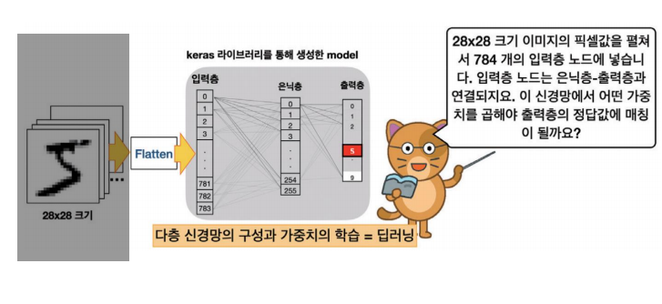
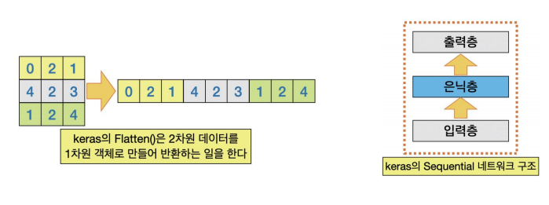
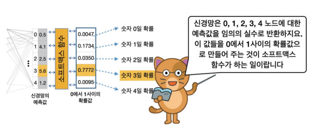
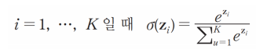
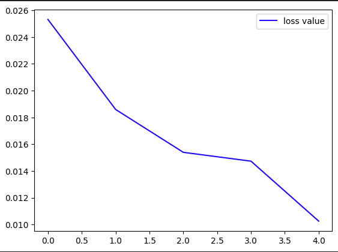
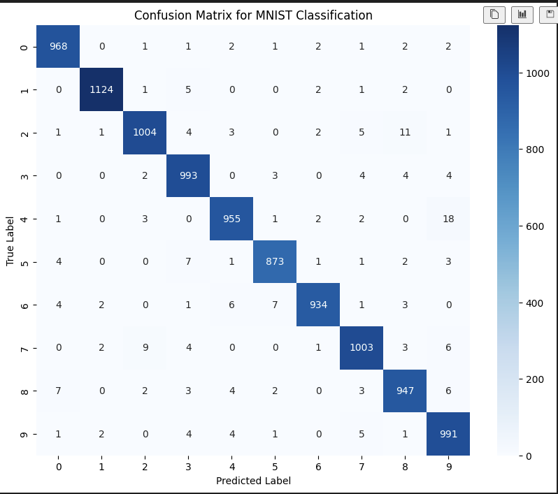

# MLP 구현2
  

```python 
model = keras.Sequential([
    keras.layers.Flatten(input_shape=(28, 28)),
    keras.layers.Dense(256, activation='relu'),
    keras.layers.Dense(10, activation='softmax')
])
```

- `Flatten`: 입력된 2D를 1D 벡터로 변환하는 레이어
- `input_shape=(28,28)`: 입력 이미지가 28 x 28 크기
- `Dense`: 완전 연결층
- `256`, `10`: 노드 수
- `activation =relu`, `activation='softmax'`: 활성화 함수로 relru, softmax 사용  

### Flatten
  

MLP는 입력값으로 2차원 배열을 사용할 수 없기에 Flatten() 클래스로 1차원 객체로 변경  

*2차원 -> 1차원이 되면 이미지의 기하학적 정보 손실 -> 이미지에서 CNN 모델이 사용되는 이유*  

### Hidden
- 256개의 노드로 구성했으므로 784 * 256 개의 연결 네트워크가 생성된다 
- 28 * 28 이미지를 Flatten하여 만들어진 785개의 입력층을 Gidden 노드 256와 완전 연결  


### Output
-  784개의 값은 신경회로망을 통과하여 10개(0~9의 숫자)중 하나의 **범주**로 분류  

1) 경사 하강법을 이용하여 오차를 줄이는 방향으로 학습을 진행
2) 오차 역전파를 이용하여 가장 좋은 가중치와 편향값을 찾아 나감  

- 최종 출력전의 활성화 함수: 가중치 값을 가진 벡터를 0에서 1 사이의 클래스별 확률값으로 변환
    - 단일 클래스 : sigmoid
    - 다중 클래스 : softmax

  

### softmax

  

- z_i는 그림 왼쪽의 가중치 값(네트워크의 예측 값) *여기서는 0.5, 4.1, 2.5,...*  


`model.summary()`로 전체 모델 구조 확인  

```
Model: "sequential"
┏━━━━━━━━━━━━━━━━━━━━━━━━━━━━━━━━━┳━━━━━━━━━━━━━━━━━━━━━━━━┳━━━━━━━━━━━━━━━┓
┃ Layer (type)                    ┃ Output Shape           ┃       Param # ┃
┡━━━━━━━━━━━━━━━━━━━━━━━━━━━━━━━━━╇━━━━━━━━━━━━━━━━━━━━━━━━╇━━━━━━━━━━━━━━━┩
│ flatten (Flatten)               │ (None, 784)            │             0 │
├─────────────────────────────────┼────────────────────────┼───────────────┤
│ dense (Dense)                   │ (None, 256)            │       200,960 │
├─────────────────────────────────┼────────────────────────┼───────────────┤
│ dense_1 (Dense)                 │ (None, 10)             │         2,570 │
└─────────────────────────────────┴────────────────────────┴───────────────┘
 Total params: 203,530 (795.04 KB)
Model: "sequential"
 Trainable params: 203,530 (795.04 KB)
 Non-trainable params: 0 (0.00 B)
 ```

 ### 학습하기  

 ```python
 model.compile(optimizer= 'adam',
              loss='categorical_crossentropy',
              metrics=['accuracy'])
```

- 최적화 함수로 `adam`:확률적 경사 하강법(SGD)의 변형으로 momentum과 RMSprop을 결합한 방식
- 손실함수로 `categorical_crossentropy`: 주로 softmax와 함꼐 사용되며 각 클래스의 확률 분포와 실제 레이블 간의 차이를 계산
    - 다중 클래스: categorical_crossentropy
    - 단일 클래스: binary_crossentropy  


```python
model.fit(train_images, train_labels, epochs= 5, verbose=1)
```
훈련 데이터와 레이블을 주고 학습 시키기  
`vervose=`은 훈련 과정 중에 진행 상황을 출력하도록 설정.  

verbose=1은 훈련이 진행될 때마다 에포크마다 손실값과 정확도를 출력한다.  

```python
test_loss, test_acc = model.evaluate(test_images, test_labels, verbose=2)
print("\n test accuracy", test_acc)
```

`model.evaluate()`는 훈련된 모델을 테스트 데이터로 평가하는 함수로 손실과 정확도를 반환  
`verbose=2` 한 줄로 간단한 평가 결과(*손실 값과 정확도*)를 출력  

### 모델 개선
1) 학습을 위한 은닉층을 더 깊게 만들기
2) 에폭을 증가시키기
3) 많은 학습용 데이터를 사용하기
4) 하이퍼파라미터 튜닝하기 

### 데이터 분류

```python
from sklearn.model_selection import train_test_split

x_train, x_test, y_train, y_test = train_test_split(dataset['data'], dataset['target'], random_state=0, test_size=0.20)
```

- `train_test_split` 데이터를 훈련용과 테스트용 데이터로 나눠 줌  
- dataset['data'] : (n_sample, n_features)형태라면 각 샘플은 n_features개의 특성을 가진다.
- dataset['target'] : (n_samples,) 형태라면 각 샘플에 대한 정답 레이블이 n_samples 개
- `random_state`: 난수 생성기의 초기값을 지정  
- `test_size =0.20`: 데이터의 20%를 테스트 데이터로 80%를 훈련으로 


```python
import matplotlib.pyplot as plt

hist = model.fit(train_images, train_labels, epochs= 5, verbose=1)
plt.plot(hist.history['loss'], 'b-', label ='loss value')
plt.legend()
```

  

```python
model.save('./mnist_model.keras')
```

model을 kears의 방식으로 저장(*예전에는 .h5의 형식을 사용했다고 하지만 이제는 아님*)  


```python
mnmodel = keras.models.load_model('./mnist_model.keras')
```

이렇게 모델을 불러와서 사용할 수 있다. 

모델 서머리() 
```
Model: "sequential"
┏━━━━━━━━━━━━━━━━━━━━━━━━━━━━━━━━━┳━━━━━━━━━━━━━━━━━━━━━━━━┳━━━━━━━━━━━━━━━┓
┃ Layer (type)                    ┃ Output Shape           ┃       Param # ┃
┡━━━━━━━━━━━━━━━━━━━━━━━━━━━━━━━━━╇━━━━━━━━━━━━━━━━━━━━━━━━╇━━━━━━━━━━━━━━━┩
│ flatten (Flatten)               │ (None, 784)            │             0 │
├─────────────────────────────────┼────────────────────────┼───────────────┤
│ dense (Dense)                   │ (None, 256)            │       200,960 │
├─────────────────────────────────┼────────────────────────┼───────────────┤
│ dense_1 (Dense)                 │ (None, 10)             │         2,570 │
└─────────────────────────────────┴────────────────────────┴───────────────┘
 Total params: 407,062 (1.55 MB)
 Trainable params: 203,530 (795.04 KB)
 Non-trainable params: 0 (0.00 B)
 Optimizer params: 203,532 (795.05 KB)
 ```

```python
from sklearn.metrics import confusion_matrix
import seaborn as sns

predictions =model.predict(test_images)
predicted_labels = np.argmax(predictions, axis=1)
true_labels = np.argmax(test_labels, axis=1)

conf_matrix = confusion_matrix(true_labels, predicted_labels)

plt.figure(figsize=(10,8))
sns.heatmap(conf_matrix, annot=True, fmt='d', cmap='Blues')
plt.xlabel('Predicted Label')
plt.ylabel('True Label')
plt.title('Confusion Matrix for MNIST Classification')
plt.show()
```


`predictions = model.predict(test_images)`는 테스트 이미지에 대해 모델을 사용하여 예측을 수행  
`predictions`는 모델이 각 이미지에 대해 예측한 확률을 포함한 배열  
*ex) (num_samples, num_classes)로, 각 샘플에 대해 각 클래스에 속할 확률이 포함*  

`predicted_labels = np.argmax(predictions, axis=1)`는 각 예측된 확률 중 가장 큰 값을 가진 인덱스를 선택하여, 예측된 라벨을 반환

*ex) predictions의 배열이 `(1000, 10)` 이라면 (1000,) 형태로, 각 이미지에 대해 가장 높은 확률을 가진 클래스 인덱스 반환  

`true_labels = np.argmax(test_labels, axis=1)` 원-핫 인코딩 형식으로 제공된 `test_labels`을 클래스 인덱스로 반환

```python
print(test_labels.shape)
# >>>(10000, 10)
np.argmax(test_labels, axis=1)
# >>> array([7, 2, 1, ..., 4, 5, 6])
```

`conf_matrix = confusion_matrix(true_labels, predicted_labels)`는 혼동 행렬 생성  

`sns.heatmap(conf_matrix, annot= True, fmt='d', cmap='Blues')`  
Seaborn라이브러리의 함수로, 혼동 행렬을 히트맵 형식으로 시각화  
- `conf_matrix`: 시각화할 데이터 
- `annot=True`: 각 셀에 값을 표시
- `fmt='d'`: 셀의 값을 정수형으로 표시
- `cmap='Blues` : 색상 맵을 파랑으로

