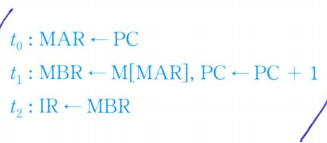

# 제어 유니트의 기능

1. 명령어 코드의 해독
2. 명령어 실행에 필요한 제어 신호들의 발생

- 명령어 사이클은 부 사이클인 인출 사이클, 간접 사이클, 실행 사이클 및 인터럽트 사이클로 이루어짐
- 각 사이클은 여러 개의 마이크로-연산들이 수행된다.

ex) 인출 사이클에서 수행되는 마이크로-연산   
  

CPU 클록 주기마다 서로 다른 마이크로-연산이 수행되며, 결과적으로 명령어 인출은 세 주기만에 종료된다.  
**단, 이 예시에서는 두 번째 주기에서 두 개의 마이크로-연산들이 동시에 수행됨**

각 마이크로-연산이 실제 수행되기 위해서는 2진 비트들로 표현되야 함.  
이와 같이 비트들로 이루어진 각 단어를 마이크로명령어 혹은 제어 단어라고 한다.  
그리고 마이크로명령어들의 집합을 **마이크로프로그램**이라고 한다.  

마이크로 명령어들은 명령어 인출과 같은 CPU의 특정 기능을 위하여 그룹 단위로 작성된다.  
이걸 **루틴(routine)**이라고 부른다.  
ex) 
- 모든 명령어들에 공통인 인출 사이클 루틴은 세 개의 마이크로명령어들로 이뤄짐
- 실행 사이클 루틴은 각 명령어마다 서ㅗ 다르며, 각 루틴의 길이도 명령어에 따라 결정됨
