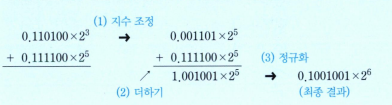

# 덧샘과 뺄셈

1. 두 수의 소수점 위치를 일치시킨다.(*두 수들중에서 더 작은 수를 우측으로 시프트*)
2. 가수들 간에 더하기를 수행
3. 결과를 정규화 시킨다.

### 문제: 부동소수점 수들 간의 덧셈(0.110100 * 2^3 + 0.111100*2^5)을 수행하라. 

풀이
--
  

뺄셈도 같은 방법으로 처리 가능(*감수를 2의 보수로 변환하여 더해야 한다*)
