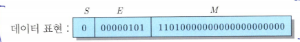
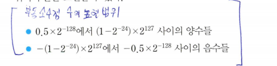
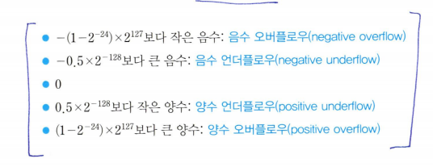

# 바이어스?

우리가 정규화된 표현을 쓸 때 **정수0**에 대해서 문제가 발생함

컴퓨터는 **zero-test**를 수시로 해서 이게 0인지 아닌지 판별을 하는데, 이 컴퓨터가 0은 모든 비트들이 0이다라는걸 기본적으로 깔고 감  
  
이렇게 하면 아주 이상적  

이제 지수가 음수 일때를 생각해보자.  
지수가 음수면 일단 지수에도 부호를 넣어줘야 함 -> 비트 낭비하기 싫음 -> 음수를 양수로 처리해서 쓰자 -> 바이어스 등장!!  
(*그리고 지수가 한 없이 큰 음수이면 언더플로우나 정밀도 손실이 발생할 수 있다*)  

ex) 바이어스가 127이면 지수 비트에 01111111을 더해주면 끝  

  

M의 범위가 0.5보다 크거나 같고 1-2^-23보다 작거나 같아야 할것 같은데 왜 **2^-24**보다 작거나 같은지 이해가 안가네

### 2^-24 설명
히든 비트가 있으니깐 24비트로 표현 가능
