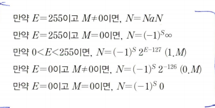
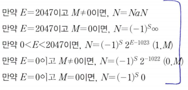

# IEE754

NaN 결과는 0으로 나누기, 음수에 대한 루트 계산 등과 같은 중요한 계산 오류들이 있다.  

이 표준에서 정의하고 있는 NaN 형식은 M !=0이고 E=255(32-bit형식) 또는 E=2047(64-bit형식)

오버플로우가 발생한 경우에는 그 결과를 무한대로 취급하며, M=0 및 E=255(32-bit형식) 또는 E=2047(64-bit형식) 로 나타낸다.  
즉, 가수의 모든 필드에는 0, 지수 필드는 모두 1  

언더플로우는 지수 필드의 모든 비트들을 0으로 세트, 가수는 0.M, 즉 소수점의 좌측 비트로서 0을 사용하여 수를 표현  

32-비트 형식
  

62-비트 형식
