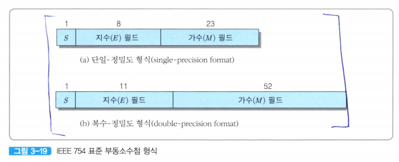
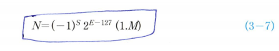
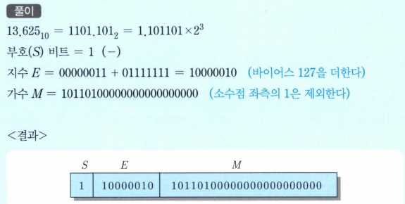
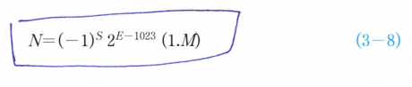

# ieee?
ieee는 미국전기전자공학회
그래서 이 아이들이 뭘 했냐?
ieee 왈 '우리 부동 소수점 통일좀 해서 쓰자' 라고 해서 이 통일된 부동소수점을 *IEEE754*라고 부르는 것

IEEE754 부동소수점 표준 형식에는
1. 8-비트 길이의 지수를 가지는 32-비트 단일 -정밀도 형식과
2. 11-비트 길이의 지수를 가지는 64-비트 복수- 정밀도 형식이 있음

자 우리 Think를 해봅시다.
32-비트 에서 지수를 8비트 쓰면, 부호 1비트 까지 해서 32-9를 한 23비트가 가수로 쓰이겠죠?

그런데 우리가 이걸 정규화 형식으로 
N=(-1)^s*M*2^E을 이용해서 0.1bbb...*2^E 이런식으로 쓰고 소수점 바로 우측에 비트에 넣지 않았단 말이죠(*왜냐하면 넣지 않아도 거기 있는걸 아니깐 굳이 넣을 필요가 없음*)

IEEE표준에서도 첫번째 `1`은 포함시키지 않는다 이 말이죠  

다만 여기서는 가수가 **1.M*2^E**의 형태를 가진다는 점만 알아주면 됩니다.
(*소수점 좌측의 1을 무시하는거임, 이걸 우린 **숨겨진 비트**라고 함*)

지수 필드는 **바이어스된 2진수**로 표현되며, 바이어스 값은 127입니다!!

### 문제: 10진수 -13.625를 IEEE754 단일-정밀도 표준 형식으로 표현하라. (단, 바이어스 128)

풀이
--

*소수점 부분 이진수 구하는 방법*

1. 0.625*2=1.25 (*정수 부분 1. 소수부분 0.25가 남음*)
2. 0.25 * 2 =0.5 (*1번에서 남은 부분을 2로 곱함*)
3. 0.5 *2 =1 (*2번에서 남은 부분을 곱함*)

문제를 다시 십진수로 바꾸면  
N=(-1)^1 * 2^130-127  
(*127을 바이어스로 더했으니 원래대로 되돌릴 때는 다시 빼줘야 함*)

을 이용해 정규화된 표현으로 표현된 2진수를 10진수로 변환할 수 있다.  