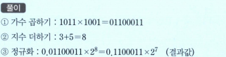

# 2진 부동소수점 곱셈 과정
1. 가수들을 곱한다(*부호를 고려해야 함, 곱셈 결과 길이가 승수나 피승수의 두배가 됨*)
2. 지수들을 더한다(*바이어스가 있다면 지수들을 더하 합의 바이어스 값은 두 배가 되므로 그 합으로부터 바이어스 값을 한 번 빼야한다, 나눗셈이면 더해야 함*)
3. 결과값을 정규화한다.

### 문제: 2진 부동소수점 곱셈(0.1011 * 2^3) * (0.1001*2^5)을 수행하라.

풀이
-- 
