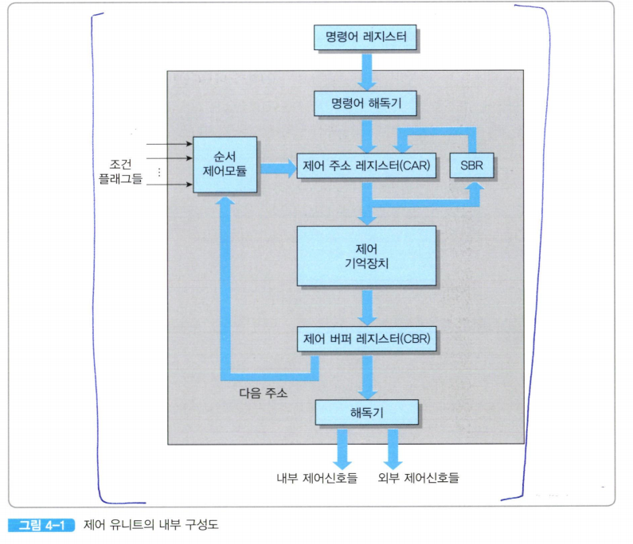
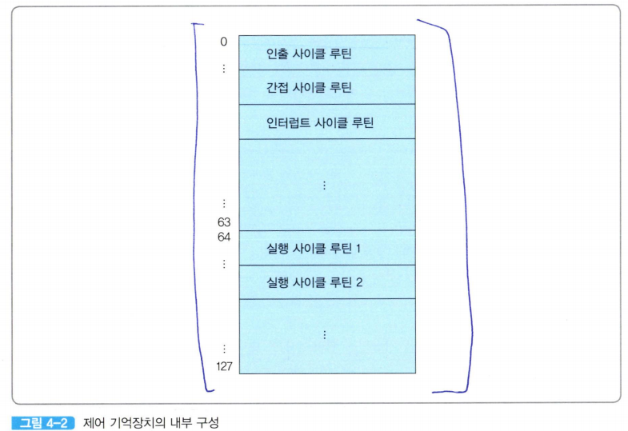
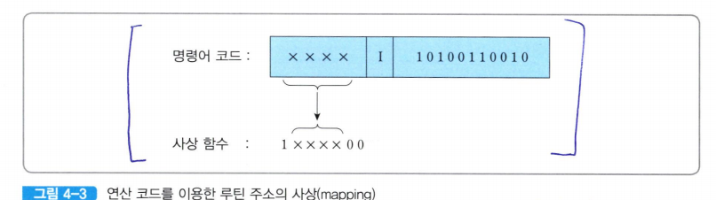

# 제어 유니트의 구조

  
**명령어 해독기(instruction decoder)**: 명령어 레지스터(IR)로부터 들어오는 명령어의 연산 코드를 해독하여 해당 연산을 수행하기 위한 루틴의 시작 주소를 결정한다.  
**제어 주소 레지스터(control address register: CAR)**: 다음에 실행할 마이크로명령어의 주소를 저장하는 레지스터. (*이 주소는 제어 기억장치의 특정 위치를 가리킨다.*)  
**제어 기억장치(control memory)**: 마이크로명령어들로 이루어진 마이크로프로그램을 저장하는 내부 기억장치  
**제어 버퍼 레지스터(control buffer register: CBR)**: 제어 기억장치로부터 읽혀진 마이크로명령어를 일시적으로 저장하는 레지스터  
**서브루틴 레지스터(subroutine register: SBR)**: 마이크로프로그램에서 서브루틴이 호출되는 경우에, 현재의 CAR 내용을 일시적으로 저장하는 레지스터이다.  
**순서제어 모듈(sequencing module)**: 마이크로명령어의 실행 순서를 결정하는 회로들의 집합이다.  

CPU의 명령어 세트를 설계한다는 것의 의미
1. 명령어들의 종류와 비트 패턴을 정의
2. 그 명령어들의 실행에 필요한 하드웨어를 설계
3. 각 명령어를 위한 실행 사이클 루틴을 마이크로프로그래밍 한다

(*마이크로 프로그램은 CPU 설계 단계에서 확정*)  

마이크로프로그램을 저장하는 제어 기억장치는 ROM으로 만들어져 CPU 칩 내에 포함된다.  

루틴들의 길이와 제어 기억장치에 저장되는 위치는 CPU마다 다르다.  
  

제어 기억장치의 용량이 128단어인 CPU에서 제어 기억장치는 그림 4-2와 같이 구성될 수 있다.  

- 제어 기억장치의 처음 절반(64 단어)부분에 공통 루틴들을 저장  
- 하반부 64단어들에는 각 명령어를 위한 실행 사이클 루틴들을 저장  

인출 사이클 동안에 명령어 레지스터로 적재된 명령어 비트들 중에서 연산 코드 (op-code) 부분은 제어 유니트의 명령어 해독기로 들어온다.  

이 연산 코드가 지정하는 연산은 실행 사이클 동안에 제어 기억장치에 저장된 해당 루틴을 실행함으로써 수행된다.  

**명령어 해독기는 연산 코드를 이용하여 제어 기억장치 내 해당 실행 사이클 루틴의 시작 주소를 찾아야 한다** 

**사상(mapping)** 방식에서는 명령어의 연산 코드를 특정 비트 패턴과 조합시킴으로써 그 연산의 수행에 필요한 실행 사이클 루틴의 시작 주소를 찾아낸다.  

  

실행 사이클 루틴들이 제어 기억장치의 64번지부터 저장되어 있고, 각 루틴은 최대 네 개씩의 마이크로명령어들로 구성된다고 가정했을 하자.  

만약 16-비트 길이의 명령어가 4비트의 연산 코드, 1비트의 간접 주소지정(I) 비트 및 11비트의 주소로 구성되어 있다면 그림 4-3과 같다.  

예를 들어 LOAD 명령어의 연산 코드가 0001이라면 1000100, 즉 64 + 4= 68번지가 실행 사이클 루틴의 시작 주소이며 이 주소가 CAR로 입력 된다.  

