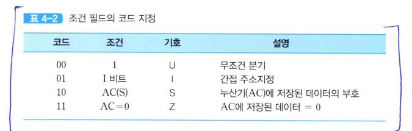

# 마이크로명령어의 형식

  

위 예의 경우에는 
- 연산 필드가 두 개이므로 두 개의 마이크로-연산들이 동시에 수행될 수 있다.  
- 조건 필드는 분기에 사용될 조건 플래그를 지정한다.  
- 분기 필드는 분기의 종류와 다음에 실행할 마이크로명령어의 주소를 경정하는 방법을 명시한다. 
- 주소필드는 분기가 발생하는 경우를 위하여 목적지 마이크로명령어의 주소를 가지고 있다.  

실제 마이크로프로그램을 작성해보자
--
  

  

### 알아야 할 것

- PCTAR은 PC To AR을 의미

- 조건 필드의 값이 00이라면 현재의 마이크로명령어의 실행이 완료된 다음에는 **무조건 분기**한다는 것을 의미  

이 경우에 분기될 목적지 마이크로명령어의 주소는 이 형식의 마지막에 있는 주소 필드의 값이 된다.  

즉, 주소 필드의 내용이 CAR로 적재된다.  

- 조건 필드의 값이 01이면 I 비트의 값에 따라 분기 여부가 결정.
    - I 비트는 간접 주소지정 방식을 나타내는 비트.
    - I=1이면 간접 사이클 루틴을 호출하여 기억장치로부터 오퍼랜드의 유효 주소를 인출
- 조건 필드의 값이 10혹은 11인 경우에는 각각 조건 플래그인 S(부호) 혹은  Z(영) 플래그의 값이 1이면 분기가 발생.  

- **분기 필드**도 두 비트로 구성되는데, 각 비트 조합이 나타내는 의미는 다음과 같다.
    - **00 (조건부 점프)**: 조건 필드가 가리키는 조건이 만족되면, 주소 필드(ADF)값이 CAR로 적재되어서 그 주소의 마이크로명령어로 점프.  
        - *조건이 만족되지 않는다면, 분기는 일어나지 않고 CAR의 내용이 +1 증가되어 다음에 위치한 마이크로 명령어 실행*
        - *앞의 **조건 필드**의 값이 00, 즉 무조건 분기로 지정되면 주소 필드가 가리키는 주소로 **무조건 점프함**
    
    - **01 (조건부 호출)**: 현재의 CAR 내용에 1을 더한 값이 서브루틴 레지스터(SBR)에 저장되고, 주소 필드의 값이 CAR로 적재되어 다음 사이클에서 그 주소의 마이크로명령어가 실행된다.  
        - *조건이 만족되지 않는다면, 원래 순서대로 다음에 위치한 마이크로명령어가 실행된다*
        - 이 경우에도 앞의 **조건필드**가 00이라면 무조건 호출이 수행된다.

호출되는 루틴의 마지막 마이크로명령어의 분기 필드에는 반드시 복귀(return)를 나타내는 필드값인 `10`이 들어있어야 한다.  
그러면 **SBR에 저장되어 있던 주소**가 **CAR로 다시 적재됨**으로써 **호출되기 전의 프로그램 실행 순서**로 되돌아가게 된다.  

만약 분기 필드값이 `11`이면 루틴의 시작 주소가 CAR로 적재되어 그 주소로 분기함  

**표 4-3을 보면CAR의 첫 번째 비트에는 항상 `1`이 적재되고, 2-5는 연산 코드 비트들이 들어가며 마지막 두 비트에는 항상 0이 채워짐을 알 수 있다**

위 예시에서 각 단어의 길이가 17비트이므로, 제어 기억장치의 전체 용량은 128*17비트가 된다.  
(*상단 64, 하단 64 총 128의 높이, 단어 길이17*)

    