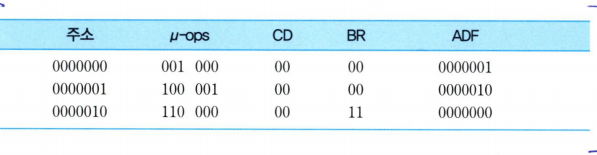

# 마이크로프로그래밍
  
*인출 사이클의 마이크로명령어 루틴, 기억장치의 0번지부터 저장된다고 가정*

- 세 개의 마이크로명령어들로 구성
- 두 번째 마이크로명령어에서는 두 개의 마이크로-연산들이 동시에 수행됨
- 마지막 단계에서는 사상을 이용하여 CAR에 실행 사이클 루틴의 시작 주소를 적재

- 주소는 각 마이크로명령어가 저장될 제어 기억장치내의 주소
- u-pos는 두 개의 마이크로-연산
- CD는 조건 필드
- BR은 분기 필드
- ADF는 주소 필드(*마지막 마이크로명령어의 ADF는 사용되지 않으므로 모든 비트들을 0으로 세트*)

### 간접 사이클 루틴

  

어떤 명령어가 간접 주소지정 방식을 사용하는 경우에는 명령어 내의 `I` 비트가 `1`로 세트된다.  
이 경우에는 실행 사이클의 시작 부분에서 간접 사이클 루틴을 호출하여 기억장치로부터 실제 오퍼랜드 주소를 읽어와야 한다.  
일반적으로 간접 사이클 루틴은 인출 사이클 루틴의 다음 위치인 4번지부터 저장된다.  

**즉, `IR`에 저장되어 있는 명령어의 주소 필드가 가리키는 기억장치 위치로부터 실제 주소를 인출하여 다시 `IR`의 주소 필드에 적재하는 것.**

복귀(RET)는 SBR에 저장되어 있던 원래의 제어 기억장치 주소를 CAR로 적재함으로써 수행된다.  

  
이 루틴의 마이크로명령어들을 2진 비트 패턴으로 변환하면 위와 같다. 

### 실행 사이클 루틴

*어떤 CPU가 위와 같은 명령어들을 가지고 있다고 가정하자*

- NOP는 아무런 연산도 수행하지 않고 PC만 1을 증가시키지만 특정 목적을 위하여 거의 모든 CPU들의 명령어 세트에 포함되어 있다.  

 
