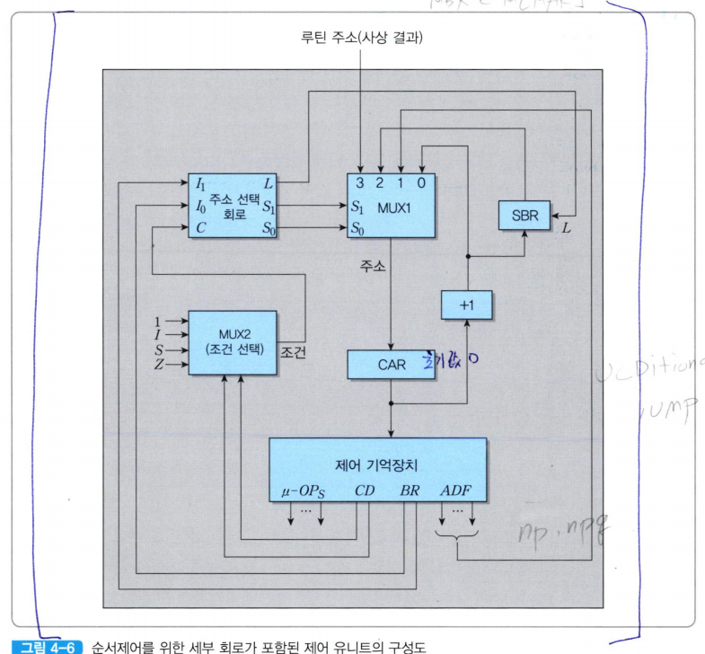
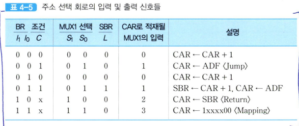
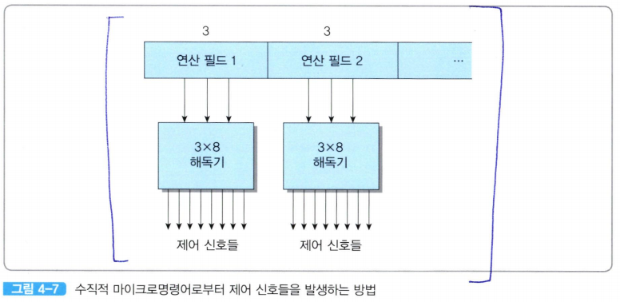

  

제어 유니트가 명령어의 실행을 제어한다는 것은 제어 기억장치에 저장된 해당 마이크로명령어들을 순서대로 인출하는 동작이라고 볼 수 있다.  

**즉, 각 마이크로명령어를 읽어서 연산 필드에 있는 비트들을 출력시키면, 그 비트들 자체가 제어 신호들이 되는 것이다**  

그림 4-6에서 제어 기억장치를 제외한 상단의 모듈들은 다음에 실행할 마이크로명령어의 주소를 결정하는 회로들이며, 그 기능을 **순서제어(sequencing)**라고 부른다.  

CPU가 처음 동작을 시작하는 순간에는 CAR이 `0`으로 세트되어, 제어 기억장치의 0번지에 있는 인출 사이클 루틴의 첫번째 마이크로명령어를 인출하면서 마이크로프로그램의 실행이 시작된다.  

제어 기억장치로부터 출력된 그 마이크로명령어의 비트들 중에 CD 필드의 두 비트들은 MUX2로 보내져서 네 개의 조건 비트들 중의 하나를 선택하게 된다.  

결과적으로 표 4-2의 네 가지 조건값들 중의 하나가 MUX2의 출력이 된다.  

그 출력은 상단의 주소 선택 회로의 한 입력(C)로 들어간다.  

주소 선택 회로의 다른 두 입력들로는 BR 필드의 두 비트들이 들어간다.  

그 세 입력들이 조합되면 표 4-5와 같이 MUX1의 선택 신호들과 SBR의 적재(L)신호가 생성되며, 그에 따라 다음 주소들이 결정되어 CAR로 적재된다.  

  

1. BR 필드가 `00(JUMP)` 혹은 `01(CALL)`을 가리킬 때, 조건이 만족되지 않으면 (C=0) CAR의 내용이 1 증가하여, 다음에 위치한 마이크로명령어를 실행하게 된다.  

2. 그러나 조건이 만족된 경우에는 목적지 주소인 주소 필드값(ADF)이 CAR로 적재된다.  

3. CALL의 경우에는 적재 동작이 수행되기 전에 현재의 CAR 내용을 SBR에 저장한다.(*이 동작은 제어 신호 L에 의해 이루어지다*)

4. BR 필드가`10(RET)`을 가리키는 경우에는 SBR에 저장되어 있던 주소가 다시 CAR로 복구된다.  

5. 마지막으로, BR 필드가 `11(MAP)`인 경우에는 사상함수에 의하여 결정된 주소가 `CAR`로 적재되어 해당 실행 사이클 루틴으로 분기하게 된다.  

그림 4-6에서 제어 기억장치로부터 읽혀진 마이크로명령어의 최상위 비트들인 마이크로-연산 비트들(u-ops)은 제어 유니트의 외부로 나가서 제어 신호들이 된다.  
(*이 비트들이 각각 하나의 제어 신호로 사용된다면, 이 예의 경우에는 연산 필드들이 각각 3비트씩이므로 모두 6개의 제어 신호들만 발생할 수 있다*)   

만약 각 마이크로-연산을 수행하는데 더 많은 제어 신호들이 필요하다면, 그 비트들을 그림 4-7과 같이 해독기(decoder)들을 통과시킴으로써 그 수를 확대 시킬 수 있다.  
  
*이 그림에서는 각 연산 필드의 세 비트를 3 x 8 해독기를 통과시켜 8비트로 변환함으로써 모두 16개의 제어 신호들을 발생시키고 있다*  

이와 같이 마이크로명령어 내에 적은 수의 코드화된(encoded) 비트들을 포함시킴으로써 마이크로명령어의 길이(비트수)를 줄이고, 그 대신에 외부에 해독기들을 접속하여 원하는 수만큼의 제어 신호로 확장하는 방식을 **수직적 마이크로프로그래밍**이라고 한다.  

이 방식에서 사용된ㄴ 마이크로명령어는 **수직적 마이크로명령어**라고 부른다.  

이 방식은 마이크로명령어의 길이가 짧다
- 기억장치의 용량이 적게 필요하다. (장점)
- 해독기를 통과하는데 걸리는 시간만큼 지연이 발생 (단점)

마이크로명령어 내 연산 필드들의 각 비트와 제어 신호를 일대일로 대응시켜서, 그 수만큼의 비트들로 이루어진 마이크로명령어들을 사용하는 방식을 **수평적 마이크로프로그래밍**이라고 한다.  

- 제어 기억장치로부터 인출된 마이크로명령어의 마이크로-연산 비트들이 해독기를 통고할 필요 없이 직접 제어 신호로 사용 될 수 있다 -> 해독에 따른 시간 지연 없음 (장점)

- 연산 필드의 비트 수가 필요한 제어 신호들의 수만큼 제공되야 함 -> 마이크로명령어의 길이가 증가 -> 제어 기억장치의 용량이 커짐 (단점)  

