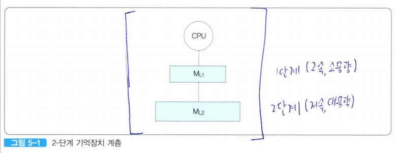
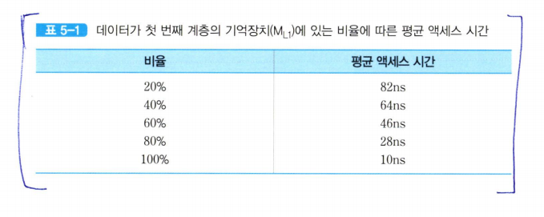
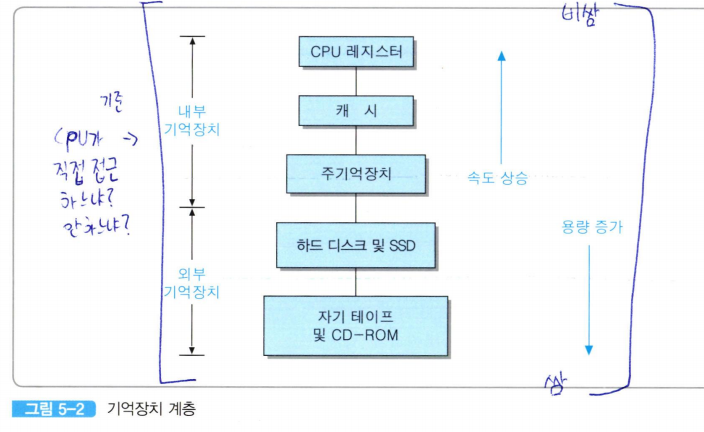

# 계층적 기억장치시스템
기억장치는 cpu보다 느림 ㅇㅇ  
그래서 그 속도차이를 조금이라도 줄이고자 킹비싼 고속 반도체로 만든 기억장치를 CPU와 주기억장치 사이에 위치 시킴

문제는 보조기억장치가 엄청 느리다는 거임(*한 10만배 정도*)  

CPU가 프로그램 코드나 데이터를 인출하고자 할 때, 이것들이 주기억장치에 존재하지 않는다면, 보조저장장치로부터 주기억장치로 이동시킨 다음에 인출할 수 있음 ㅇㅇ   

이 느린 보조기억장치보다 당연히 주기억 장치에 있는게 좋음, 문제는 비싸다는 거임  

### 기억장치의 특성
1. 액세스 속도가 높다? -> 비트당 가경도 높다
2. 용량이 크다? -> 액세스 속도는 낮다 -> 그래도 비트당 가격은 낮다 

  

- 첫 번째 계층의 기억장치(M_L1)는 액세스 시간이 10ns이다.  
- 두 번째 계층의 기억장치(M_L2)는 용량이 더 크지만, 액세스 시간은 100ns이다.  

만약 CPU가 액세스할 데이터들의 50%가 첫 번째 계층에 있고 나머지 50%는 두 번째 계층에 있다면,  
평균 액세스 시간은 (0.5 x 10ns)+(0.5 x 100ns) =55ns가 된다.  

  

프로그램 코드들을 처음에는 두 번째 계층의 기억장치로부터 인출하지만 그 과정에서 첫 번째 계층의 기억장치에도 인출한 내용을 저장해두기 때문에 그 이후에는 더욱 신속하게 읽어올 수 있게 된다.  

오랜 시간이 지나면 액세스가 집중되는 위치도 바뀌겠지,  
근데 짧은 시간을 기준으로 보면 CPU가 기억장치의 한정된 몇몇 영역들을 주로 액세스하는걸 알 구 있음.  

이걸 **지역성의 원리**라고 함  
실제로 보면 이 원리가 적용되는 경우가 많음  

첫 번째 계층의 기억장치에 대한 액세스 횟수가 두 번째 계층의 기억장치에 대한 액세스보다 훨씬 많아짐  

  
상위 계층으로 갈 수록
- 비트당 가격 높음
- 용량이 감소함
- 액세스 시간 짧음
- CPU에 의한 액세스 빈도는 높음

보통 CPU 클록 신호의 한 주기 내에 데이터를 레지스터에 쓰거나 읽는 것이 가능하다.  

*ex) 1GHz의 클록으로 동작하는 CPU에서 내부 레지스터에 대한 읽기/쓰기 동작에 걸리는 시간은 1ns 이하이다*  

  

레지스터가 주기억장치보다 훠~월씬 빠름 -> 데이터 전송 시간이 김  
이러한 문제를 해결하기 위해 **캐시 메모리**(*캐시*)를 설치  

### 캐시
- 프로그램을 통하여 직접 읽거나 쓰는게 안됨

- CPU와 주기억장치 간의 속도차이를 보완하기 위해 데이터를 일시 저장해주는 중간 버퍼 기능 수행

- 고속의 반도체 기억장치 칩들이 사용 (*대략 2~10ns정도의 액세스 시간을 가진다*)  

CPU 레지스터, 캐시 메모리, 주기억 장치는 CPU가 직접 액세스할 수 있는 **내부 기억장치**들이다.  

CPU가 직접 액세스하지 못하고 반드시 장치 제어기를 통해야 액세스할 수 있는 기억장치를 **외부 기억장치**라고 한다.  

### 외부 기억장치
- CPU가 직접 액세스 할 수 없다
- 각 저장장치의 제어기 혹은 I/O 프로세서를 통해서만 데이터 저장 및 검색이 가능하다.
- **2차 기억장치(secondary memory)** 또는 **보조저장장치(auxilary storage device)**라고 부른다
- 주로 프로그램 파일ㄹ들과 데이터 파일들이 저장된다
- 바이트나 단어 단위가 아닌 블록(block)이나 페이지(page)단위로만 액세스할 수 있다.
- *ex) 하드 디스크,SSD, CD-ROM*

### 계층적 기억장치시스템 특징
- 하위 계층으로 내려갈수록 용량이 더 커진다
- 비트당 가격은 떨어진다
- 지역성의 원리로 인하여 액세스 빈도가 더 낮아진다.

