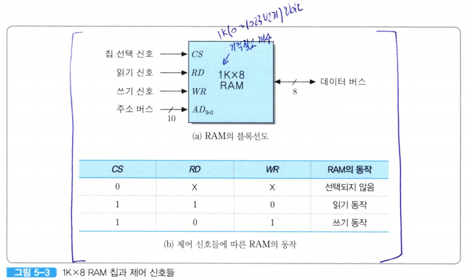
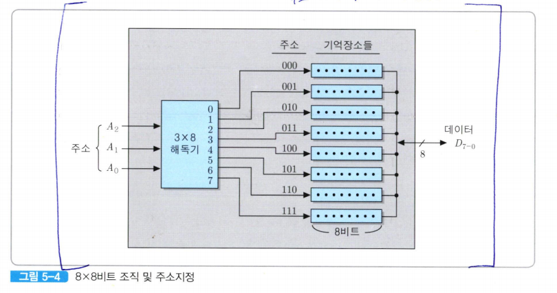
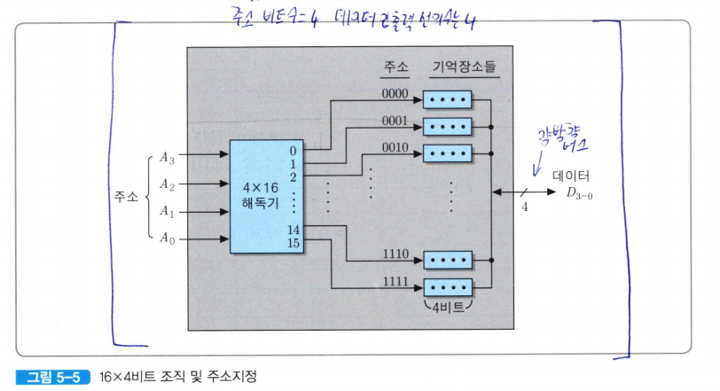
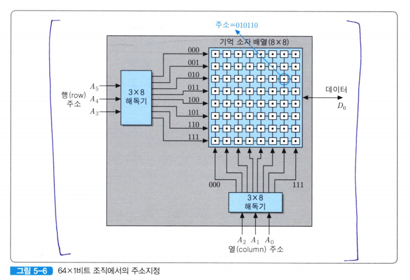
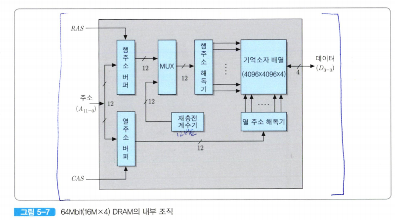
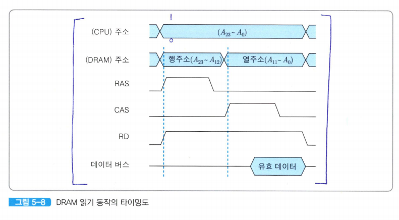
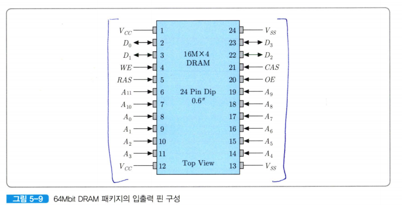

# 반도체 기억장치
**RAM(Random Access Memory)** 은 임의 액세스 방식을 이용하는 반도체 기억장치  
- 이 기억장치에 저장된 각 단어들은 CPU가 전송하는 주소에 의해 지정되어 직접 액세스된다.  
- RAM의 특징은 데이터를 읽는 것과 쓰는 것이 모두 가능하며, 이 동작들이 전기적인 신호들을 이용하여 이루어진다.  
- 휘발성이다
  
이 그림의 1Kx 8비트 조직은 8비트로 구성된 기억 장소들이 1024개가 배열되어 있는 경우이다.(*블록선도는 시스템이나 회로의 구조를 간단하게 표현한 그림*)  

이 칩의 용량은 1K바이트가 되며, 주소 비트는 1K=2^10이므로 10개가 필요하다.  
데이터 입출력은 한 번에 8비트씩 이루어지기 대문에, 데이터 버스의 폭은 8비트가 된다.  

### 그림 5-3 RAM의 블록선도
- **RD(read command)**: 읽기 명령 신호
- **WR(write command)**: 쓰기 명령 신호
- **cs(chip select)**: 칩 선택 신호

CS 신호가 1로 활성화되며, 칩은 주소와 제어 신호에 따라 적절한 동작을 수행한다.  
- 만약RD=1이고 WR=0이라면, 주소가 지정하는 기억 장소로부터 8비트 데이터가 읽혀서 데이터 버스를 통하여 출력된다.  
- 만약 RD=0이고 WR=1이면, 데이터 버스를 통하여 들어오는 8-비트 데이터가 주소에 의해 지정되는 기억 장소에 저장된다.  

CS신호가 0인 경우에는 이 칩이 선택되지 않은 것이므로, 제어 신호들이나 데이터 입츌력 통로가 모두 전기적으로 단절된 상태가 된다.  

그림 5-3의(b)에서 X는 해당 신호가 0 혹은 1중의 어느 값이든 상관 없음을 의미  

### 제조기술에 따른 RAM의 분류 
- **DRAM(Dynamic RAM)**:은 캐피시터에 전하를 충전하는 방식으로 비트값을 저장하는 기억 셀들로 이루어져 있다.  
    - 데이터의 저장 상태를 유지하기 위하여 주기적으로 재충전(refresh)해줘야 한다.

-  **SRAM(Static RAM)**:  플립-플롭(flip-flop)으로 구성된 메모리
    - 전력이 공급되는 동안에는 재충전 없이도 데이터를 계속 유지할 수 있다.  
    - *Flip-Flop*: 디지털 전자회로에서 사용되는 **기본적인 기억 소자**로, **1비트의 데이터를 저장**할 수 있는 장치로 전원이 꺼지지 않는 한 데이터를 잃지 않는다.  

### DRAM vs SRAM
- DRAM의 각 기억 셀은 SRAM의 경우보다 더 간단하고 더 작다.  
- DRAM의 밀도가 더 높으며 같은 용량의 SRAM보다 비트당 가격이 더 저렴하다.  
- DRAM에는 재충전 회로가 추가되어야 하지만, 기억장치의 용량이 커질수록 그 회로가 차지하는 비중이 상대적으로 줄어들기 때문에 칩의 가격에는 별 영향을 주지 않는다
- DRAM은 SRAM보다 속도가 더 **느리다**

위와 같은 이유들로 DRAM은 주로 주기억장치로 사용되며 SRAM은 캐시로 사용된다.  

예시: 64-비트 RAM이 가질 수 있는 조직들 (*실제로 64-비트 RAM따위는 없다*)
--

### 1) 8x8비트 조직
  


- 8개의 기억 장소들로 구성되며, 각 기억 장소에는 8비트씩 저장된다.  
- 기억 장소는 8개이므로 세 개의 주소 비트들(*A_2,A_1,A_0*)로 기억장소들의 주소를 모두 지정할 수 있다.
    - 주소의 범위는 0(000_2)번지부터 7(111_2)번지가지가 된다.  
- 칩 내의 3 x 8 해독기는 주소 비트들을 해독하여 8개의 출력들중의 하나를 활성화시킨다.  
    - 해당 출력 선이 연결된 기억 장소가 선택되고, 제어 신호에 따라 읽기 혹은 쓰기 동작이 수행된다.  
- 한 번의 읽기 혹은 쓰기 동작이 수행될 때 동시에 입출력되는 데이터 비트 수가 8개이기 때문에, 데이터 입출력 선은 8개가 필요하다.  

이와 같은 조직을 가지는 RAM에서 전체 용량이 8Kbit라면, 1K x 8비트 조직으로 구성되며, 주소 비트는 10개가 필요하게 된다.  

1Mbit(128K x 8비트조직)RAM의 경우에는 17비트, 1Gbit(128M x 8비트 조직)RAM의 경우에는 27비트의 주소가 각각 입력되어야 한다.  

### 2) 16 x 4
  

- 16개의 기억 장소들이 서로 다른 주소를 할당 받느나
- 각 기억 장소에는 4- 비트 데이터가 저장된다
- 이 칩에 대한 주소지정을 위해서는 16=2^4, 즉 4- 비트 주소(A_3,A_2,A_1,A_0)가 필요하다.  
- 4 x 16 해독기가 16개의 출력 신호들 중의 하나를 활성화시킴으로써 각 기억 장소가 선택된다.  
- 칩 내부 기억장소들의 주소 범위는 0(0000_2)번지부터 15(1111_2)번지까지가 되며, 데이터 입츌력 선은 4개가 있으면 된다.  

이와 같은 조직을 가지는 RAM의 경우 전체 용량이 8Kbit라면 2K x 4비트 조직으로 구성되며, 11개의 주소 비트들이 필요하게 된다.  

1Mbit(256K x 4비트 조직)RAM은 18비트, 1Gbit(256M x 4비트 조직)RAM의 경우에는 28비트의 주소가 각각 입력되어야 한다.  

### 3) 64 x 1비트 조직
  

- 64 x 1 비트 조직의 RAM에서는 8 x 8의 장방형 구조에 위치한 64개의 기억 소자들에 대하여 읽기 및 쓰기가 한 비트 단위로 이루어진다.  
    - 데이터 입출력 선이 한 개만 있으면 된다.  

- 각 기억 장소가 별도의 줏를 가지므로 64=2^6, 즉 여섯 개의 주소 비트들(A_5,A_4,A_3,A_2,A_1,A_0)이 필요하다.  

- 주소 비트들 중에서 상위 세 비트는 8개의 행들 중에서 한개를 선택하고, 하위 세 비트들은 8개의 열들 주엥서 한 개를 선택한다.  
    - 두 개의 3 x 8 해독기가 필요하다.  
    - 그림 5-6에서 세 번ㅉ 행의 일곱 번째 기억 소자의 주소는 010110이 된다.  

이와 같은 조직을 가지는 RAM에서 전체 용량이 8Kbit라면, 8K x 1비트 조직으로 구성되어 모두 13개의 주소 비트들이 필요하게 된다.  

1Mbit(1M x 1비트 조직) RAM은 20비트, 1Gbit(1G x1 비트 조직) RAM의 경우에는 30비트의 주소가 각각 입력되어야 한다.  
*그러나 대용량의 RAM에서 이 조직을 사용하게 되면, 필요한 주소 비트 수가 너무 많아지기 때문에 거의 채택되지 않는 편이다*  

### 4) 16M x 4비트 조직
  
이 칩의 주소 입력 단에는 주소 버퍼들이 있고, 두개의 해독기들이 각각 행 주소와 열 주소를 해동한다.  

이 조직의 핵심부인 기억 소자 배열은 4096 x 4096 x 4비트로 표시되는데, 그 의미는 기억 장소들이 4096개의 행과 4096개의 열들로 이루어진 장방형 구조로 배열되어 있으며, 각 기억 장소에는 네 개의 데이터 비트들이 저장된다는 것을 말한다.  

이 칩의 전체 기억 장소의 수는 16M개이기 때문에, 그들을 구분하기 위해서는 24비트의 주소가 필요하다.  

그림과 같은 조직에서 기억 소자의 행과 열을 구분하기 위해서는 각 방향으로 12비트씩의 주소가 필요하다.  

그러나 실제로 칩으로 접속되는 주소 선은 12개만 있어도 된다.  

**재충전 계수기**
1. 0부터 4095까지의 주소를 순서대로 발생
2. 해당 주소는 기억장치 액세스가 일어나지 않는 사이클 동안에 내부의 멀티플렉서(MUX)에 의해 선택되어 행 주소 해독기로 보내짐
3. 해당 주소가 지정하는 행에 위치한 모든 기억 소자들이 동시에 선택되어 재충전 된다.  
4. 재충전 동작은 각 행에 공통으로 접속된 재충전 신호 선으로 전기를 인가하여 `1`이 저장되어 있는 기억 소자들을 충전함으로써 이뤄진다.  


  
*DRAM 읽기 동작에 대한 타이밍도*

1. 주소 전송과 함께 RD 신호가 활성화
2. 4-비트 데이터가 읽혀져 데이터 버스에 실림
    - *열 주소가 인가된 순간부터 칩의 액세스 시간만큼 지난 후*


**CPU 주소**란 CPU가 발생한 전체 24개의 주소 비트들을 말한다.  
1. 주소 비트들 중에서 상위 12개(A_23~A_12)비트들이 먼저 선택되어 DRAM 칩의주소 입력으로 들어온다.  

    - 그 상위 주소 비트들은 4096개의 행들 중의 하나를 선택하는 행 주소로 사용되는데, 그들은 **RAS(Row Address STrobe)**신호에 의해 행 주소 버퍼에 래치 된다.  

2. 그 후 열 주소로 사용될 하위 12비트들(A_11~A_0)이 선택되어 DRAM으로 전송된다.
    - 그들은 **CAS(Column Address Strobe)** 신호에 의해 열 주소 버퍼에 래치된다.  

RAS 및 CAS 신호를 발생시키는 동작은 **기억장치 제어기(memory controller)** 가 담당한다.  

### 기억장치 제어기
- 주소 및 데이터 전송을 제어하는 장치
- CPU와 기억장치 사이에 위치
- 노스 브리지라고 부르는 칩셉으로 구현
- 지연을 줄이기 위해 CPU 칩 내부에 포함시키는 경우도 있다

  
*DRAM을 패키징하여 24개의 핀들을 가진 칩으로 만들어짐*

- Vcc: 전원 공급 핀
- Vss: 접지 핀
- 2,3,22 및 23번: 데이터 입출력 핀
- A_0~A_11 핀: 주소 핀
- WE 핀: 쓰기 신호 선
- OE 핀: 출력 활성화 신호(*읽기 신호 핀*)
- 5,21 핀: RAS 및 CAS 신호


### 래치 vs 플립 플롭
- 래치 : 디지털 회로에서 데이터를 임시로 저장하는 장치입니다.

차이점
-- 
```
래치:
클록 신호가 필요하지 않으며, 입력 신호에 따라 즉시 동작합니다.
RAS 신호처럼 특정 신호로 제어됩니다.

플립플롭:
클록 신호에 동기화되어 데이터를 저장합니다.
더 정밀한 타이밍 제어가 필요한 경우에 사용됩니다.
```
