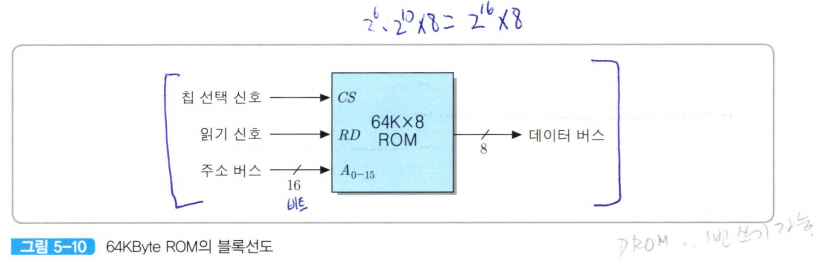

# ROM(Read Only Memory)
- 내용을 읽는 것만 가능, 즉 프로그램이나 변경될 수 없는 데이터를 저장
    - 시스템 초기화 및 진단 프로그램
    - 빈번히 사용되는 함수들과 서부루틴
    - 제어 유니트의 마이크로프로그램

프로그램이나  데이터가 영구 저장되므로 보조저장장치로부터 매번 이동시킬 필요가 없기 때문에 액세스 시간이 짧아진다

대부분의 컴퓨터시스템에서 RAM과 함께 주기억장치의 일부분으로서 ROM을 사용하고 있다  

  
*64K x 8비트 조직을 가진 ROM의 블록 선도*  

ROM은 읽기만 가능하기때문에 WR 신호는 필요 없고 RD 신호만 있으면 된다.  
64K = 2^16, 16비트의 주소가 입력되어야 한다.  

칩 선택 신호인 CS와 읽기(RD)신호가 활성화되면, 주소가 지정하는 기억 장소로부터 데이터가 읽혀져서 데이터 버스에 실리게 된다.  

대부분의 ROM은 데이터 출력 선이 8개인 조직을 사용하며, 용량도 바이트 단위로 표시한다.  

ROM에 저장될 내용은 제조 과정에서 미리 쓰여진다.(*그리고 그 이후에는 내용을 수정하는 것이 불가능*)  

### ROM의 제한을 완하시키기 위해 개발된 ROM
- **PROM(Programmable ROM)**: 제조 단계에서 기억 소자들에 데이터르 쓰지 않고 비워두며, 그 후에 전기적으로 데이터를 쓰는 것이 가능(*한 번만 쓸 수 있음*)
    - 이러한 행위를 프로그래밍한다고 하며 PROM프로그래머라고 부르는 특수한 장치 필요
-**EPROM(Eraasable Programmable ROM)**: 내용을 삭제할 수 있어 사용자가 내용을 여러 번 갱신 가능
    - 자외선 사용해야 함
    - 바이트 단위로 갱신
    - 칩 전체가 함께 지워짐
    - 비트 당 가격이 PROM보다 높음
- **EEPROM(Electrically Erassable PROM)**: 내용을 전기적으로 삭제할 수 있는 EPROM
    - 컴퓨터로부터 칩을 분리시킬 필요 없음
    - 데이터를 갱신할 수 있는 횟수가 수만 번 이하로 제한
- **플래시 메모리(flash memory)**: 내용을 전기적으로 삭제 가능  
    - EEPROM에 비해 매우 빠름
    - 페이지 단위로 갱신(2k 혹은 4k 바이트)  
        - 기존의 내용을 갱신하기 위해서는 먼저 해당 페이지를 삭제해야 함, 삭제는 64개의 페이지들로 구성되는 블록 단위로만 가능하기 ㄸ문에 블록 내의 다른 페이지들을 임시 장소로 이동시켜두어야 하는 어려움이 있음
    - 횟수 제한이 있지만 EEPROM보다 많음 
    