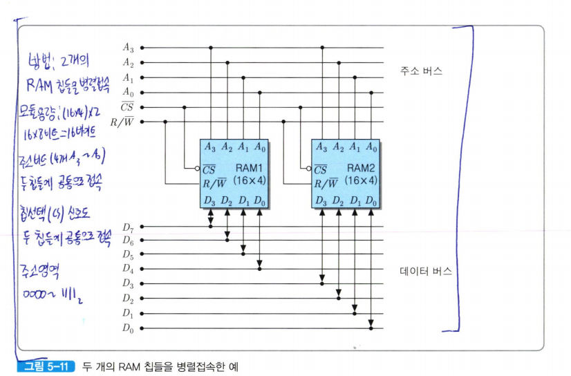
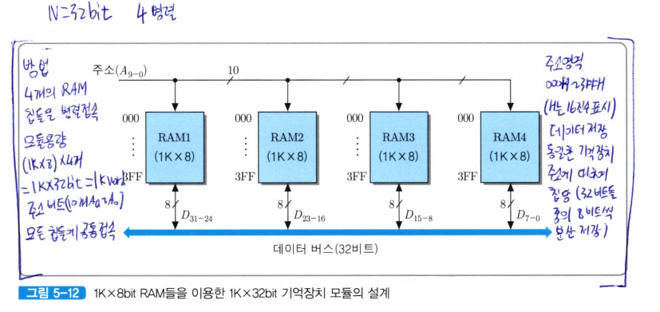
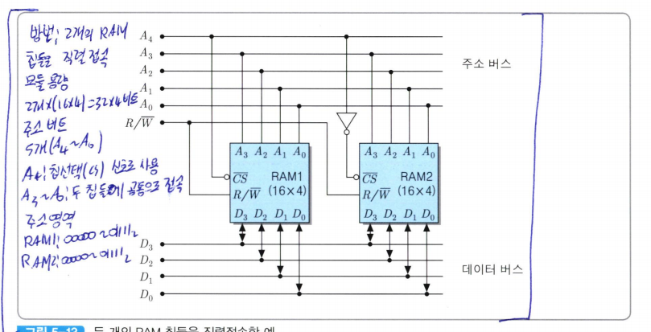
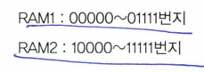
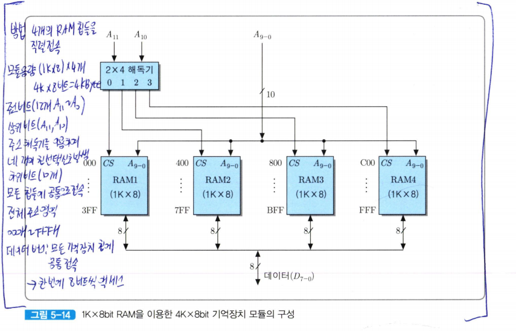
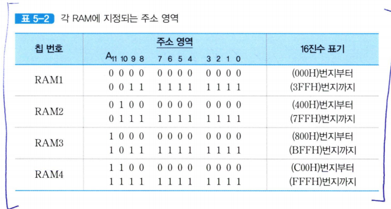
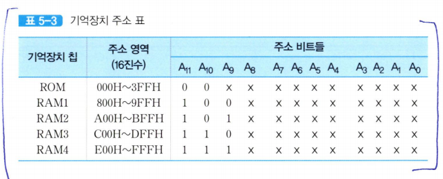
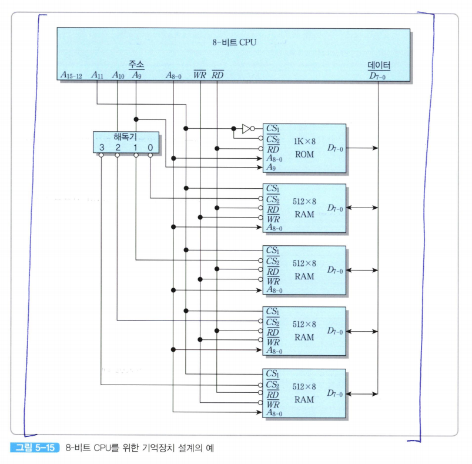

# 기억장치 모듈의 설계  

칩의 각 기억 장소에 저장되는 비트 수가 일반적으로 컴퓨터의 단어 길이보다 적기 때문에, 여러 개의 칩들을 병렬로 접속해야 한다.  
  
단어 길이가 N비트이고 기억장치 칩의 데이터 입출력 비트 수가 B개일 때, 한 번에 한 단어씩의 데이터 액세스가 가능하도록 하기 위해서는 N/B개의 칩들로부터 동시에 B비트식 액세스 할 수 있어야 한다.  

그렇게 하기 위해서는 기억장치 칩들을 병렬로 접속해야 한다.  

예시1
--
단어 길이가 8비트인 컴퓨터에서 두 개의 16 x 4bit RAM 칩들을 이용하여 기억장치를 구성한다면, 그 칩들을 병렬로 접속하여 한 번에 8비트씩 읽기/쓰기가 가능하도록 해야 한다.  

병렬접속을 위해서는 그림 5-11과 같이 모든 주소 비트들(A_3~A_0)을 두 칩에 공통적으로 인가하며, 칩 선택(CS)신호도 같은 것을 접속한다.  
그렇게 되면 두 RAM 칩에서 동일한 위치에 있는 기억 장소들에게 같은 주소가 배정된다.  

즉, 이 예의 경우에 두 칩의 첫 번째 기억 장소들에게 모두'0000'번지가 배정되며, 다음 기억 장소에는 '0001', ..., 그리고 마지막 기억 장소에는 '1111'번지가 배정된다.  

결과적으로, 전체 주소 영역은 0000~1111번지가 된다.  

RAM1의 데이터 입출력 선들은 상위 데이터 버스 선들(D_7~D_4)과 접속하고, RAM2의 데이터 선들은 하위 데이터 버스 선들(D_3~D_0)과 접속한다.  
이와 같이 구성하게 되면, 어던 한 기억 장소가 선택되었을 때 각 칩에서 4비트씩, 전체적으로 8-비트 데이터가 동시에 입력 혹은 출력되는 것이다.  

예시2
--
  
단어 길이가 32비트인 컴퓨터의 기억장치 모듈을 내부 죅이 1K x 8비트인 RAM 칩들을 이용하여 구성해보기로 하자. 즉, 각 읽기/쓰기 동작 대마다 32비트씩의 데이터가 액세스되는 기억장치 모듈을 칩당 8비트씩 입출력되는 RAM들을 이용하여 설계하는 것이다.  

그림과 같이 32/8=4개의 RAM 칩들을 병렬로 접속하면 된다.  
(*이 그림에서는 제어 시호들을 생략하였으며, 주소 및 데이터 비트들도 간략히 표기하였다*)  

그렇게 접속하면, 모듈 내의 모든 칩들에 같은 주소를 가진 기억 장소들이 한 개씩 존재하게 된다.  

이 경우에 각 주소에 저장될 32비트 데이터 중에서 최상위 8비트(D_31~D_24)는 그림 5-12의 맨 좌측 칩에 저장하고, 그 다음 칩들에 순서대로 D_23~D_16, D_15~D_8, 그리고 맨 우측 칩에 최하위 비트들인 D_7~D_0를 각각 저장하면 된다.  

이 예에서 각 단어의 길이는 4바이트이므로, 기억장치의 전체 용량은 (1K x 8bit) x 4개 =32Kbit=4KByte= 1Kword가 된다.  
10개의 주소선들(A_9 ~ A_0)이 모든 칩들에 공통으로 연결되기 때문에, 칩들의 같은 위치에 있는 기억 장소들은 동일한 주소를 가지게 되는 것.  

다라서 어떤 주소가 인가되면 그 주소에 해당하는 기억 장소가 네 개의 RAM 칩들에 모두 존재하기 때문에, 각 칩 당 9비트식, 전체 32-비트 단어에 대한 쓰기(혹은 읽기) 동작이 한 번에 수행될 수 있는 것이다.  

주소 영역을 보면 모든 칩들의 첫 번째 기억 장소는 0번지이며, 마지막 기억 장소의 주소는 3FFJ번지이다  
(*여기서 3FF는 10비트의 2진수 비트 배열인 11111111111을 4비트씩 묶어서 각각 16진수로 변환한 표현이며 H는 앞의 숫자들이 16진수라는 것을 가리키는 표기이다*)  

직렬접속을 이용하여 기억 장소의 수 확장
--
  
두 개의 16 x 4bit RAM 칩들을 이용하여 32x4bit 기억장치 모듈을 구성한다면, 그 칩들을 직렬로 접속하면 된다.  
(*이 경우에는 전체 기억 장소의 수가32개이기 땜ㄴ에 주소 비트는 다섯 개가 필요하다*)  

그림 5-13에서와 같이 최상위 주소 비트인 A_4를 RAM1의 바 CS 핀으로 인가하고, 그 비트를 반전시킨 값을 RAM2의 바 CS 핀으로 연결한다. 그런ㄷ 그림에서 보는 바와 같이 바 cs 신호는 'active low'이기 때문에, 그 값이 `0`일 때 해당 칩이 선택된다.  

A_4=0일 때는 RAM1이 선택되고, A_4=1일 때는 RAM2가 선택된다. 그리고 하위 주소 비트들(A_3~A_0)은 두 RAM 칩들에 공통적으로 접속하여 칩 내부의 기억 장소들에 대한 주소를 지정하도록 한다.  
  

전체 32개 기억 장소들의 주소는 00000번지부터 11111번지가 배정되었다.  
RAM 칩의 데이터 입출력 선들을 데이터 버스 선들(D_3~D_0)과 공통으로 접속하게 되면, 각 주소가 인가될 때마다 해당 기억 장소가 위치ㅏㄴ RAM 칩으로부터 4비트씩 읽혀지거나 쓰여진다.  

1K x 8bit RAM 칩들을 이용하여 4K x 8bit의 기억장치 모듈 구성하기
--
  
이 기억장치 모듈에서는 읽기 및 쓰기 동작이 8비트씩 이루어지므로, 각 기억장치 주소에 대하여 RAM 칩이 한 개씩만 선택되도록 하면 된다.  

전체 용량이 4KByte가 되도록 하기 위해서는 모든 RAM 칩들이 순차적인 주소 영역을 가지도록 해야 한다.  
(*네 개의 RAM 칩들을 직렬로 연결하면 됨*)  

RAM 칩의 수가 모두 네 개이므로, 칩의 구분을 위해 CS 신호를 그 수만큼 발생해야 한다.  
최상위의 두 비트들(A_11, A_10)을 2 x4 해독기로 접속하여, 네 개의 CS 신호들을 발생시킨다.  

해독기의 첫 번째 출력은 RAM1의 CS입력으로 연결하고, 두 번째 출력은 RAM2, 세 번째 출력은 RAM3, 그리고 네 번째 출력은 RAm4로 각각 연결한다.  

  
*H는 해당 수가 16진수라는 것을 가리킨다*  

### ROM과 RAM들로 구성된 주기억 장치를 가진 간단한 마이크로컴퓨터 설계
1. 컴퓨터에 필요한 전체 기억장치 용량을 결정한다
2. 사용가능한 칩들을 조사하고, 그들에 대한 주소 표(address table)를 작성한다
3. 세부적인 회로를 설계한다.  

*이제부터 설계할 마이크로컴퓨터는 아래의 사항을 지킨다고 가정*
*단어 길이는 8비트, 1KByte의 ROM과 2KByte의 RAM으로 구성된 주기억장치*    
*시스템 초기화 및 OS 프로그램이 저장되는 ROM들의 주소는 0번지부터 시작*  
*RAM의 주소는 800H번지부터 시작*  
*사용할 수 있는 칩들로는 네 개의 512 x 8bit RAM들과 한 개의 1K x 8bit ROM*  

  
*X는 0이나 1 중의 어느 값이든 가질 수 있다는 표시*  
*ex) RAM1의 경우에 하위 9비트 모두가 0이면 첫 번째 기억 장소의 주소가 되고, 모두 1이면 마지막 기억 장소의 주소, 그리고 0과 1이 조합된 주소들은 그 사이의 다른 기억 장소들의 주소가 된다*  
*주소 영역들은 각 칩에 할당되는 시작 주소와 마지막 주소를 표싷주고 있다*  

CPU로부터 발생되는 주소는 모두 16비트이지만, 이 용량의 기억장치시스템에 주소를 지정하기 위해서는 그 주소 비트들을 모두 사용할 필요는 없다.  

ROM의 용량은 1KByte이므로 10개의 주소 비트들(A_9~A_0)이 입력되어야 한다.  
반면에, 각 RAM 칩은 용량이 512바이트기 때문에 주소가 9비트이면 되지만, 전체 RAM 용량은 2KByte이므로 11비트의 주소가 필요하다.  
그 주소의 상위 두 비트(A_10,A_9)는 네 개의 RAM 칩들을 구분하는데 사용된다.  

ROM과 RAM들의 시작 주소가 각각 0번지와 800H이기 때문에 표 5-3을 자세히 살펴보면 주소 비트 A_11의 값이 ROM의 주소에서는 0이고 RAM들의 경우에는 모두 1이 된다는 것을 알 수 있다.  

따라서 ROM과 RAM을 구분하는 칩 선택 신호로 A_11을 사용할 수 있다. 결과적으로, 전체적으로 필요한 주소 비트들은 A_11부터 A_0까지의 12비트이며, 그 보다 상위 비트들 (A_15~A_12)은 사용되지 않으므로 모두 0으로 세트하면 된다.  

  
ROM 및 RAM 칩들이 주소 버스와 데이터 버스를 통하여 CPU와 접속된 모습을 보여주고 있다.  
먼저, ROM으로는 주소의 하위 10비트들이 공급되어서 2^10=1024바이트=1K개의 바이트들 중의 하나를 선택하게 된다.  

RAM 칩들은 각각 512개의 기억 장소들을 가지고 있으므로, 주소의 하위 9비트들(A_8~A_0)을 공통으로 연결해주면 된다.  

각 칩이 칩 선택 신호를 두 개씩(CS_1과 바 CS_2)가지고 있으며, CS_1는 1 일때 활성화되고, 바 CS_2는 0일 때 활성화된다는 점이다.  

ROM은 A_11=0일 때 선택되고, RAM은 A_11 =1일 때만 선택된다.  
A_11을 ROM 칩의 바 CS_2와 RAM칩의 CS_1으로 각각 연결하고, 인버터를 통과시킨 다음에는 ROM의 CS_1으로 접속한다면, ROM은 별도의 해독기 없이도 RAM과 구분되어 칩 선택이 가느해지게 된다.  

네 개의 RAM들 각각에 대한 구분은 두 개의 주소 비트들(A_10,A_9)에 의해 이루어진다.  
그 두 비트를 2 x 4 해독기로 입력시켜 네 개의 출력들을 발생하고, 그들을 각 칩의 바CS2 신호로 사용하고 있다.  

그 결과, A_10,A_9 = '00'이면 첫 번째 RAM이 선택되고, '01'이면 두 번째 RAM, '10'이면 세 번째 RAM, 그리고 '11'이면 네 번째 RAM이 각각 선택된다.  

CPU로부터 발생되는 바RD 및 바 WR 신호도 일반적으로 active-low 신호이며,  
모든 RAM 칩들로 연결되어 읽기 혹은 쓰기 동작을 선택해준다.  그리고 ROM 칩으로는 바 RD 신호만 연결하면 된다.  

모든 기억장치 칩들의 데이터 입출력 선들이 8개씩이므로, 그들은 모두 데이터 버스에 공통적으로 연결된다.  

