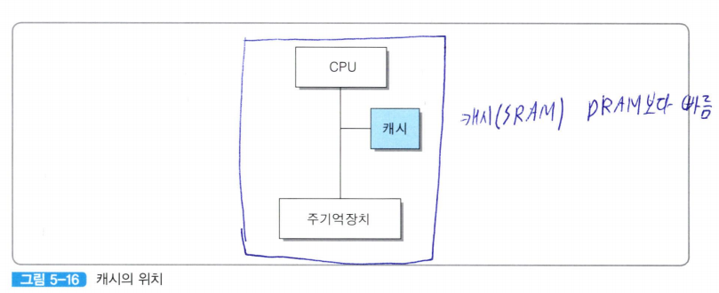
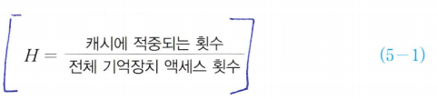
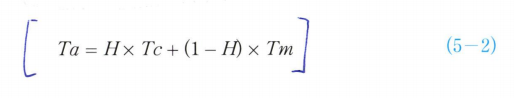
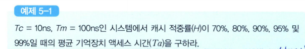
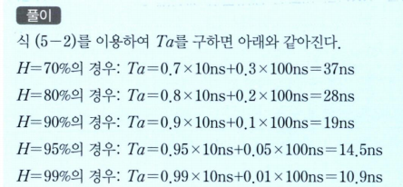

# 캐시 메모리  
  
캐시는 CPU 칩과 인접한 곳에 위치하며, CPU 칩 내부에 포함되기도 한다.  
명령어와 데이터를 별도의 캐시에 분리하여 저장하며, 여러 레벨의 계층적 캐시로 구성하는 방법도 널리 사용되고 있다.  

캐시로는 고속의 반도체 기억장치 칩들을 사용하기 때문에, 캐시 액세스 시간이 주기억장치 액세스 시간보다 상당히 더 짧다.  

칩의 가격이 그만큼 더 높아지고 설치할 수 있는 공간도 제한되기 때문에, 캐시의 용량은 일반적으로 주기억장치의 용량에 비해 훨씬 더 적다.  

CPU가 기억장치로부터 어떤 데이터를 읽으려고 할 때는 먼저 그 데이터가 캐시에 있는 지 검사한다. 만약 있다면, 데이터를 즉시 CPU로 인출할 수 있기 때문에 액세스 시간이 크게 단축된다.  

그러나 만약 없다면, 그 데이터를 주기억장치로부터 인출해야 하기 때문에 더 오랜 시간이 걸린다.  

주기억장치로부터 인출되어 CPU에 의해 사용되는 데이터는 캐시에도 적재된다.  
프로그램 수행이 진행되는 동안에 그러한 과정은 데이터뿐 아니라 명령어들에 대해서도 반복되며, 결과적으로 어느 정도 시간이 경과한 후에는 주기억장치의 내용 중에서 CPU가 한 번 이상 액세스하였던 많은 부분들이 캐시에 복사되어 있는 상태가 된다.  

이와 같이 CPU가 프로그램 코드나 데이터를 처음으로 액세스할 때는 주기억장치로부터 직접 읽어와야 하지만, 일단 캐시에 적재되어 있는 프로그램 코드나 데이터가 CPU에 의해 다시 사용될 때는 캐시로부터 신속히 읽어올 수 있다.  

CPU가 원하는 데이터가 이미 캐시에 적재되어 있는 상태를 **캐시 적중(cache hit)**이라고 한다.  
반대로, CPU가 원하는 ㄷ이터가 캐시에 없는 상태를 **캐시 미스(cache miss)**라고 한다.  
기억장치 액세스들 중에서 캐시에 적중되는 비율을 나타내는 **캐시 적중률(cache hit ratio)** H는 아래와 같다.  
  

캐시 적중률은 CPU가 원하는 데이터가 캐시에 있을 확률이라고 말할 수 있다.  
캐시에 없을 확률인 **미스율(miss ratio)**은 (1-H)가 된다.  
캐시가 사용되는 시스템에서 **평균 기억장치 액세스 시간 Ta는 다음 식을 이용하여 계산할 수 있다.  
  

Tc는 캐시 액세스 시간이고, Tm은 주기억장치 액세스 시간을 나타낸다.  
주기억장치로부터 인출된 데이터는 일단 캐시에 적재된 다음에 다시 인출되어 CPU로 전송되기 때문에, 그 ㅋ시 인출 시간을 별도로 고려한다면 식 5-2에서 두 번째 항이 (1-H) x (Tm + Tc)로 표현되어야 한다.  

그러나 TM이 Tc에 비하여 상대적으로 큰 값이기 때문에, Tm에 그 시간도 모두 포함된 것으로 간주하여 일반적으로 식 5-2와 같이 표현한다.  

그리고 캐시 미스의 경우에도 적중 여부를 검사하는 시간은 소모되지만.  
상대적으로 짧기 때문에 무시하였다.  

 문제 
 --

풀이
--
  

예제 5-1에서 보는 바와 같이, 캐시 적중률이 높아질수록 평균 액세스 시간은 캐시의 액세스 시간에 접근하게 된다.  

캐시 적중률이 높아질수록 캐시 사용의 효과가 더 커진다는 사실을 보여주는 것이다.  

캐시 적중률은 프로그램과 데이터의 **지역성**에 크게 의존한다.  

### 지역성의 분류
- **지역성**: CPU가 주기억장치의 특정 부분에 위치한 프로그램 코드나 데이터를 빈번히 혹은 집중적으로 액세스하는 현상  
- **시간적 지역성(temporal locality)**: 최근에 액세스된 프로그램 코드나 데이터가 가까운 미래에 다시 액세스될 가능성이 높아지는 특성  
*(반복 루프 프로그램, 서브루틴, 공통 변수)*
- **공간적 지역성(spatial locality)**: 기억장치 내에 서로 인접하여 저장되어 있는 데이터들이 연속적으로 액세스될 가능성이 높아지는 특성  
*(표나 배열 데이터들이 저장되어 있는 기억장치 영역은 그들에 대한 연산이 수행되는 동아네 집중적으로 액세스)*  
- **순차적 지역성(sequential locallity)**: 분기가 발생하지 않는 한, 명령어들은 기억장치에 저자오딘 순서대로 인출되어 실행된다.  
*(일반적인 프로그램에서는 순차적 실행과 비순차적 실행의 비율이 대략 5:1 정도)*  

### 캐시 설계에 있어 공통적인 목표
- 캐시 적중률의 극대화
- 캐시 액세스 시간의 최소화
- 캐시 실패에 따른 지역시간의 최소화
- 주기억장치와 캐시간의 데이터 일관성 유지 및 그에 따른 오버헤드의 최소화: CPU가 캐시의 내용을 변경하였을 때, 주기억장치에 그 내용을 갱신하는 절차 때문에 발생하는 지연 시간을 최소화시켜야 한다.  

