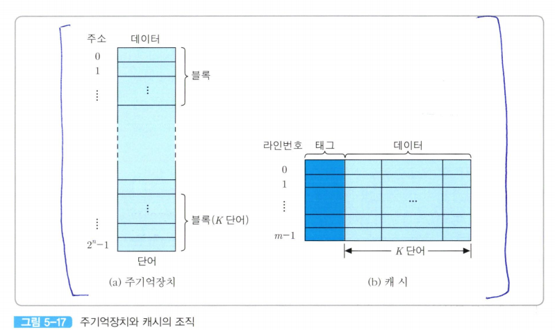

# 캐시 용량
캐시의 크기가 커질수록 적중룔 높음 -> 비용도 높음, 주소 해독 및 정보 인출을 위한 주변회로가 더 복잡해짐  
*캐시 용량은 칩 혹은 주기판의 공간에 의해서도 제한을 받음*  

# 인출 방식

- **요구 인출(demand fetch)**: 필요한 정보만 인출해 오는 방법  
- **선인출(prefetch)**: 필요한 정보 외에 앞으로 필요할 것으로 예측되는 정보도 미리 인출해오는 방법  
    - CPU가 원하는 정보를 인출할 때 그 정보와 근접한 위치에 있는 정보들을 함께 인출하여 캐시에 적재
    - 지역성에 의해 연속적으로 액세스될 가능성이 많음 -> 캐시 적중률 높일 수도
    - 지역성 높으면 좋지만 그렇지 않다면 인출 시간 때문에 비효율적
이와 같이 주기억장치를 액세스할 때 함께 인출되는 정보들의 그룹을 **블록(block)**이라 함  
    - 일반적으로 블록의 크기는 2~4단어 정도가 최적

  

주기억장치는 2^n개의 단어(word)로 구성되며, 각 단어는 n비트의 주소에 의해 지정된다.  

선인출을 위하여 주기억장치를 K개의 단어들로 이루어진 블록으로 나눌 경우에 전체 블록들의 수는 2^n /K개가 된다.  

캐시는 m개의 **라인(line)**들로 구성되는데, 각 라인에는 주기억장치 블록과 같은 크기인 K개의 단어들로 저장된다.  
- 따라서 라인의 크기는 주기억장치 블록의 크기와 같아야 한다.  
- 선인출 방식이면 CPU가 주기억장치에서 읽은 단어가 포함된 블록 전체가 캐시 라인들 중에 하나로 적재됨

캐시의 각 라인은 여러 개의 블록들에 의해 공유된다.  
그렇기 때문에 각 캐시 라인에는 데이터 블록 외에도 현재 자신을 공유하는 블록들중의 어느 것이 적재되어 있는 지를 구분해주는 **태그(tag)**가 저자오디어 있어야 한다.  

