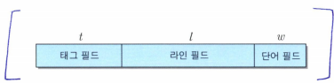
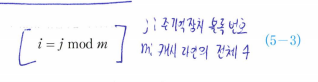
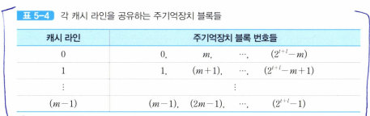
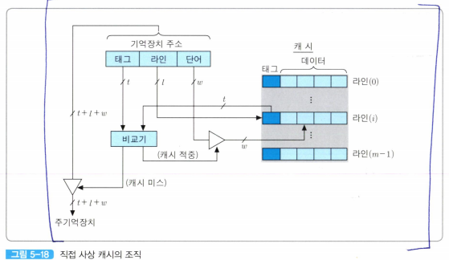
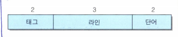
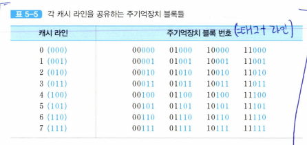
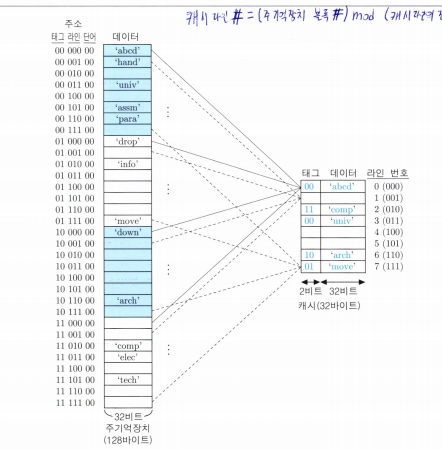
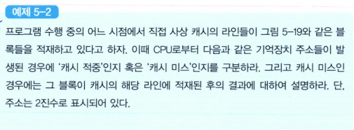
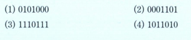
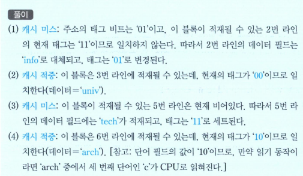

# 사상 방식
어떤 주기억장치 블록들이 어느 캐시 라인을 공유할 것인지를 결정해주는 방법이 필요하다.  
그 방법을 주기억장치와  캐시 간의 **사상 방식(mapping scheme)**라고 하는데, 캐시 적중률에도 많은 영향을 미친다.  

### 직접 사상
  

주기억장치의 블록들이 지정된 어느 한 캐시 라인으로만 사상될 수 있다.  
즉, 각 블록은 지정된 라인에만 적재될 수 있다.  

이 주소의 상위(t+*l*) 비트들은 주기억장치의 2^t+*l*개의 블록들 중의 하나를 지정해준다.  

그리고 최하위 w비트들은 2^w개의 단어들로 구성된 각 블록 내의 단어들을 구분하는 데 사용된다.  

캐시 제어기는 최상위 t개의 비트들을 태그(tag) 번호로 해석하고,  그 다음 *l*개의 비트들은 라인 번호로 해석한다.  
라인 번호는 캐시의 m = 2^*l*개의 라인들 중에서 그 블록이 적재될 수 있는 라인을 지정해준다.  

*태그 번호는 같은 캐시 라인을 공유하는 주기억장치 블록들을 서로 구분하는데 사용된다*  

주기억장치의 블록 j가 적재될 수 있는 캐시 라인의 번호 i는 식 5-3과 같은 모듈로(modulo)함수의 의해 결정된다.  
  

예를 들어 캐시 라인의 수 m=4라면, 주기억장치의 여섯 번째 블록(j=6)은 6 mod 4 =2이므로 캐시의 2번 라인에 적재될 수 있다.  

식 5-3을 적용하면, 각 캐시 라인에 적재될 수 있는 주기억장치 블록들은 표 5-4와 같아진다.  

즉, 각 캐시 라인은 2^t개의 블록들에 의해 공유된다.  

따라서 어떤 블록이 지정된 라인에 적재되었을 때, 그 라인을 공유하는 다른 블록들과 구분될 수 있도록 하기 위하여 그 블록에 태그를 붙여야 한다.  
주기억장치 주소의 태그 필드 비트들이 그 용도로 사용된다.  

결과적으로, 캐시의 각 라인에는 태그와 데이터 블록들이 함께 저장되며, 캐시 적중 여부는 주소의 태그 비트들과 라인에 저장된 태그 비트들을 비교함으로써 결정된다.  

  

### 읽기 동작 순서
1) 캐시로 기억장치 주소가 보내진다.
2) 그 주소 비트들 중에서 라인 필드의 *l*비트들에 의해 캐시의 해당 라인이 선택된다.  
3) 선택된 라인의 태그 비트들이 읽혀져서 주소의 태그 비트들과 비교된다.  
4) 두 태그값이 일치하면(캐시가 적중되면) 주소의 최하위에 있는 w개의 비트들을 이용하여 라인 내의 단어들 중에서 하나가 선택된다.
5) 그 단어는 인출되어 CPU로 보내진다.  
6) 태그값이 일치하지 않는다면(캐시 미스) 기억장치 주소 전체가 주기억장치로 보내져서 한 블록을 인출한다
7) 인출된 블록은 지정된 캐시 라인에 적재되며, 주소의 태그 비트들이 그 라인의 태그 필드에 저장된다.
8) 만약 그 라인을 공유하는 다른 블록이 이미 그 라인에 적재되어 있는 상태라면, 원래의 블록은 지워지고 새로이 인출된 블록이 적재된다(태그도 갱신)  

예시
--
- 주기억장치의 용량은 128비트, 따라서 주기억장치의 주소는 7비트이며, 바이트 단위로 주소가 지정된다
- 단어의 길이는 한 바이트인 것으로 가정
- 주기억장치의 블록 크기를 4단어(즉, 4바이트)로 한다. 따라서 블록의 수는 128/4 =32개
- 캐시의 크기는 32바이트
- 주기억장치의 블록 크기가 4바이트이므로 캐시 라인의 크기도 4바이트가 되어야 하며, 결과적으로 아인의 수 m =32/4 =8개  

이 예의 경우에 블록 내의 단어 수가 네 개이기 때문에 각 단어를 구분하기 위하여 w =2비트가 필요하고, 라인의 수(m)가 8개이므로 *l* =3비트, 그리고 태그 필드(t)는 나머지 2비트가 된다.  

결과적으로 기억장치 주소(7비트)의 각 필드는 다음과 같이 구성된다.  

  

이 예에서 캐시 랑니의 수 m=8이므로, 각 기억장치 블록이 공유하게 될 캐시 라인의 번호는 i = jmod 8에 의해 결정된다.  
따라서 직접 사상 방식을 적용했을 때 각 캐시 라인에 적재될 수 있는 주기억장치 블록들은 표 5-5와 같아진다.  
  

표에서 2진수로 표현된 블록 번호는 그 블록에 대한 기억장치 주소의 상위 5비트에 해당한다.  

각 블록은 네 개의 단어로 구성되므로, 블록 번호의 우측에 '00'을 추가하면 해당 블록의 첫 번째 단어의 주소가 된다.  

표에서 보면, 각 캐시 라인을 공유하는 블록 번호의 하위 세 비트는 주기억장치 주소에서 라인 필드에 들어가는 비트들로서, 해당 캐시 라인 번호를 나타내는 비트들과 동일하다는 것을 알 수 있다.  

예시
--
0번 라인을 공유하는 블록들의 하위 세 비트는 모두'000'이며, 1번 라인을 공유하는 블록들의 하위 세 비트는 모두 '001'이다.  
즉, 블록 번호에는 그 블록이 적재될 수 있는 라인의 번호가 포함되어 있으며, 같은 라인을 공유하는 블록들은 동일한 라인 번호를 가지고 있는 것이다.  

같은 라인을 공유하는 블록 번호들도 상위 두 비트(태그)는 각각 '00','01','10' 및 '11'로서 서로 다른데, 이 비트들이 캐시 라인의 태그 부분에 저장되어, 네 개의 블록들 중 어느 것이 현재 캐시에 저장되어 있는지를 구분해주는 것이다.  

또한, 같은 태그값을 가진 8개의 블록들이 서로 다른 라인에 적재된다는 것도 표에서 확인할 수 있다.  

*그림 5-19 직접사상의 예*

위 그림은 이 예에  직접 사상 방식을 적용한 경우의 기억장치 조직을 보여주고 있다. 주기억장치는 동일한 태그값을 가지는 블록들로 이루어진 네 개의 그룹으로 나눌 수 있다.  

각 그룹은 8개의 블록들로 이루어지며, 각 블록에는 네 단어(이 예에서는 4바이트)씩 저장된다.  
7-비트 길이의 주기억장치 주소는 각 블록의 첫 번쨰 단어가 저장된 위치를 가리키기 때문에, 마지막 두 비트는 모두 '00'이다.  

예를 들어, 첫 번째 블록에 저장된 네 단어들의 주소는 각각 0000000, 0000001, 0000010 및 0000011이지만, 그림에는 첫 번쨰 단어의 주소만 표시되어 있다.  

블록 내의 각 단어들은 주소의 단어 필드인 마지막 두 비트에 의해 구분된다.  

각 그룹의 첫 번쨰(라인 필드 값이 '000'인) 블록들 네 개는 0번 캐시 라인을 공유하며, 두 번쨰(라인 필드 값이 '001'인) 블록들은 1번 라인, 그리고 마지막 여덟 번쨰(라인 필드 값이 '111'인) 블록들은 7번 라인을 공유한다.  

이러한 공유 관계는 표 5-5에서와 마찬가지로 이 그림에서도 각 기억장치 주소의 두 번쨰 필드인 라인 비트들과 해당 캐시 라인의 번호를 나타내는 비트들이 동일하다는 것을 통하여 다시 확인될 수 있다.  

또한 그림 5-19는 프로그램 수행 중의 실제 예로서 몇몇 블록들에 데이터가 네 단어(32비트)씩 저장되어 있고, 그들 중의 몇 개는 이미 해당 캐시 라인들에 적재되어 있는 상태를 보여주고 있다.  

여기서는 ASCII 코드와 패리티 비트로 이루어진 8-비트 단어로 표현되는 문자(character) 네 개씩이 각 블록에 저장되어 있는 것으로 가정  

예시
--
주기억장치 0000000번지에 위치한 32-비트 블록에 저장되어 이ㅛ는 네 문자 'abcd'가 캐시의 0번 라인에 적재되어 있고, 주소의 최상위 두 비트인 '00'이 라인의 태그 필드에 함께 저장되어 있다.  

또한 2번 라인에는 주기억장치 0000000번지에 위치한 32-비트 블록에 저장되어 있는 네 문자'abcd'가 캐시의 0번 라인에 적재되어 있고, 주소의 최상위 두 비트인 '00'이 라인의 태그 필드에 함께 저장되어 있다.  

또한 2번 라인에는 주기억장치 1101000번지 블록의 'comp'가 적재되어 있고, 태그 필드에는 '11'이 저장되어 있다.  
현재 캐시 라인들 중에서 다섯 개는 채워져 있고, 1번과 4번 및 5번 라인은 비어있는 상태  

### 문제
  
  
### 풀이
  

직접 사상 방식은 간단하고, 구현하는 비용이 적게 든다는 장점을 가지고 있다.  

단점은 각 주기억장치 블록이 적재될 수 있는 캐시 라인이 한 개뿐이라는 점이다.  

만약 어떤 프로그램의 수행 과정에서 같은 라인에 사상되는 두 개의 블록들로부터 데이터들을 번갈아 읽어와야 한다면, 그 블록들은 캐시에서 반복적으로 교체될 것이고, 결과적으로 적중률이 낮아진다.  
