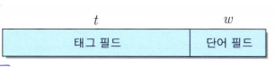
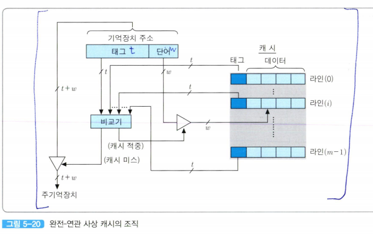
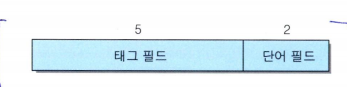
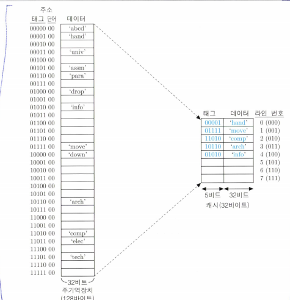
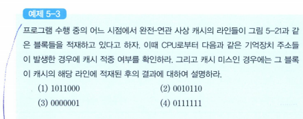
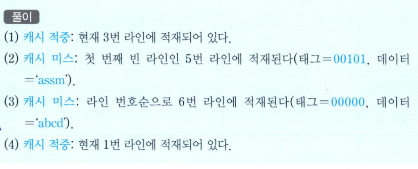

### 완전-연관 사상
**완전-연관 사상(fully-associative mapping) 방식은 주기억장치 블록이 캐시의 어떤 라인으로든 적재될 수 있도록 허용함으로써 직접 사상 방식의 단점을 보완하고 있다.  

  
결과적으로, 태그값이 주기억장치 블록 번호와 같아진다.  
따라서 캐시로 적재될 떄, 그 주소의 태그 필드의 모든 비트들이 그 라인의 태그 부분에 저장되어야 한다.  

이 방식에서는 주기억장치 블록이 캐시의 어떤 라인에든 적재될 수 있으므로, 캐시 적중 여부를 검사할 떄는 캐시의 모든 라인들의 태그들과 주기억장치 주소의 태그 필드 내용을 비교하여 일치하는 것이 있는 지 확인해야 한다.  

만약 일치하는 라인이 있다면 캐시가 적중된 것이므로, 단어 필드의 값을 이용하여 그 라인에 저장되어 있는 단어들 중의 하나를 인출하여 CPU로 전송한다.  

그러나 만약 태그가 일치하는 라인이 없다면, 캐시 미스가 발생한 것이다.  

이 경우에는 주소를 주기억장치로 보내어 해당 단어가 포함된 블록을 인출해 온다.  

  

그림은 이 방식을 위한 캐시 조직을 보여주고 있다.  

그림에서 보는 바와 같이 기억장치 주소의 태그 비트들은 모든 캐시 라인의 태그들과 비교되어야 한다.  
그런데 이 비교를 하나씩 순차적으로 수행하면 많은 시간이 걸릴 것이므로, **연관 기억장치** 등을 이용하여 비교 동작이 병렬로 신속히 이루어질 수 있도록 하드웨어가 구성되어야 한다.  

만약 어떤 라인의 태그값도 일치하지 않는다면, 그것은 캐시 미스를 의미하므로 주기억장치 액세스가 시작된다.  
그렇지 않다면(즉, 캐시가 적중하였다면), 단어 필드의 값을 이용하여 그 라인으로부터 한 단어를 인출하여 CPU로 보낸다.  

이 방식에서는 주기억장치로부터 인출된 데이터 블록을 캐시의 어느 라인에 적재할 것인지를 결정해야 한다.  

캐시에 빈 라인들이 있다면, 라인 번호에 따라 차례대로 적재하면 된다.  

그런데 만약 비어 있는 라인 없이 캐시가 완전히 채워진 상태일 때 새로운 블록이 인출되어 온다면, 적절한 교체 알고리즘을 이용하여 라인들 중의 하나를 선택한 다음에 새로운 블록을 적재해야 한다.  

이떄 그 라인에 먼저 적재되어 있던 블록은 지워지게 된다.  
따라서 만약 그 블록이 캐시에 적재되어 있던 동안에 새로운 내용으로 변경된 적이 있었다면, 그 블록을 주기억장치에 갱신(update)한 다음에 새로운 블록을 그 라인에 적재해야 한다.  

### 교체될 라인을 선택하는 방법
- 적재된 지 가장 오래된 블록이 저장되어 있는 라인을 선택
- 최근에 액세스된 횟수가 가장 적은 라인을 선택

  
앞 절의 직접 사상에서 사용하였던 예(주기억장치의 용량이 128바이트고 캐시의 용량이 32바이트인 경우)에 완전-연관 사상 방식을 다시 적용해본다면, 7-비트 길이의 기억장치 주소는 다음과 같이 두 개의 필드로 나누어진 것으로 해석된다.  

즉, 주기억장치의 주소는 5-비트 태그 필드와 2-비트 단어 필드로 구성된다.  

  
*그림 5-21 완전-연관 사상의 예*  

그림 5-21은 완전 -연관 사상을 적용한 기억장치 조직과 실제 몇몇 블록들이 캐시에 적재되어 있는 예를 보여주고 있다. 앞에서 설명한 바와 같이 주기억장치 블록들은 비어있는 어느 캐시 라인에든 적재될 수 있으며, 5-1ㅣ트 태그가 캐시의 각 라인에 32-비트 데이터 블록과 함꼐 저장된다는 것을 확인할 수 있다.  

그림 5-21에서 현재 캐시에 적재되어 있는 블록들은 다음과 같다.  
0번 라인에는 0000100번지의 블록(data ='hand'), 1번 라인에는 0111100번지의 블록(data='move'). 2번 라인에는 1101000번지의 블록(data ='comp'). 3번 라인에는 1011000번지의 블록(data='arch'). 그리고 4번 라인에는 0101000번지의 블록(data='info')이 각각 적재되어 있따.  

각 라인의 태그 부분에는 주소의 단어 필드(2비트)를 제외한 상위 5비트가 저장되어 있어서, 어느 블록이 적재되어 있는 지를 가리키고 있다. 여기서 캐시에 적재된 블록들의 주소와 그들이 적재된 라인들의 번호 사이에는 아무런 상관이 없다는 것을 알 수 있다.  

이 시점에서는 0번 라인부터 4번 라인까지 채워져 있고, 아래 세 개의 라인들은 비어있는 상태이다. 이때 만약 새로운 블록이 캐시로 적재된다면, 비어있는 첫 번쨰 라인인 5번 라인이 사용된다.  

### 문제
  

### 풀이

  

완전- 연관 사상에서는 새로운 블록이 캐시로 적재될 때 라인의 선택이 자롭기 때문에,  
프로그램 세그먼트나 데이터 배열 전체가 캐시로 적재될 수도 있다.  

만약 지역성이 높다면, 적중률이 매우 높아질 것이다.  
그러나 완전-연관 사상 방식은 모든 태그들을 병렬로 검사하기 위하여 복잡하고 비용이 높은 하드웨어를 포함해야 한다는 결정적인 단점이 있어 실제로는 거의 안쓰임  

