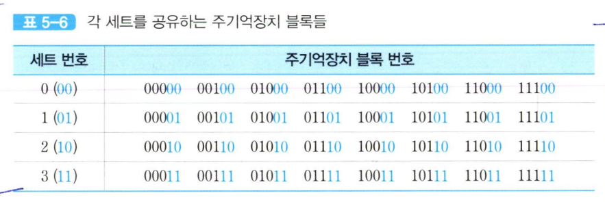
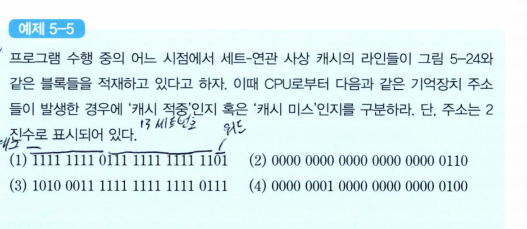
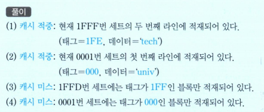

# 세트-연관 사상
**세트-연관 사상(set-associative mapping)** 방식은 직접 사상 방식과 완전-연관 사상 방식의 장점만을 취하기 위한 절충안임  

캐시는 먼저 v개의 세트(set)들로 나누어지며, 각 세트는 k개의 라인들로 구성됨  

  

따라서 전체 캐시 라인의 수 m과 그 변수들 간의 관계는 식 5-4와 같아지며, 각 주기억장치 블록이 적재될 수 있는 캐시 세트의 번호 i는 식 5-5에 의해 결정된다.  

예시
-- 
전체 캐시 용량이 32바이트이고 라인의 크기는 4바이트이므로, 라인의 수 m=32/4=8개  
만약 세트 당 두 개씩의 라인(k=2)을 둔다고 가정한다면, 세트의 수 v=8/2=4개  

결과적으로 캐시는 네 개의 세트들로 구성되고, 각 세트에는 라인이 두 개식 있는 구조가 된다.  
그리고 식 5-5를 이용하면, 주기억장치의 7번 블록은 7mod 4=3번 세트에는 두 개의 라인들이 있으므로, 그 중 한 개가 채워져 있더라도 다른 라인에 적재될 수 있다는 것이다.  

이와 같이 각 세트에 라인이 두 개가 있는 경우를 2-way 세트-연관 사상이라고 말하며, 네 개가 있는 경우를 4-2way 세트-연관 사상이라고 말한다.  

즉, 세트당 라인이 k개씩 있으면 k-way 세트-연관 사상이라고 부른다  

세트-연관 사상을 사용하면 주기억장치의 블록 B_J는 지정된 세트 i 내의 어떤 라인으로든 사상될 수 있다.  

  

이 경우에 캐시 제어회로는 주기억장치 주소ㅡㄹ 다음과 같은 세 개의 필드로 나누어 해석한다.  

여기서, s개의 세트 비트들은 캐시의 v =2^s개 세트들 중에서 해당 주기억장치 블록이 적재될 수 있는 세트를 선택하는 데 사용되고, 태그 필드의 t비트들은 그 세트 내에 있는 라인들의 태그들과 비교되어 캐시 적중 여부를 확인하는 데 사용된다.  

  
그림은 캐시의 각 세트가 두 개의 라인들로 구성된 경우, 즉 2-way 세트-연관 사상 캐시의 조직을 보여주고 있다.  

지정된 세트에 포함된 라인의 태그들과 기억장치 주소의 태그중 일치하는게 있다면(*캐시 적중*), 캐시가 적중된 것이므로 w개의 비트에 의해 그 라인 내 2^w개의 단어들 중 하나가 선택되어 인출된다.  

그러나 세트 내 어느 라인의 태그와도 일치하지 않는다면(*캐시가 미스*)됐다면 주기억장치 액세스가 시작된다.  
이 방식을 사용하면 주기억장치 블록은 지정된 어느 한 세트에 적재될 수 있다.  

그런데 각 세트에는 다수의 라인들이 있으므로, 직접 사상방식에 비하여 기억장치 블록이 적재될 수 있는 공간이 더 많아진다.  
그러나 캐시의 전체 용량은 고정되어 있기 때문에 세트의 수는 그만큼 감소한다.  

예시
--
8개의 라인들로 이루어진 캐시에서 각 세트에 2개씩의 라인을 둔다면, 세트 수는 4개가 된다.  
그러나 각 세트에 라인을 4개식 둔다면, 세트 수는 2개로 줄어들게 된다.  

앞에서 사용하였던 예에 2-way 세트-연관 사상 방식을 적용한다면, 기억장치 주소는 아래와 같이 세 개의 필드로 나누어진 것으로 해석된다.  
  

이 예에서 캐시에는 전체적으로 8개의 라인들이 있고, 라인들이 2^2=4개의 세트들로 나누어지므로, 각 세트에는 라인이 두개식 있게 된다.  
세트 필드의 2비트는 4개의 캐시 세트들 중 하나를 선택하는 데 사용된다.  
그리고 태그 필드가 3비트이므로 각 캐시 세트는 8개의 주기억장치 블록들에 의해 공유되며, 그들 중 두개가 동시에 그 세트 내에 적재될 수 있다.  

각 주기억자치 블록이 적재될 수 있는 세트의 번호는 식 5-5에 다라 j mod 4 계산에 의해 결정되며, 결과를 보면 표 5-6과 같다.
  

표를 보면, 주기억장치 블록 번호의 하위 두 비트(세트 번호)가 '00'인 블록들은 모두 0번 세트를 공유하며, '01'인 블록들은 1번 세트. '10'인 블록들은 2번 세트, 그리고 '11'인 블록들은 3번 세트를 공유한다는 것을 알 수 있다.  

그리고 각 세트를 공유하는 8개의 블록들은 앞의 세 비트들, 즉 태그값에 의해 구분될 수 있다는 것을 확인할 수 있다.  

같은 세트를 공유하는 블록들 중의 두 개는 세트 내 두 라인들 중의 어느 곳에든 동시에 적재될 수 있다.  

그림 5-23은 그와 같은 2-way 세트-연관 사상을 위한 조직과 사상(mapping)관계를 보여주고 있다.  
먼저 주기억장치는 주소의 상위 세 비트, 즉 태그 값이 동일한 네 블록씩 모두 8개의 그룹으로 나누어진다.  
1) 각 그룹의 첫 번째 블록들이 0번 세트를 공유하며
2) 두 번째 블록들은 1번 세트
3) 세 번째 블록들은 2번 세트
4) 마지막 네 번째 블록들은 3번 세트를 공유한다.  

이와 같은 세트 번호는 주소의 중간에 위치한 두 개의 세트 비트들에 의해 지정된다.  

그룹이 모두 8개이므로, 각 세트는 8개의 블록들에 의해 공유되는 것이다.  

그림 5-23에는 몇몇 블록들이 실제 캐시에 적재되어 있는 예를 보여주고 있는데,  
0번 세트의 첫 번째 라인에는 0000000번지의 블록(데이터='abcd')이 적재되어 있고, 두 번째 라인에는 0100000번지의 블록(epdlxj='drop')이 적재되어 있다.  
이때 만약 0번 세트를 공유하는 다른 블록이 캐시로 인출되어 온다면,  
적절한 교체 알고리즘에 의하여 두 라인 중의 하나를 선택한 다음에 그 라인에 새로운 블록을 적재하게 된다.  
이 경우에, 먼저 있던 블록은(*변경된 적이 있다면 주기억장치에 갱신된 다음에*)지워진다.  

1번과 3번 세트에는 현재 한 라인씩만 블록이 적재되어 있고, 다른 라인은 비어있다.  
따라서 주기억장치로부터 새로운 블록이 인출되는 경우에는 그 세트의 빈 라인으로 적재될 것이다.  

CPU에 의해 기억장치 주소가 발생되어 캐시 액세스 동작이 시작되면, 먼저 2-비트 세트 번호를 이용하여 세트를 선택한다. 그런 다음에는 그 세트 내 라인들의 태그 중에서 기억장치 주소의 태그와 일치하는 것이 있는 지 검사한다.  
만약 태그가 일치하는 라인이 있다면, 캐시가 적중된 것이므로 최하위 두 비트들을 이용하여 그 라인에 저장된 네 단어들 중의 하나를 선택하여 인출한다.  
만약 세트 내의 어느 태그도 주소의 태그와 일치하지 않는다면, 캐시 미스가 발생한 것이므로 주기억장치 액세스가 시작된다.  

  

### 문제 
  

### 풀이 

  

  

예시
--
- 주기억장치의 용량은 16M(2^24)바이트이다. 따라서 주기억장치의 주소는 24비트이고, 바이트 단위로 주소가 지저오딘다.  
- 주기억장치는 4-바이트 단위로 주소가 지정된다.  
- 주기억장치는 4-바이트 크기의 블록들 4M(2^22)개로 구성되어 있다.(*단어의 길이는 한 바이트*)  
- 캐시의 용량은 64K(2^16)바이트  
- 주기억장치의 블록 크기가 4바이트이므로 캐시 라인의 크기도 4바이트가 되어야 하며, 결과적으로 라인의 수 m=16K(2^14)개가 된다.  

2-way 세트-연관 사상 방식을 사용한다면, 기억장치 주소는 아래와 같이 세개의 필드들로 나누어진다.  

  

캐시에는 전체적으로 2^14개의 라인들이 있지만, 그들이 2^13개의 세트들로 나누어지므로 각 세트에는 라인이 두 개씩 있게 된다.  

따라서 13비트의 세트 번호는 세트들 주으이 하나를 선택해준다.  
주소의 태그 필드는 9비트이므로 각 세트를 공유하는 블록들의 수는 2^9 =512개이며, 그들 중의 두 개가 동시에 그 세트 내에 적재되어 있을 수 있다.  

  
각 세트를 공유하는 블록들을 식 5-5를 이용하여 구하고, 블록 번호들을 16진수로 표현하면 표 5-7과 같아진다. 여기서 각 블록 번호는 최하위에 단어 번호(2비트)를 포함하고 있는데, 그 비트들은 항상 00이므로 마지막 16진수가 0, 4, 8 혹은 C가 된다.  

위 그림은 2-way 세트-연관 사상을 위한 조직을 보여주고 있다.  

주기억장치에는 같은 태그값을 가지는 블록들이 캐시의 세트 수와 같은 8K(2^13)개씩 있다.  

*예를 들어, 태그가 16진수로 '000'인 블록들이 그 수만큼 있으며, 각각 다른 태그를 
가지는 그러한 그룹들이 모두 512(즉, 2^9)개가 있다. 같은 태그를 가지는 블록들은 서로 다른 캐시 세트를 공유한다. 따라서 캐시의 각 세트는 512개의 블록들에 의해 공유된다.  
즉, 512개의 블록들이 지정된 세트 내의 두 라인들 중 어느 곳에든 적재될 수 있다.*  

  
예를 들어, 위 그림에서 각 블록 주소의 세트 번호를 나타내는 16진수가 '0000'인 블록들은 0000번 세트, '0004'인 블록은 0001번 세트, 그리고 '7FFC'인 블록은 1FFF번 세트에 각각 적재될 수 있다.  

블록이 적재될 때, 그 블록의 태그값(9비트)은 해당 세트 내 라인의 태그 부분에 저장된다.  

문제
--
  

풀이
-- 
  

*세트-연관 사상에서 만약 세트의 수가 캐시 라인의 수와 같고(v=m), 세트 내 라인의 수 k=1이라면, 이 방식은 직접 사상과 같아진다. 또한, 만약 세트의 수 v=1이고, 세트 내 라인 수가 캐시의 전체 라인 수와 같다면(k=m), 완전-연관 사상에 해당한다.*  

세트당 두 개씩의 라인들(v=m/2, k=2)을 가지는 2-way 조직이 가장 보편적으로 사용되고 있는 세트-연관 조직이다.  

이 조직을 사용하면 직접 사상보다 적중률이 훨씬 더 높아진다. 4-way 세트-연관(v=m4, k=4)은 비교적 적은 추가 비용으로 성능을 더 향상시킬 수 있다.  

그러나 세트 당 라인의 수를 그 이상으로 증가시키더라도 효과는 별로 더 높아지지 않는 것으로 알려져 있다.  

