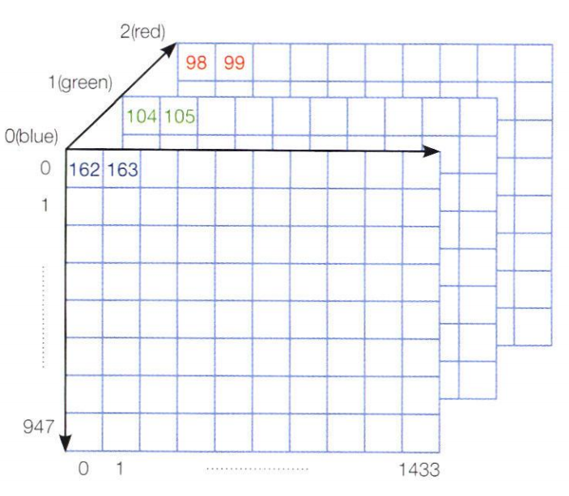

# opencv 시작하기
영상을 구성하는 한 점을 화소라고 한다.  
pixel은 picture element의 약어다.
영상에서 화소의 위치는 행 좌표 r과 열 좌표 c를 이용해 (r,c)로 표기한다.  
행 좌표는 y축, 열 좌표는 x축에 해당하다.  
**즉!!, 컴퓨터 비전에서는 왼쪽 위를 원점으로 간주한다는 말씀이다!!**  
아무튼 그래서 점의 좌표를 쓸 때(y,x)또는 (r,c)와 같이 y축을 먼저 쓴다.  
  
```python
>>> type(img)
<class 'numpy.ndarray'>
>>> img.shape
(948, 1434, 3)
>>> print(img[0,0,0], img[0,0,1], img[0,0,2])
162 104 98
>>> print(img[0,1,0], img[0,1,1], img[0,1,2])
163 105 99
```

