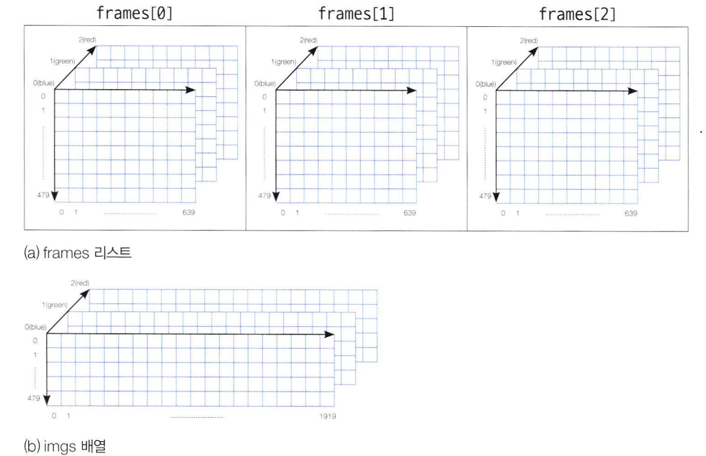

# 비디오에서 영상 수집하기

```python
import cv2 as cv
import numpy as np
import sys

cap=cv.VideoCapture(0,cv.CAP_DSHOW);

if not cap.isOpened():
    sys.exit('connet to failed');

frames=[]
while True:
    ret,frame=cap.read()

    if not ret:
        print('프레임 획득에 실패')
        break
    
    frame= cv.flip(frame, 1)
    cv.imshow('video display', frame)
    key=cv.waitKey(1)
    if key==ord('c'):
        frames.append(frame)
    elif key==ord('q'):
        break

cap.release()
cv.destroyAllWindows()

if len(frames)>0:
    imgs=frames[0]
    for i in range(1,min(4,len(frames))):
        imgs=np.hstack((imgs,frames[i]))
    
    cv.imshow('collected images', imgs)

    cv.waitKey()
    cv.destroyAllWindows()
```
`np.hstack()` 함수는 NumPy 배열들을 수평(가로)방향으로 연결하는 함수로 hstack의 h는 horizontal을 의미하며, 배열을 열 방향으로 쌓아 연결할 때 사용


  
이런 느낌
