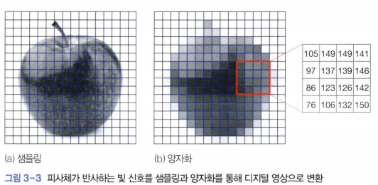
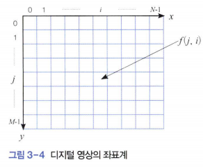
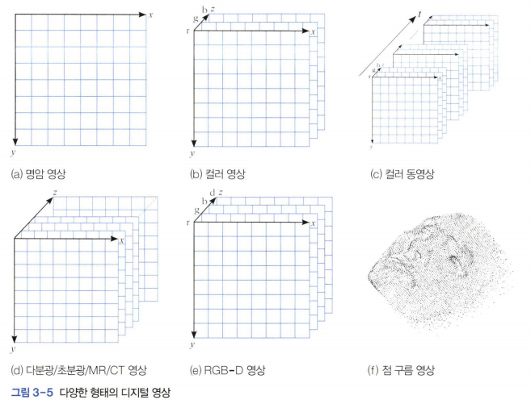
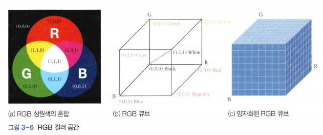
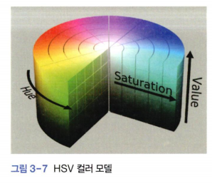
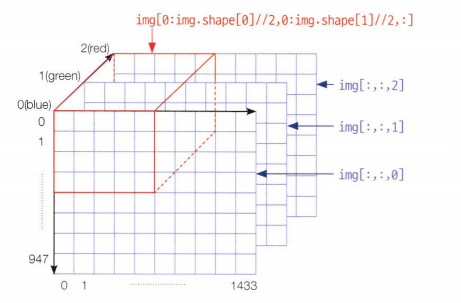

# 영상처리를 배워보자
영상 처리는 특정 목적을 달성하기 위해 원래 영상을 개선된 영상으로 변환하는 작업이다.  

### 핀홀 카메라와 디지털 변환
물체에서 반사된 빛은 카메라의 작은 구멍을 통해 안으로 들어가 뒷면에 있는 영상 평면에 맺힘  
영상 평면 == 눈의 망막(사람), 필름(카메라), CCD센서(디지털 카메라)  
빛(아날로그 신호) -> CCD 센서 (디지털 신호로 변환 후 메모리에 저장)  
(*이 때 샘플링과 양자화를 수행*)  


샘플링은 그림과 같이 2차원 영상 공간을 가로 방향으로 N개, 세로 방향으로 M개 구간으로 나눈다.  
이렇게 형성된 한 점을 화소(*pixel*)라 하고, M*N을 영상의 크기 도는 해상도라 한다.  

그림 (b)와 같이 화소의 명암을 L개(*보통 L=256*) 구간으로 나누는 것을 양자화라고 한다.   

  
j행 i열의 명암을 f(j, i)로 표기하며 영상은 2차원 공간의 함수로 간주할 수 있다.  

**디지털 영상의 좌표계에서 주의 할 점**

1. 원점이 왼쪽 위라는 점
2. ~~(x, y)~~ -> (y,x)로 표기

OpenCV는 영상을 numpy 모듈의 ndarray 클래스 형으로 표현한다.  
(*OpenCV의 영상이 numpy.ndarray 대문에 numpy가 지원하는 다양한 함수를 사용할 수 있다는 장점이 있다.*)

영상을 저장하는 배열에서 화소의 위치를 지정할 때는 (y,x)표기를 사용하지만 그 외에는 주로 (x,y)로 표기한다.  
*ex) cv.line(img,(10,20), (100,20), ...) 에서 x=10과 y =20을 의미한다.*  


### 물체가 반사한 빛을 측정한 디지털 영상

- 채널이 1개 == 명암 영상(grayscale image)
    - 2차원 구조의 배열로 표현
- 채널이 3개 == RGB영상
    - 3차원 구조의 배열로 표현 
- 채널이 4개 == 웹 캠에서 입력되는 컬러 동영상
    - 4차원 구조의 배열로 표현

컬러 영상은 인간의 눈으로 식별할 수 있는 가시광선 영역이고  
다분광 영상은 자외선과 적외선 영역까지 확장한 영역으로 채널을 3~10개 가량 소유한다.  
초분광 영상에는 다분광보다 조밀하게 획득한 수백 ~수천 개의 채널이 있다.  
물론 **다분광과 초분광도 3차원 구조의 배열로 표현한다**  
(*그저 3번째 축인 z축의 크기가 커지는 것임, mri는 z축이 위에서 아래로 되어있는 거임*)  

### 물체까지 거리를 측정한 영상 
거리를 깊이(*depth*)도는 range라고도 부르며, 거리를 표현한 영상은 깊이 영상 또는 range영상이라고 부른다.  
(*빛은 날시 조명등 변화에 민감하나 깊이는 둔감*)


### 컬러 모델


세 요소의 범위를 0부터 1로 설정해 세상의 모든 색을 RGB큐브에 넣는다.  
(0,0,0)은 검정이고 하양은 (1,1,1) 이걸 256단계로 양자화 함  
(*그림에서는 8단계이지만 실제로는 256단계라는 뜻, 0 ~255*)

  
H는 색상, S는 채도, V는 명암을 표현한다

실습
--
```python
import cv2 as cv
import sys

img=cv.imread('soccer.jpg')

if img is None:
    sys.exit('not found file')

cv.imshow('orginal_RGB', img)
cv.imshow('Upper left half', img[0:img.shape[0]//2,0:img.shape[1]//2,:])
cv.imshow('Center half', img[img.shape[0]//4:3*img.shape[0]//4,img.shape[1]//4,:])


cv.imshow('R channel',img[:,:, 2])
cv.imshow('G channel', img[:, :, 1])
cv.imshow('B channel', img[:, :, 0])

cv.waitKey()
cv.destroyAllWindows()
```
0:img.shape[0]//2는 y축 ,0:img.shape[1]//2는 x축 :는 z축  
