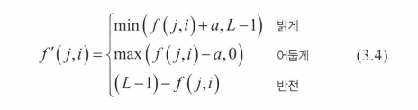
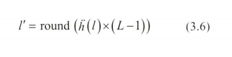

# 점 연산~~
화소 입장에서 바라본 영상 처리 연산이란 화소가 새로운 값을 받는 과정이다.  
이 새로운 값을 어디에서 받느냐에 따라 점 연산, 영역 연산, 기하 연산의 세 종류로 구분할 수 있다.  

- 점 연산에서는 자기 자신으로부터 값을 받는다.  
- 영역 연산에서는 이웃 화소의 값을 보고 새로운 값을 결정한다.  
- 기하 연산에서는 기하학적 변환에 따라 다른 곳으로부터 값을 받는다.  
(*오츄 이진화는 점 연산, 모폴로지는 영역 연산에 속함*)  
  

### 명암 조절
  

1. 맨 위 식은 원래 영상에 양수 a를 더해 밝게 만드는데, 화소가 가질 수 있는 최댓값 L -1을 넘지 않게 min을 취한다.  
2. 가운데 식은 원래 영상에 a르 빼서 어둡게 만드는데 max를 취해 음수를 방지한다.  
3. 마지막 식은 L-1에서 원래 명암값을 빼서 반전 시킨다.  

식(3.4)는 모두 선형 연산이다.  
선형 연산이란 상수를 곱해서 더하기만 하는 연산이다.  

  
인간의 눈은 빛의 밝기 변화에 비선형적으로 반응한다.  
예를 들면 명암 10에서 20으로 올랐렸을 때와 120을 130으로 올렸을 때 인간이 느끼는 밝아지는 정도를 다르게 느낀다.  
식(3.5)의 감마 보정은 이런 비선형적인 시각 반응을 수학적으로 표현한다. 
(*감마 보벙은 이미지나 비디오의 밝기와 색상을 인간의 시각 특성에 맞게 조정하는 기술*) 
f '  = [0,L-1] 범위의 화소의 값을 L-1로 나누어 [0,1]범위로 정규화한 영상  
y는 사용자가 조정하는 값  
(*y =1 -> 유지, y<1 ->밝아짐, y>1 - > 어두워짐* )  


실습
```python
import cv2 as cv
import numpy as np

img=cv.imread('soccer.jpg')
img=cv.resize(img,dsize=(0,0), fx=0.25, fy=0.25)

def gamma(f,gamma=1.0):
    f1=f/255.0
    return np.uint8(255*(f1**gamma))

gc=np.hstack((gamma(img,0.5),gamma(img,0.75),gamma(img,1.0),gamma(img,2.0),gamma(img,3.0)))

cv.imshow('gamma', gc)

cv.waitKey()
cv.destroyAllWindows()
```
uint8은 Unsigned Integer 8-bit의 약자

```
TypeError: hstack() takes 1 positional argument but 5 were given
```

왜 책에서 괄호를 이렇게 쓰나 했다 -.-  
(*우리 모두 함수의 사용법을 잘 숙지하도록 하자*)  

`def gamma(f,gamma=1.0):` 의 **첫 번째 매개변수**는 감마 보정할 영상이고 **두 번째 매개변수**는 식(3.5)의 y다.  
`f1=f/255.0`는 f를 256이라 가정하고 255.0으로 나누어 [0,1] 범위의 영상으로 정규화 한것.  

`np.uint8(255*(f1**gamma))` 8비트 정수형으로 바꿔 전환  

`gc=np.hstack((gamma(img,0.5),gamma(img,0.75),gamma(img,1.0),gamma(img,2.0),gamma(img,3.0)))` gamma를 적용한 영상 5개를 `hstack`를 이용해 하나로 붙여준다.  


### 히스토그램 평활화 
히스토그램 평활화는 히스토그램이 평평하게 되도록 영상을 조작해 영상의 명암 대비를 높이는 기법.  
(*명암 대비가 높아지면 영상에 있는 물체를 더 잘 식별할 수 있다*)  

  
모든 칸의 값을 더하면 1.0이 되는 정규화 히스토그램 h^'와  
i 번 칸은 0~i번 칸을 더한 값을 가진 누적 정규화 히스토그램 h^''를 가지고 식 (3.6)을 수행한다.  
(*l= 원래 명암값, l^' 평활화로 얻은 새로운 명암값*)

   

 


실습
--
```python
import cv2 as cv
import matplotlib.pyplot as plt

img=cv.imread('mistyroad.jpg')

gray=cv.cvtColor(img,cv.COLOR_BGR2GRAY)
plt.imshow(gray,cmap='gray'), plt.xticks([]), plt.yticks([]), plt.show()

h=cv.calcHist([gray], [0],None,[256],[0,256])
plt.plot(h,color='r', linewidth=1)
plt.show()

equal=cv.equualizeHist(gray)
plt.imshow(equal, cmap='gray')
plt.xticks([]),plt.show()

h=cv.calcHist([equal],[0],None,[256],[0,256])
plt.plot(h,color='r', linewidth=1), plt.show()

```

```
cv2.error: OpenCV(4.10.0) D:\a\opencv-python\opencv-python\opencv\modules\imgproc\src\color.cpp:196: error: (-215:Assertion failed) !_src.empty() in function 'cv::cvtColor'
```
이미지의 소스를 찾지 못해서 생긴 오류, 우리 모두 경로를 잘 보도록 하자...  

