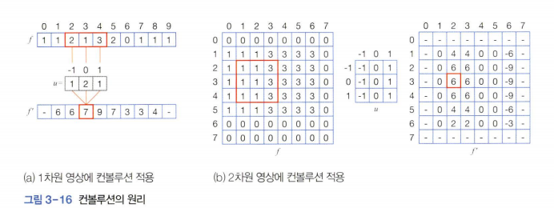
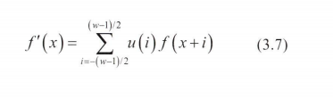
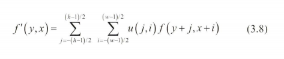
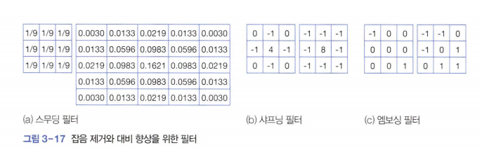
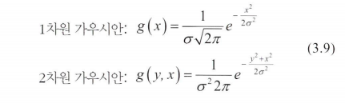
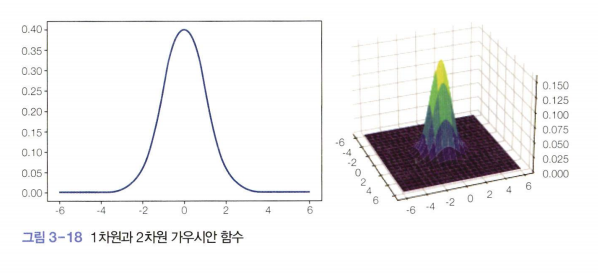

# 영역 연산
[text](2024-11-08-chap3-3.md)

### 컨볼루션
컨볼루션(*convolution*)은 입력 영상 f의 각 화소에 필터를 적용해 곱의 합을 구하는 연산  
  

그림은 위치 3에 필터를 씌우고 곱의 합을 계산하는 과정을 보인다.  
위 예에서 필터의 크기는 3이고 필터를 구성하는 화소의 인덱스는 중앙을0, 왼쪽을 -1, 오른쪽을 1로 표시한다.  

그림b의 2차원 영상의 컨볼류션에서는 필터 u가 2차원이다.  
필터를 1행을 마치면 2행으로 내려와 (2,1)에서 시작해 오른쪽으로 진행하며 (2,6)까지 적용한다. 이런 일을 3,4,5,6헹에 적용한다.  

  
  

1차원과 2차원의 컨볼루션을 각각 식3.7, 3.8 로 정의할 수 있다.  

필터를 가장자리 화소에 씌우면 필터의 일부가 밖으로 나가기 때문에 적용할 수 없다. 따라서 그림 3-16에서는 f'의 가장자리를 -로 표시햇다.  
가장자리에 적용하려면 원래 영상 f에 덧대기를 하면 된다.  
0 padding는 필요한 만큼 가장자리를 확장한 후 0으로 채우고, copy padding는 가장자리 화소의 값으로 채운다.  
컨볼루션은 연산 도중에 발생하는 값을 입력 영상 f자체에 기록하는 제자리 연산으로 구현할 수 없다.  
다음 화소의 값을 계산할 때 이웃 호솟값이 바뀌어 있으면 안 되기 때문  
컨볼루션 결과는 별도의 출력 영상 f'에 기록해야 한다.  


### 다양한 필터 
컨볼루션 자체는 특정한 목적이 없는 일반 연산이다.  
필터가 정해지면 목적이 결정된다.  
예를 들면 그림 b에서의 필터 u는 오른쪽 3개 화소는 1, 왼쪽 3개 화소는 -1이다.  
따라서 입력 영상의 오른쪽 3개 화솟값에서왼쪽 3개 화솟값을 빼는 효과를 발휘한다.  
입력 영상 f를 잘 보면 2열에서 3열로 이동하면서 값이 커지고 6열에서 7열로 이동하면서 값이 작아진다.  
(*다시 말해 그곳에 수직 에지가 있다*)  
결과 영상 f'를 보면 2열과 3열에 양수가 나타나며 6열에 음수가 나타난다.  
그림 b의 필터는 수직 에지를 검출하는 목적을 달성해준다.  

  
- 스무딩 필터
    - 1/9을 하여 입력 영상의 해당 9개 화소의 평균을 취하는 셈
    - 5 *5 필터는 중심의 값이 가장 크고 중심에서 멀어질수록 작아지는 가우시안 함수에 따라 제작  

  
함수의 모양은 표준편차 σ에 따른다.  
σ가 크면 봉우리가 낮아지고 멀리까지 퍼지며 작으면 봉우리가 높아진다.  
가우시안 함수는 중심에서 멀어지면 0은 아니지만 0에 가갑기 ㄷ문에 디지털 필터를 만들 때는 필터 크기를 한정 짓는다.  
(*보통 6σ와 같거나 큰 정수 중에 가장 작은 홀수는 5이기 대문에 5 by 5 필터를 만든다)  

**스무딩** 필터는 잡음을 제거하는 효과가 있지만 부작용으로 물체의 경계를 흐릿하게 만드는, 즉 **블러링** 이라는 부작용이 있다.  

**샤프닝 필터**는 에지를 선명하게 해서 물체의 식별을 돕는 작용을 하는데, 부작용으로 잡음을 확대한다.  

  

### 데이터 형과 컨볼루션 

OpenCV는 주로 한 화소의 명암 단게를 0~255 범위로 표현하며 이를 위해 1바이트를 사용한다.  

실습
--
```python
import cv2 as cv
import numpy as np

img=cv.imread('soccer.jpg')
# img=cv.resize(img,dsize=(0,0), fx=0.4, fy=0.4)
gray=cv.cvtColor(img,cv.COLOR_BGR2GRAY)
cv.putText(gray, 'soccer', (10,20), cv.FONT_HERSHEY_SIMPLEX, 0.7,(255,255,255),2)
cv.imshow('Original', gray)

smooth=np.hstack((cv.GaussianBlur(gray,(5,5),0.0),cv.GaussianBlur(gray,(9,9),0.0),cv.GaussianBlur(gray,(15,15),0.0)))
cv.imshow('Smooth', smooth)

femboss=np.array([[-1.0, 0.0, 0.0],
                  [0.0, 0.0, 0.0],
                  [0.0, 0.0, 1.0]])

gray16 = np.int16(gray)
emboss=np.uint8(np.clip(cv.filter2D(gray16, -1, femboss)+128,0,255))
emboss_bad=np.uint8(cv.filter2D(gray16,-1,femboss)+128)
emboss_worse=cv.filter2D(gray,-1,femboss)

cv.imshow('Emboss',emboss)
cv.imshow('Emboss_bad', emboss_bad)
cv.imshow('Emboss_worse', emboss_worse)

cv.waitKey()
cv.destroyAllWindows()
```

```python
print(type(img[0,0,0]))
<class 'numpy.uint8'>
# uint8 형의 범위는 0에서 255까지입니다.
```
위 실습은 엠보싱 필터를 사용하는데, 이 필터는 오른쪽 아래 화소에서 왼쪽 위 화소를 배는 연산이므로 -255~255 범위의 값이 발생할 수 있다.  

uint8 형의 변수가 범위를 벗어난 값을 어떻게 저장하는지 다음 명령어로 확인해보자.  

```
import numpy as np
a= np.array([-3, -2, -1, 0,1,254,255,256,257,258], dtype=np.uint8)
print(a)

    a= np.array([-3, -2, -1, 0,1,254,255,256,257,258], dtype=np.uint8)
       ^^^^^^^^^^^^^^^^^^^^^^^^^^^^^^^^^^^^^^^^^^^^^^^^^^^^^^^^^^^^^^^
OverflowError: Python integer -3 out of bounds for uint8
```
그러면 어찌해야 할까?  
-255 ~ -128 사이와 128 ~255사이는 발생할 수 있지만 빈도는 작을 것이기 때문에 이곳을 희생하기로 한다.  
따라서 128을 더해 -127~383 범위로 변환환 후 np.clip 함수로 0 ~255 범위로 축소한다.  
`np.clip(a,p,q)`는 a가 p보다 작으면 p, q보다 크면 q로 바구고 그렇지 않으면 원래 값을 유지한다.  
`np.clip(a+128,0,255)`를 추가로 적용해 0~255 범위로 변환한다.  

`smooth=np.hstack((cv.GaussianBlur(gray,(5,5),0.0),cv.GaussianBlur(gray,(9,9),0.0),cv.GaussianBlur(gray,(15,15),0.0)))` 
1. 첫 번째 인수는 스무딩을 적용할 영상이고  
2. 두 번째 인수는 필터의 크기
3. 세 번째 인수는 식 (3.9)에 있는 표준편차  σ (*0.0으로 설정하면 필터 크기를 보고 자동으로 추정하다*)  

```python
femboss=np.array([[-1.0, 0.0, 0.0],
                  [0.0, 0.0, 0.0],
                  [0.0, 0.0, 1.0]])
```
는 엠보싱 필터를 정의한다.  

```python
ray16 = np.int16(gray)
emboss=np.uint8(np.clip(cv.filter2D(gray16, -1, femboss)+128,0,255))
```
엠보싱 필터는 오른쪽 아래 화소에서 왼쪽 위 화소를 빼기 때문에 음수가 발생한다.  
그런데 gray배열의 화소는 np.unit8 형이므로 부호가 없는 nyte 정수 형.  
`cv.filter2D` 함수는 주어진 영상 배열과 같은 형의 배열을 출력하기 때문에 결과 영상도 uint8형이다.  
`np.int16(gray)` 부호가 있는 2바이트 형으로 변환하여 filter2D함수에서 음수가지 저장

**컨볼루션(convolution)**은 이미지 처리에서 주로 필터(커널)와 이미지의 특정 영역을 곱한 후, 그 결과를 모두 합산하여 새로운 픽셀 값을 만드는 연산을 의미

ex) 
```
가상의 3x3 이미지와 엠보싱 필터를 적용하는 과정을 보여드리겠습니다.

원본 이미지
plaintext
코드 복사
10  20  30
40  50  60
70  80  90
엠보싱 필터
주어진 엠보싱 필터 femboss는 다음과 같습니다:

plaintext
코드 복사
-1.0  0.0  0.0
 0.0  0.0  0.0
 0.0  0.0  1.0
필터 적용 과정
컨볼루션 연산은 이미지의 각 픽셀에 대해 3x3 필터를 겹쳐서 계산합니다. 예를 들어, 중간 픽셀인 50에 필터를 적용하는 과정을 보겠습니다.

필터가 중간 픽셀(50)에 위치하게 겹칩니다.

-1.0	0.0	0.0
0.0	50.0	0.0
0.0	0.0	1.0
필터 내 값과 이미지 값의 곱을 계산합니다.

(-1.0) * 10 = -10
(0.0) * 20 = 0
(0.0) * 30 = 0
(0.0) * 40 = 0
(0.0) * 50 = 0
(0.0) * 60 = 0
(0.0) * 70 = 0
(0.0) * 80 = 0
(1.0) * 90 = 90
이 값들을 모두 더합니다.

−

−10+0+0+0+0+0+0+0+90=80
따라서, 필터가 중간 픽셀에 적용된 결과는 80이 됩니다.

결과 이미지
이 과정을 이미지의 모든 픽셀에 적용하면, 대략적으로 다음과 같은 엠보싱 효과가 나타납니다.

엠보싱 효과가 적용된 이미지
plaintext
코드 복사
0    10    20
10   80    20
20   20    0
```
