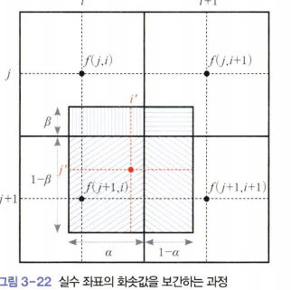
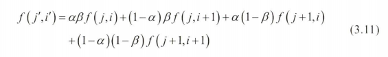

### 영상 보간 

영상에 후방 변환을 사용해도 여전히 실수 좌표를 정수로 변환하는 과정이 필요하다.  
이때 반올림을 사용해 가장 가까운 화소에 배정하는 기법을 **최근접 이웃**(*nearest neighbor*) 방법이라고 부른다.  

최근접 이웃은 에일리어싱이 심하다.  
이런 에일리어싱은 보간을 사용하면 상당히 개선된다.  

  

그림은 어떤 화소가 (j',i')로 변환되어 4개 화소에 걸친 상황이다.  
보간에서는 4개 화소와 걸친 비율에 따라 가중 평균하여 화솟값을 계산한다.  
- (j,i) 화소와 수직 빗금 친 영역만큼 겹쳤는데 영역의 넓이는 aB다.  
- (j, i+1)과 수평 빗금 친 영역만큼 겹쳤고 영역의 넓이는(1-a)B다.  
- (j+1, i)화소와 a(1-B) 만큼 겹친다. 
-  (j+1, i+1) 화소와 (1-a)(1-B)만큼 겹친다. 

  
(*j',i' 화소의 명암값*)  

그림은 겹치는 비율을 곱하기 때문에 선형 보간법에 해당한다.  
이 보간은 x와 y의 두방향에 걸쳐 계산하므로 **양선형 보간법**이라 한다.  

양선형 보간은 최근접 이웃에 비해 화질이 월등히 좋다.  
*대신 계산 시간이 더 걸리는데 요즘 컴터가 좋아서 별문제는 안됨*  

OpenCV 프로그램에서는 resize()의 인자로
- 최근접 이웃은 INTER_NEAREST,
- 양선형 보간은 INTER_CUBIC

```python
import cv2 as cv

img=cv.imread('rose.png')
patch=img[25:350,170:270,:]

img=cv.rectangle(img,(170, 250),(270,350),(255,0,0),3)
patch1=cv.resize(patch,dsize=(0,0),fx=5,fy=5,interpolation=cv.INTER_NEAREST)
patch2=cv.resize(patch,dsize=(0,0),fx=5,fy=5,interpolation=cv.INTER_LINEAR)
patch3=cv.resize(patch,dsize=(0,0),fx=5,fy=5,interpolation=cv.INTER_CUBIC)

cv.imshow('original', img)
cv.imshow('nearest', patch1)
cv.imshow('bilinear', patch2)
cv.imshow('bicubic', patch3)

cv.waitKey()
cv.destroyAllWindows()
```

