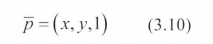

  
영상의 크기를 조절하거나 영상을 회전하려면 위 그림 처럼 멀리 있는 화소에서 값을 가져올 수 있어야 한다.  
기하 연산은 이런 경우를 다룬다.  

### 동차 좌표와 동차 행렬 
**동차 좌표**는 2차원 점의 위치 (x,y)에 1을 추가해 3차원 벡터p^-로 표현한다.  
  
동차 좌표에서는 3개 요소에 값을 곱하면 같은 좌표를 나타낸다.  
(*Ex (-2,4,1), (-4, 8, 2), (-1, 2, 0.5)는 모두 (-2, 4)점에 해당한다*)  
  

  

예시
--
행 벡터 p_1 =(1, 3, 1)  
  
x 방향으로 2, y 방향으로 -1만큼 이동한 다음 반 시계 방향으로 30도 회전   
  

  

  

(*행렬 곱셈에서는 결합 법칙이 성립하기 때문에 어떤 순서로 곱하든 같은 결과를 얻는다*)  

  

변환 행렬에서 아무리 여러 개를 곱해도 직선은 직선으로 평행인 선은 평행을 유지하는 이유는 동차 행렬의 3행이 (0 0 1)이기 때문이다.  

이런 성질을 가진 변환을 **어파인 변환**이라고 한다.  
(*ex 투영은 멀리 있는 물체가 작게 보이기 때문에 평행을 유지하지 못하는 변환으로 어파인 변환이 아님*)  

### 영상의 기하 변환


화소에 동차 변환을 적용해 영상을 회전하거나 크기를 조정할 수 있다.  
(*화소: 영상을 구성하는 점*)  
**그런데** 화소 위치를 정수로 지정하면 문제가 생긴다.  
그림 3-20에서 점(1,3)이 (3.598, 0.232)로 변환되었는데 변환된 위치를 어떤 화소에 배정할까?  

  

그림 3-21은 동차 행렬 A로 원래 영상을 새로운 영상으로 변환하는 과정이다.  
빨간색으로 표시된 화소는  A에 의해 변환 영상의 해당 화소로 매칭된다.  
이때 실수 좌표를 정수로 반올림하면 ?로 표시된 화소처럼 값을 받지 못하는 경우가 발생한다!!  

결과적으로 곳곳에 구멍이 뚫린 이상한 영상이 되는데 이런 현상을 **에일리어싱**이라 하고 에일리어싱을 누그러뜨리는 방법을 **안티 에일리어싱**이라 한다.  

안티 에일리어싱을 할려면 그림 b처럼 변환 영상이 원래 영상의 해당 화소를 찾는 **후방 변환**을 사용하면 된다.  

```
왜 빈 공간(?)이 발생하는가?
전방 변환에서는 각 원래 화소가 변환 후의 위치로 이동하게 되는데, 이 위치가 실수 좌표로 이동할 수 있기 때문에 반올림을 통해 정수 좌표에 할당하게 됩니다. 이 과정에서 몇몇 정수 좌표는 어떤 화소로부터도 이동되지 않게 되어 빈 공간이 생기게 됩니다.

즉 동차 행렬을 하면 실수 예를 들면 6.5 같은게 만들어 질 수 있는데 이걸 반올림 하여 7로 바꾸면 6.5가 있어야 할 자리에 어떤 화소도 안들어가 구멍이 뚫린다는 것!

```

예시 설정
--
원래 영상: 
5×5 크기의 간단한 격자 형태의 이미지라고 가정하겠습니다.

변환 행렬 
A: 오른쪽으로 2칸 이동하는 변환을 표현하는 동차 변환 행렬을 사용합니다.
  

역행렬 : 이 변환을 후방 변환으로 수행할 것이므로, 변환 행렬의 **역행렬**을 사용합니다. 역행렬은 다음과 같습니다.


변환 후 영상의 각 픽셀을 순회하며 원래 영상에서 값을 가져오는 과정:  
  

### 역행렬 구하기 

1. 단순 이동 행렬
    - 이동 거리의 부호를 반대로 적용 
      
    

2. 2*2 변환 행렬의 경우 
  
  
*단, 행렬식 ad-bc != 0, 행렬식이 0이면 역행렬이 존재 하지 않음 *  

3. 3*3 행렬 
1. 
2. 행렬식 계산  
    -   
3. 여인자(*cofactor) 행렬 구하기
    -   
4. 여인자 행렬을 전치하여 수반(adjugate) 행렬 구하기  
 -   
5. 역행렬 계산 
 -    

*여인자는 특정 원소가 속하지 않는 나머지 행렬의 행렬식에 부호를 적용한 값입니다.*  

*예시를 들자면 위 행렬에서 “원소 a의 여인자는, 원소 a가 속한 첫 번째 행과 첫 번째 열을 제외한 나머지 원소들 e,f,h,i로 구성된 작은 2x2 행렬의 행렬식에 부호를 적용한 값입니다:”*  
  

*여기서 부호는 원소의 위치에 따라 다릅니다. 위치에 따른 부호는 체스판 패턴을 따라 결정됩니다:*


*수반 행렬은 여인자 행렬을 전치한 행렬*