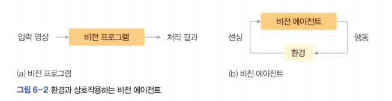

# PyQt를 이용한 사용자 인터페이스
비전 프로그램을 비전 에이전트로 확장하려면 적절한 그래픽 사용자 인터페이스(*GUI*)를 추가해야 한다.  
그중에서 우리는 PyQt를 사용하기로 한다.  
`pip install PyQt6`

### PyQt 기초 프로그래밍  

```python
from PyQt6.QtWidgets import *
import sys
import winsound # 삑 소리를 내는데 사용, 매개변수는 QMainWindow

class BeepSound(QMainWindow):
    def __init__(self) : # 객체를 생성하면 자동으로 실행되는 생성자 함수 __init__ 정의
        super().__init__()
        self.setWindowTitle("삑 소리 내기") # 윈도우 이름과 위치 지정
        self.setGeometry(200,200,500,100) # 윈도우를 화면의 (200, 200)위치에 초기 배치하고 너비와 높이를 각각 500과 100으로 설정

        shortBeepButton=QPushButton("짧게 삑", self) # 버튼 생성
        longBeepButton=QPushButton("길게 삑", self)
        quitButton=QPushButton("나가기", self)
        self.label=QLabel("welcome!",self) # self.으로 시작하면 멤버 변수가 된다,
                                           #멤버 변수는 클래스 어느 곳에서든 접근이 가능하며 클래스로 생성한 객체에서도 접근이 가능하다
        shortBeepButton.setGeometry(10,10,100,30) # 버튼 위치와 크기 지정
        longBeepButton.setGeometry(110,10,100,30)
        quitButton.setGeometry(210,10,100,30)
        self.label.setGeometry(10,30,500,70)

        shortBeepButton.clicked.connect(self.shortBeepFunction) # 콜백 함수 지정, 인자로 들어간 함수 실행
        longBeepButton.clicked.connect(self.longBeepFunction)
        quitButton.clicked.connect(self.quitFunction)

    def shortBeepFunction(self):
        self.label.setText('주파수 1000으로 0.5초 동안 삑 소리를 냅니다') # 레이블 위젯에 지정한 텍스트를 쓴다
        winsound.Beep(1000, 500) # 주파수 1000인 삑 소리를 500밀리초 동안 들려준다

    def longBeepFunction(self):
        self.label.setText('주파수 1000으로 3초 동안 삑 소리를 냅니다')
        winsound.Beep(1000,3000)

    def quitFunction(self):
        self.close()

app=QApplication(sys.argv) # PyQt 실행에 필요한 객체 app을 생성한다
win=BeepSound() # BeepSound 클래스의 객체 win을 생성한다, 이때 위에서 정의된 BeepSound 클래스의 생성자 함수 __init__이 자동으로 실행된다.
win.show()
app.exec() # 무한루프를 돌림으로써 프로그램이 끝나는 것을 방지 
# exec()가 없으면 win 객체에 해당하는 윈도우를 화면에 띄우는 순간 프로그램이 끝나서 사용자가 프로그램과 상호작용할 기회가 없다. 

```
super(). __init__() 라고 해야하는데 super. __init__()라 해서 인자 없다고 오류남ㅋㅋㅌㅌㅋㅋ

```
TypeError: descriptor '__init__' of 'super' object needs an argument
```


```
app.exec()는 PyQt 애플리케이션의 이벤트 루프를 시작하는 역할을 합니다. 이 이벤트 루프는 프로그램이 종료될 때까지 계속해서 실행되며, 사용자 입력, 창 이동, 마우스 클릭, 키보드 입력 등의 이벤트를 처리합니다.

왜 exec()를 사용하는가?
이벤트 처리 유지: app.exec()는 애플리케이션이 실행되는 동안 무한 루프를 돌면서 이벤트를 계속해서 수신하고 처리합니다. 이 루프가 없다면 프로그램이 즉시 종료되어, 창이 나타나도 바로 사라질 것입니다.

사용자 상호작용 처리: GUI 애플리케이션은 단순히 코드를 한 번 실행하고 끝나는 게 아니라, 사용자 입력과 같은 상호작용을 지속해서 처리해야 합니다. app.exec()는 이러한 입력을 처리하기 위해 필요합니다.

프로그램 종료까지 실행 유지: 이벤트 루프가 돌고 있는 동안 app.exec()는 끝나지 않으며, 프로그램 창이 닫힐 때 자동으로 종료됩니다. 프로그램을 종료하기 위해 app.quit()을 호출하거나, 창을 닫는 것으로 루프가 끝납니다.
```

.  
.  
.  
.  
  
*비전에이전트*
