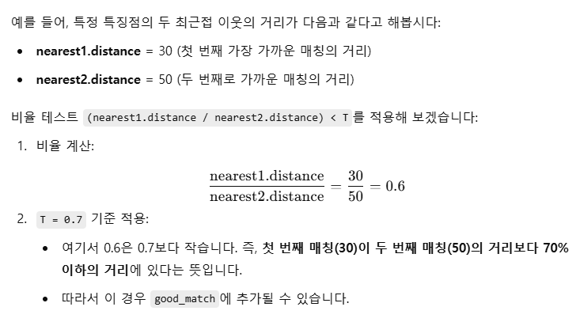

# 교통약자 보호구역 알림

```python
import cv2 as cv
import numpy as np
from PyQt6.QtWidgets import *
import sys
import winsound

class TrafficWeak(QMainWindow):
    def __init__(self):
        super().__init__()
        self.setWindowTitle('교통약자 보호')
        self.setGeometry(200,200,700,200)

        signButton=QPushButton('표지판 등록', self)
        roadButton=QPushButton('도로 영상 불러옴', self)
        recognitionButton=QPushButton('인식', self)
        quitButton=QPushButton('나가기',self)
        self.label=QLabel('welcome!',self)

        signButton.setGeometry(10,10,100,30)
        roadButton.setGeometry(110,10,100,30)
        recognitionButton.setGeometry(210,10,100,30)
        quitButton.setGeometry(510,10,100,30)
        self.label.setGeometry(10,40,600,170)

        signButton.clicked.connect(self.signFunction)
        roadButton.clicked.connect(self.roadFunction)
        recognitionButton.clicked.connect(self.recognitionFunction)
        quitButton.clicked.connect(self.quitFunction)

        self.signFiles=[['child.png', 'child'],['elder.png','elder'],['disabled.png','disabled']]
        self.signImgs=[]
    
    def signFunction(self):
        self.label.clear() # 레이블을 깨끗이 지움
        self.label.setText('교통약자 표지판을 등록합니다')

        for fname,_ in self.signFiles:
            self.signImgs.append(cv.imread(fname))  # cv.imread는 기본적으로 이미지를 NumPy 배열 형태로 반환
            cv.imshow(fname,self.signImgs[-1])  # 방금 추가한 영상을 fname이라는 제목 표시줄을 가진 윈도우에 디스플레이
    
    def roadFunction(self):
        if self.signImgs==[]:
            self.label.setText('먼저 표지판을 등록하세요.')
        else:
            fname=QFileDialog.getOpenFileName(self,'read file', './')  # 사용자가 폴더를 브라우징하면서 도로영상을 선택할 수 있게 한다
            self.roadImg=cv.imread(fname[0])
            if self.roadImg is None: sys.exit('file not found')

            cv.imshow('Road scene',self.roadImg)
    
    def recognitionFunction(self):
        if self.roadImg is None:
            self.label.setText('먼저 도로 영상을 입력하세요')
        else:
            sift=cv.SIFT_create()  # 이미지에서 특징점(keypoint)를 감지하고 설명자(descriptor)를 생성하는 알고리즘

            KD=[]
            for img in self.signImgs:
                gray=cv.cvtColor(img,cv.COLOR_BGR2GRAY)
                KD.append(sift.detectAndCompute(gray,None))  # detectAndCompute 함수를 통해 9특징점, 기술자] 정보를 획득
            
            grayRoad=cv.cvtColor(self.roadImg,cv.COLOR_BGR2GRAY)  # 명암으로 변환
            road_kp,road_des=sift.detectAndCompute(grayRoad,None)  # 키포인트와 기술자 추출

            matcher=cv.DescriptorMatcher_create(cv.DescriptorMatcher_FLANNBASED)  # FLANN 기반 매칭을 해주는 matcher 객체를 생ㅇ성
            GM=[]  # 여러 표지판 영상의 good match를 저장
            for sign_kp,sign_des in KD:
                knn_match=matcher.knnMatch(sign_des,road_des,2)  # sign_de를 road_des와 매칭하여 특징점마다 최근접 이웃 2개를 찾는다.
                T=0.7
                good_match=[]
                for nearest1,nearest2 in knn_match:  # knnMatch 함수에서 k=2로 설정했기 때문에 nearest1과 nearest2로 가장 가까운 두 개의 매칭 결과를 반환
                    if (nearest1.distance/nearest2.distance)<T: # nearest1.distance는 각 특징점과 가장 가까운 이웃의 거리이고, nearest2.distance는 그 다음으로 가까운 이웃의 거리
                        good_match.append(nearest1)
                GM.append(good_match)
            
            best=GM.index(max(GM,key=len))  # 매칭 쌍 개수가 최대인 표지판 찾기

            if len(GM[best])<4:
                self.label.setText('표지판이 없습니다')
            else:
                sign_kp=KD[best][0]
                good_match=GM[best]

                points1=np.float32([sign_kp[gm.queryIdx].pt for gm in good_match])
                points2=np.float32([road_kp[gm.trainIdx].pt for gm in good_match])

                H,_=cv.findHomography(points1,points2,cv.RANSAC)

                h1,w1=self.signImgs[best].shape[0],self.signImgs[best].shape[1] # 표지판 영상의 크기
                h2,w2=self.roadImg.shape[0],self.roadImg.shape[1]  # 도로 영상의 크기

                box1=np.float32([[0,0],[0,h1-1],[w1-1,h1-1],[w1-1,0]]).reshape(4,1,2)
                box2=cv.perspectiveTransform(box1,H)

                self.roadImg=cv.polylines(self.roadImg,[np.int32(box2)],True,(0,255,0),4)

                img_match=np.empty((max(h1,h2),w1+w2,3),dtype=np.uint8)
                cv.drawMatches(self.signImgs[best],sign_kp,self.roadImg,road_kp,good_match,img_match)
                cv.imshow('Matches and Homography',img_match)

                self.label.setText(self.signFiles[best][1]+'보호구역입니다')
                winsound.Beep(3000,500)
            
    def quitFunction(self):
        cv.destroyAllWindows()
        self.close()

app=QApplication(sys.argv)
win=TrafficWeak()
win.show()
app.exec()
    

    
```

첫 시도 실행이 안됐다.
```python
    def quitFunction(self):
        cv.destroyAllWindows()
        self.close()

app=QApplication(sys.argv)
win=TrafficWeak()
win.show()
app.exec
```
행간을 맞추자...

~~`app.exec`~~  -> app.exec() 젭알....

```python
        signButton.setGeometry(10,10,100,30)
        roadButton.setGeometry(110,10,100,30)
        recognitionButton.setGeometry(210,10,100,30)
        quitButton.setGeometry(510,10,100,30)
        self.label.setGeometry(10,40,600,170)
```
좌표...

~~`quertIdx`~~ ->`queryIdx` ...

`drawMatches()`에서 flags를 어찌 해야 할지 모르겠어서 일단 뻄
| https://docs.opencv.org/3.4/d4/d5d/group__features2d__draw.html 


```python
keypoints, descriptors = sift.detectAndCompute(gray, None)
gray: 특징점과 설명자를 감지할 입력 이미지입니다. 일반적으로 SIFT는 그레이스케일 이미지에서 작동하므로 컬러 이미지를 cv.cvtColor(img, cv.COLOR_BGR2GRAY)로 변환해 입력합니다.
None: 마스크 값입니다. None을 사용하면 이미지 전체에서 특징점을 찾고, 특정 영역에만 특징점을 찾고 싶다면 해당 영역에 맞는 마스크를 전달할 수 있습니다.
```


```
FLANNBASED: FLANN(Fast Library for Approximate Nearest Neighbors)은 대용량 데이터 세트에서 빠르게 유사한 설명자를 찾기 위한 라이브러리입니다. 
```


  


```
queryIdx: 첫 번째 이미지의 특징점 인덱스입니다. knnMatch를 호출할 때, knnMatch(descriptors1, descriptors2, k=2)와 같이 호출하게 되면 descriptors1의 각 특징점이 queryIdx에 해당됩니다.

trainIdx: 두 번째 이미지의 특징점 인덱스입니다. knnMatch에서 descriptors2의 특징점 인덱스를 가리킵니다.
```

예제
--
```
예를 들어, 다음과 같은 매칭이 있다고 가정해 보겠습니다.

sign_des에 있는 특징점 중 5번째 (sign_kp[5])가 road_des의 특징점 중 8번째 (road_kp[8])와 매칭된 경우:
이 경우, DMatch 객체의 queryIdx는 5, trainIdx는 8이 됩니다.
```
