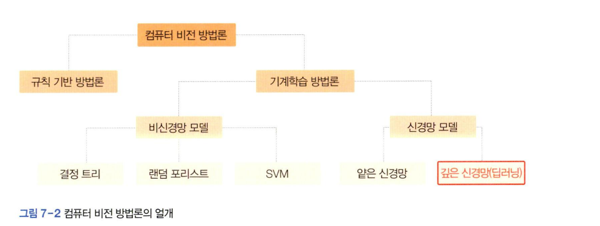

# 방법론의 대전환
6장까지는 고전적 컴퓨터 비전(*규칙 기반*)에 해당한다. 
현대적 컴퓨터 비전은 **데이터 중심**인 딥러닝으로 대전환한다.  

### 규칙 기반의 한계
- 사람이 만든 특징과 매칭 알고리즘을 수작업 특징과 수작업 알고리즘이라고 한다
    - 대부분 규칙으로 표현
- 규칙 기반은 '더 좋은 방안이 없을까?'라는 물음에 명쾌한 해결책을 제시하기 힘들다.  

### 딥러닝으로 대전환
  

컴퓨터 비전 방법론은 크게 규칙 기반과 기계학습으로 나눌 수 있다.  
- 기계학습은 주어진 문제 도메인에서 데이터를 수지바고 모델을 학습하는 과정을 거쳐 문제를 해결한다. 
    - 신경망 모델과 신경망이 아닌 모델로 구분
- 비신경망 
    - SVM, 결정 트리, 랜덤 포리스트
    
