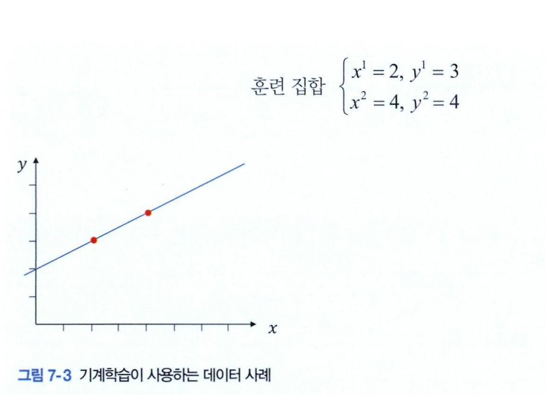
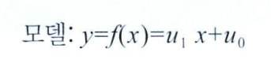
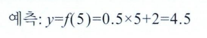
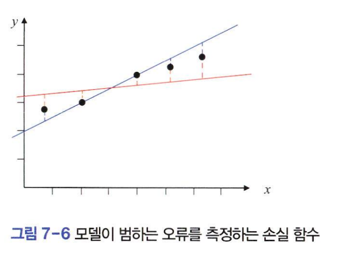
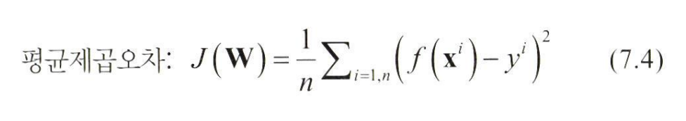
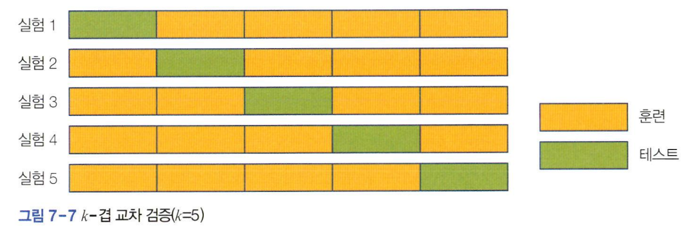

# 기계학습의 단순한 예
기계학습에서는 함수를 **모델**이라 부르고, 수집한 데이터로 방저익을 풀어 함수를 알아내는 일을 **학습**이라고 한다.  
```
기계학습 모델: y=f(x)
```
학습된 모델로 특정 분사량에 대해 온도를 계산하는 일을 예측이라고 한다.  

ex) 예시 7-1: 기름 분사량에 따라 온도를 예측하는 모델
--

1. 데이터 수집
    - 분사량을 2와 4로 설정하여 다음과 같이 샘플 2개를 수집했다고 가정하자. x는 분사량, y는 온도다.  
    샘플을 좌표계에 그리면 그림 7-3이 된다.  
    - 기계학습에서는 수집한 샘플의 모음을 **훈련 집합**이라고 한다.  

2. 모델 선택
    - f는 선형과 비선형의 다양한 함수 관계가 가능하다.
    

3. 학습
    - 훈련 집합에 있는 두 샘플을 모델에 대입한 방정식을 풀어(*모델을 학습하여*) 가중치의 값 u_1 =0.5와 u_0=2를 구한다.  

4. 예측
    - 훈련 집합에 없는 새로운 샘플 x=5를 모델에 대입하여 y=4.5라고 예측한다. 
    


### 기계학습의 4단계
  

1. 데이터 수집
    - 모델의 입력을 특징 벡터(*feature vector*), 출력을 참값(*GT: Ground Truth*)또는 레이블(*label*)이라고 한다.  
    - 보통은 특징 벡터와 참값을 x와 y로 표기한다.  
    - 식 7.3에서 표현한 데이터셋은 특징 벡터마다 참값이 붙어있는 n개의 샘플로 구성된다.  
      
    - 예시 7-1의 경우 y는 연속된 값이고, 이런 문제를 **회귀**라고 한다.  
      

2. 모델 선택
    - x와 y의 관계가 복잡한 경우는 비선형 모델을 사용해야 한다. (*두 변수가 2차 함수의 관계면 y=u_2x^2+u_1x+u_0*)
    - 가중치는 보통 행렬 **W**로 표기한다
        - 선형 모델: **W** =(u_0, u_1)
        - 2차 다항식 모델: **W** = (u_0,u_1,u_2)
    - 딥러닝 모델은 수십 개 층으로 구성되며, 층마다 가중치가 있으므로 **W**={U^1,U^2, ...,U^L}로 표기한다. (*L은 층의 개수*)  

3. 학습
    - 훈련 집합에 있는 샘플을 최소 오류로 맞히는 최적의 가중치 값을 알아내는 작업
    - 모델 함수에 데이터셋을 대입하여 만든 방정식을 풀어 가중치의 최적값을 구하는 방식을 **분석적 방법**이라 함.  
    - 기계학습은 오류를 조금씩 줄이는 과정을 반복하는 **수치적 방법**을 사용한다.  
      
    - **손실 함수**는 기계학습에서 오류를 얼마나 덜 범하는지 측정하는 함수
      
    - 그림 7-6은 평균제곱오차를 설명한다.
        - 점선: 오차 f(x^i)-y^i
        - 검은색 점: 참값에 해당하는 y^i
        - 직선상의 점은 모델이 예측한 값f(x^i)
        - 즉, 모든 점선 길이의 제곱의 평균을 구하면 평균제곱오차  
        - 파란색 모델이 최적에 더 가까움을 알 수 있다  
    - 최적화 알고리즘은 평균제곱오차를 최소로 하는 가중치의 최적값 **W hat**을 찾아준다.
        - 기계학습에서는 최적화 알고리즘을 **옵티마이저**라 부른다

4. 예측(추론)
    - **W hat**을 가진 모델에 학습에 사용하지 않던 새로운 특징 벡터를 입력하고 출력을 구하는 과정
    - 데이터셋을 일정 비율로 분할하여 일부는 훈련 집합에 넣어 학습에 사용하고 나머지는 테스트 집합에 넣어 예측에 사용한다.
        - 데이터 크기가 충분하지 않으면 우연히 쉬운 샘플이 걸려서 성능이 좋아지기도 그 반대가 될 수도 있음
    - 아래 그림은 데이터셋을 k개 부분 집합으로 분할하고 성능 실험을 k번 하여 평균ㅇㄹ 취하는 k-겹 교차 검증을 설명한다.
        
    - i=1,2,...,k로 바꾸면서 실험하는데 i번째 실험에서는 i번 부분 집합을 테스트 집합으로 사용하고 나머지 k-1개 부분 집합을 훈련 집합으로 사용한다.
    