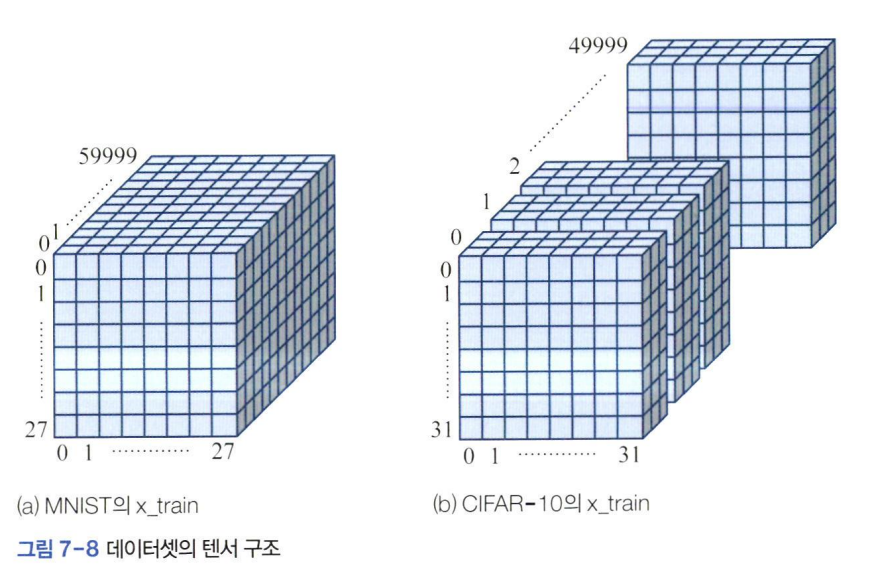

# 딥러닝 소프트웨어 맛보기
파이썬은 비신경망 모델과 얕은 신경망까지만 지원하는 `sklearn` 라이브러리를 제공한다.  
딥러닝을 구현하는데 가장 널리 쓰이는 도구는 **텐서플로**와 **파이토치**다.  

- 딥러닝에서는 다차원 배열을 **텐서**라 부른다.
  

- MNIST에는 70,000개의 필기 숫자 샘플이 있는데, 60,000개의 훈련 집합과 10,000개의 테스트 집합으로 분할되어 있다
    - `(x_train,y_train),(x_test,y_test)=ds.mnist.load.data()`
- x_train은 60000x28x28 모양의 3차원 구조
    - `print(x_train.shape,y_train.shape,x_test.shape,y_test.shape)`
    - 28x28 맵이 60,000장 쌓여 있는 3차원 구조
- x_test는 10000x28x28
- 참값을 저장하고 있는 y_train은 60000 크기의 1차원 구조
- cifar10은 50,000개의 훈련 집합과 10,000개의 테스트 집합으로 분할됐고 특징 벡터는 32 x 32 x 3(R,G,B)
    - (x_train : *50000x32x32x3, 4차원 구조*)
    - (y_train : *50000, 1차원 구조*)
    - 부류가 10개 이므로 참값으 0~9사이의 값을 가진다.  
    

```
CIFAR-10 훈련 시 일반적인 과정
훈련 과정:

CIFAR-10에서 batch_size (예: 32 또는 64)로 데이터를 분할합니다.
각 배치 데이터를 1개씩 모델에 입력하고, 예측값을 얻어 손실(loss)을 계산합니다.
손실을 바탕으로 역전파(backpropagation)를 수행하고 가중치를 업데이트합니다.
이렇게 모든 배치를 처리하고 나면, 전체 데이터셋의 훈련이 완료되며 1 에포크가 끝납니다.
평가 과정:

**평가 데이터셋(Validation)**을 사용합니다.
모든 데이터(예: 테스트 데이터셋 10,000개)를 모델에 넣고, 정확도, 손실 등 평가지표를 계산합니다.
일반적으로 평가는 1 에포크가 끝날 때마다 수행됩니다.
```


```
데이터 분할 과정
전체 데이터셋 (예: 10,000장의 CIFAR-10 이미지)

CIFAR-10 데이터셋은 총 50,000장의 훈련 이미지와 10,000장의 테스트 이미지로 구성되어 있습니다.
각 이미지는 32x32 크기이고, **3개의 채널(RGB)**을 가지므로 32x32x3의 특징맵입니다.
Batch 단위로 분할

모델 훈련 시 데이터를 효율적으로 처리하기 위해, 데이터셋을 Batch 단위로 나눕니다.
예를 들어, batch_size=32로 설정하면, 10,000장의 이미지를 32개씩 묶음으로 나눕니다.
이 경우 한 번의 Epoch에서 총 10,000 ÷ 32 = 312.5, 즉 313번(마지막 배치는 16장만 포함) 모델이 업데이트됩니다.
```
***Batch의 구성**:* 각 Batch는 32장의 이미지로 이루어져 있습니다. * 이미지 하나는 크기가 **32x32x3**이므로, Batch 단위 데이터는 크기가 `[32, 32, 32, 3]`이 됩니다.  
*첫 번째 차원 `32`는 Batch 크기를 나타냅니다.나머지 `32x32x3`은 각 이미지의 특징맵입니다.*  

**Batch 처리 순서**:  
1. 모델은 Batch에 포함된 **32장의 이미지를 동시에 입력**받습니다.  
2. 각 이미지에 대해 예측값(출력)을 생성하고, 실제 정답과 비교하여 \*\*손실(loss)\*\*을 계산합니다.  
3. 계산된 손실을 기반으로 가중치를 업데이트합니다.  
4. 이렇게 하나의 Batch 처리가 끝나면, 다음 batch로 넘어간다

