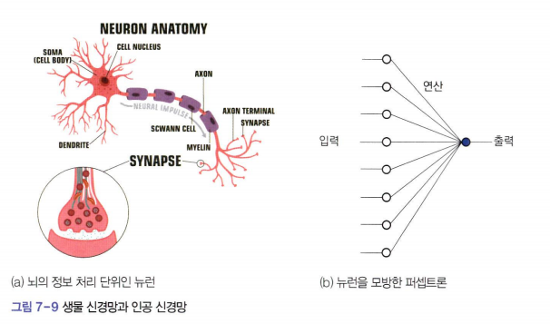
# 인공 신경망의 태동
- 1943년 맥컬록과 피츠가 뉴런의 정보 처리를 모방한 수학 모델(*세계 최초의 인공 신경망*) 발표
- 1946년 초당 3,000회 가량 덧셈을 할 수 있는 세계 최초의 전자식 컴퓨터 **에니악** 탄생
- 1949년 헤브가 학습 알고리즘 발표
- 1958 로젠블랫이 퍼셉트론 최초 구현
- 위드로와 호프 퍼셉트론을 개선한 아달린과 마달린 발표
- 1969년 민스키와 페퍼트는 'Perceptrons'라는 저서를 통해 퍼셉트론의 한계 (*XOR problame*) 발표
- 1986년 루멜하트와 동료들이 퍼셉트론에 은닉층을 추가한 다층 퍼셉트론과 다층 퍼셉트론을 학습할 수 있는 **역전파 알고리즘** 발표
- 1990년 **SVM**이라는 비신경망 모델이 등장하여 다층 퍼셉트론을 능가
- 2000년대 은닉층의 개수를 대폭 늘린 딥러닝이 등장하여 신경망이 다시 기계학습의 주류 기술이 된다.  

### 퍼셉트론
- 퍼셉트론은 특징 벡터를 입력으로 받아 연산을 수행하고 결과를 출력층으로 내보낸다.
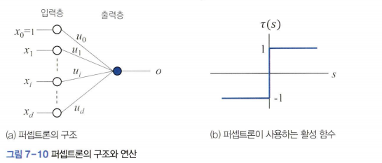
- 입력층에는 d차원 특징 벡터를 받기 위한 d개 노드와 1개의 바이어스 노드가 있다.  
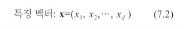

- *바이어스 노드는 x_0=1로 설정하여 항상 1이 입력된다.*  
- *출력층에는 노드가 하나 있다*
- *입력 노드는 특징값을 통과시키는 일만 하여 속이 빈 원으로 그렸고, 출력 노드는 연산을 수행하기 때문에 속이 찬 파란색 원으로 구별하였다.*
- 입력 노드와 출력 노드를 연결하는 에지에 있는 u_i는 **가중치**라고 한다.
- 출력 노드는 입력 노드의 값 x_i와 에지에 있는 가중치 u_i를 곱해서 얻은 d+1개(*i=0부터 시작하므로 d+1개*)의 곱셈 결과를 더해 s를 구한 다음. s(*로짓*)를 t 함수(*활성 함수*)에 통과시켜 얻은 값 o를 출력한다.  
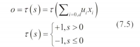  
*활성화 함수로 계단 함수 사용*

### 퍼셉트론은 분류기
- 퍼셉트론은 특징 공간을 2개의 부분 공간으로 나누는 함수로 해석할 수 있다.  

예시 7-2 퍼셉트론으로 OR 분류 문제 풀기
--
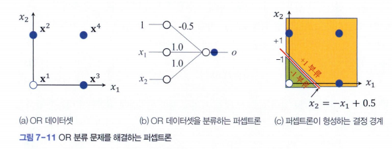  
- x^1 ~x^4는 특징 벡터
- y^1~y^4는 참값  
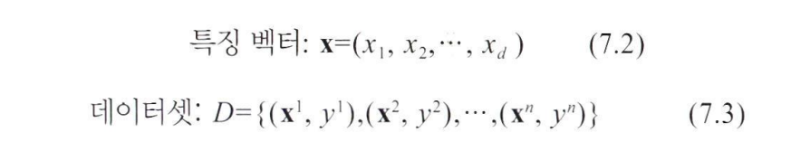  
- 식 7.2, 7.3에 따르면 d=2, n=4다.  
- 속이 찬 샘플은 참값이 1이고 속이 빈 샘플은 -1이다

- 그림b는 OR 데이터셋을 분류하는 퍼셉트론
- 식 7.5에 넣으면 값이 옳게 분류됐는지 확인 가능
- *o* =0은 두 부류를 나누는 **결정 경계**
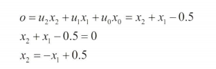
- *u* =0으로 두고 식을 만들고 2차원 좌표계에 그리면 그림c의 빨간색 선분이 된다.  
*u_1과 u_2는 직선의 기울기를 표현하고 u_0은 절편에 해당*  
*u_0이 없으면 직선이 항상 원점을 지나므로 데이터를 제대로 분류할 수 없다.*  

### 행렬 표기
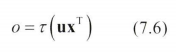  
- 식 7.5를 행렬을 이용하여 표현한 것  
- x는 식(7.2)의 d차원 특징 벡터에 바이어스 값 1을 추가하여 (d+1)차원으로 확장한 벡터  
(*행렬 곱셈이 가능하도록 x의 전치 행렬 x^T를 곱한다.*)  

예시 7-2의 계산  
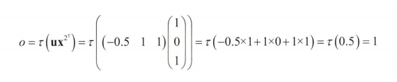  

예시 7-3 OR 데이터셋을 행렬 표기로 처리
--

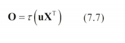  
데이터셋에 있는 n개의 샘플을 한꺼번에 계산하는 식  
- 특징 벡터  x가 행령 **X**가 되었고 출력이 스칼라 *o*에서 행렬**O**가 되었다
- 모든 샘플을 담은 행렬 **X**를 **설계 행렬**이라 부른다.  
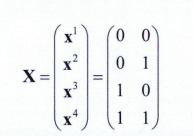  
식.7.7의 행렬 표기를 따른 OR 데이터셋  
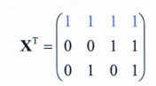  
바이어스 값을 추가하고 전치를 적용한 **X^T**  
(*파란색 부분이 바이어스**)  
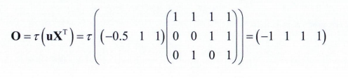  
**X^T**를 식 7.7에 대입

