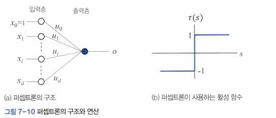

# 깊은 다층 퍼셉트론
  
퍼셉트론은 선형 분류기이기 때문에 b와 같이 선형 분리 불가능한 상황에서는 정확률이 낮다.  

1986년 루멜하트는 비선형 분류 문제를 풀기 위해 은닉층을 추가한 다층 퍼셉트론(*비선형 분류기*)을 제시하였다

### 다층 퍼셉트론 
  
그림 b처럼 퍼셉트론을 2개 사용하면 특징 공간을 3개 영역으로 분할할 수 있다.  

두 퍼셉트론의 출력을 z_1과 z_2로 표기했는데
- z_1과 z_2 모두 +1일 때만 +1 
- 나머지 경우는 -1 부류로 분류

  
두 퍼셉트론을 병렬 결합하면 원래 특징 공간 x=(x1,x2)를 새ㅗ운 특징 공간 **Z**=(z_1,z_2)로 변환할 수 있다.  

원래 특징 공간 **X**의 세 부분 공간 a,b,c는 새로운 특징 공간 **Z**에서 세 점 a',b',c'가 된다.  
**주목할 사실은 변환된 세 점의 선형 분리가 가능해졌다는 것이다**  

  
z공간에서 분류를 수행하는 세 번째 퍼셉트론을 보여준다.  

그림a에서 파란색으로 표시한 이 퍼셉트론을 순차적으로 결합하면 그림b의 신경망을 얻는다.  

이 신경망을 다층 퍼셉트론이라고 한다.  

  
다층 퍼셉트론의 출력 **o**와 레이블 **y**를 비교하면 4개 샘플 모두 같아서 XOR 데이터를 100% 정확률로 분류한다고 말할 수 있다.  

그림b의 구조를 일반화 하면 그림 7-16의 다층 퍼셉트론이 된다.  
  
입력층과 출력층 사이에 새로 생긴 층을 **은닉층**이라고 한다.  

은닉층이 형성하는 새로운 특징 공간을 **은닉 공간** 또는 **잠복 공간**이라 부른다.  

입력층은 특징을 통과시키는 일만 하고 연산을 하지 않기 때문에 층을 셀 때 뺀다.  

따라서 그림 7-16의 다층 퍼셉트론은 층이 2개다.  

다층 퍼셉트론은 이웃한 두 층에 있는 노드의 모든 쌍에 에지가 있어 **완전 연결** (*FC: Fully-Connected*) 구조라 부른다.

*문제: 그림 7-10의 층은 몇개일끼?*
--
  
답: 1개

  

  
은닉층과 출력층을 연결하는 가중치를 행렬 **U^1**, **U^2**로 표현  

- **U^1**은 p x (d+1) 행렬  
- **U^2**은 c x (p+1) 행렬  

특징 벡터의 차원이 d이고 부류의 개수가 c인 데이터가 주어지면 입력층의 노드 개수는 d+1이 되고 출력층의 노드 개수는 c가 된다.  

*ex) MNIST는 28 x 28맵으로 숫자를 표현하는데. 화소를 특징으로 간주하면 d=784이고 c= 10*  

은닉층의 노드 개수 p는 사용자가 지정해야 한다.  
*사용자가 설정해줘야 하는 매개변수를 **하이퍼 매개변수**라고 한다*  

그림 7-15b의 다층 퍼셉트론의 가중치 개수는 (2+1)2+(2+1)1= 9개

1. 입력층 → 은닉층
- 입력 노드 2개 (𝑥1,𝑥2) + 바이어스 노드 1개 = 총 3개의 입력
은닉 노드 2개(𝑧1,𝑧2)로 연결
따라서 필요한 가중치 수는 3×2=6개
2. 은닉층 → 출력층
- 은닉 노드 2개(𝑧1,𝑧2) + 바이어스 노드 1개 = 총 3개의 입력
출력 노드 1개(𝑜)로 연결
따라서 필요한 가중치 수는 
3×1=3개

이제 MNIST 데이터셋을 사용하고 p를 128로 설정했다고 가정해 다층 퍼셉트론의 가중치 개수를 계산하면  
(784+1)128+(128+1)10  

### 전방 계산  
특징 벡터 **X**가 입력층으로 들어가 은닉층과 출력층을 거치면서 순차적으로 연산을 수행하는 과정을 **전방 계산** 이라고 한다.  

  
은닉층 j번째 노드는 하나의 퍼셉트론에 해당하므로 연산은 식7.5와 같다.  
  

이 식을 그림 7-16의 표기에 맞추면 식 7.9가 된다.  
  
- z_j는 다음 층의 입력으로 사용
- t()의 인자를 로짓이라고 부름

  
  

  
위 식을 복합 함수 형태로 바꿔서 한줄로 나타낼 수도 있다.  
  

n개의 특징 벡터를 한꺼번에 처리하는 행렬 표현  
  
**x** -> **X**, **o** -> **O**

예시 7-4 다층 퍼셉트론의 연산
--
그림 7-15b의 신경망 연산을 살펴보자.  
이 신경망은
- d=2
- p=2
- c=1
- 가중치 행렬:   
- 활성 함수 : 계단 함수
    - 계산 결과에 은닉층의 바이어스를 추가하는 역할까지 한다고 가정
  
식 7.13을 **x**=(0,1) 샘플에 적용

데이터셋을 한꺼번에 처리하는 식 7.14를 적용  
  

### 딮은 다층 퍼셉트론의 전방 계산
  
L개 층을가진 깊은 다층 퍼셉트론  

- 은닉층부터 출력층까지 오른쪽으로 진행  
- 가중치 행렬을 **U^1**,**U^2**,...,**U^L**로 표기  

  
*l*번째 층의 가중치 행렬  

- *l*번째 층의 *j*번째 노드와 *l*-1번째 층의 *i*번째 노드를 연결하는 가중치를 *u^l_ji*로 표기한다.  
- 층 번호는 입력층을 0번째 층, 은닉층 *l*을 *l*번째 층, 출력층을 L번째 층으로 매긴다.  
- n_*l*은 *l*번째 층의 노드 개수  

  
- 입력층에 입력되는 특징 벡터(1,x_1,x_2,...,x_d)를 **Z^0**=(z^0_0,z^0_1,...,z^0_n0)로 표기한다.  
- 출력층은 예측값(o_1,o_2,...,o_c)를 **Z**^L로 간주한다.  
  

### 신경망 출력을 부류 정보로 해석
- 식 7.17에 따라 전방 계산을 하면 **O**=(o_1 o_2 ... o_c)를 얻는다.  
- c는 출력 노드의 개수로 부류의 수
  
- *ex) 숫자 인식 c=10의 출력이 **o**=(0.0 0.1 0.8 ...0.1)이라면 세 번째 부류가 최대값이므로 숫자 2로 인식  
- 식 7.19를 이용하여 부류 정보를 알아내는 것을 **예측** 또는 **추론**이라 한다.  

보통 출력층은 활성 함수로 **sofmax**를 사용한다.  

sofmax는 모든 요소를 더하면 1이 된다는 특성이 있어 확률로 해석할 수 있다는 장점이 있다.  

### 활성 함수
  

- β는 함수의 모양을 제어한다.  
- ReLU는 비교 연산 한 번으로 계산할 수 있고 미분값은 양수에서 1, 음수에서 0이므로 계산 효율 측면에서도 유리하다.  
- logistic sigmoid와 hyperbolic tangent는 0 에서 멀지면 변화량이 작다, 즉 신경망 학습에서 미분값이 급격하게 0에 가까워져 가중치 갱신이 일어나지 않는 **그레이디언트 소멸**이 발생할 수 있다.  
- ReLU는 양수 구간이면 어느 곳에서나 미분값이 1이기 때문에 그레이디언트 소멸을 크게 누그러뜨린다.  

  
softmax는 모든 출력 노드를 같이 고려하여 k번째 출력 노드의 값을 계산하여 (o_1,o_2,...,o_c)를 출력  
