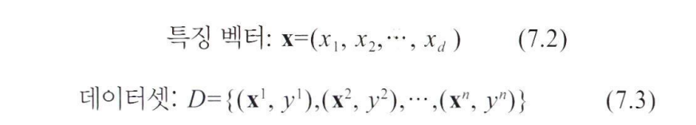
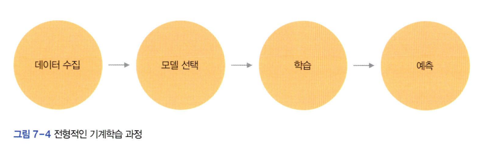

# 학습 알고리즘
  
우리에게 주어진 것은 데이터셋 **D={X,Y}**뿐이다.  

  
모델 선택 단계에서 깊은 다층 퍼셉트론을 모델로 선택하고 
은닉층의 개수와 노드 개수를 설정하여 모델 선택을 마쳤다고 가정하자  

이제 D를 가지고 신경망 모델을 학습해야 한다.  

  
a는 MNIST의 i번째 샘플 X^i를 보여준다.  
x^i는 28*28 맵으로 표현된다.  

다층 퍼셉트론은 1차원 구조의 특징 벡터를 입력으로 받기 때문에 2차원 구조의 맵을 1차원으로 펼쳐 784개(*28 x 28 =784*) 요소를 가진 벡터를 만든다.  

참값 y^i는 주로 **원핫 코드**로 표현한다.  
*원핫 코드는 해당 부류만 1이고 나머지는 모두 0인 벡터*  

학습 알고리즘이 알아내야 하는 것은 식7.15로 정의된 가중치 **W={U^1,U^2,...,U^L}**이다.  

처음에는 난수로 설정하고 충분히 높은 정확률을 달성하거나 개선이 불가능할 때까지 정확률을 향상하는 방향으로 가중치 갱신을 반복한다.  

  
3행은 식7.18로 전방 계산을 수행하면 된다.   
  

### 경사하강법
**경사하강법(*GD method*)**은 미분값을 보고 함수가 낮아지는 방향을 찾아 이동하는 일을 반복하여 최저점에 도달하는 알고리즘   

*예시 7-5: 단순한 신경망의 학습*  

  
a는 층에 노드가 하나뿐인 신경망이다.  
훈련 집합은 샘플 하나뿐이고, 활성함수는 s가 들어가면 s가 나오는 항등 함수라고 가정한다.  

신경망의 연산과 손실 함수인 평균제곱오차 J를 다음과 같이 쓸 수 있다.  
  
- 학습은 J가 최소인 u를 구하는 문제이기 때문에 J를 u로 미분한 도함수를 구한다.  
- x와 y는 값이 정해져 있으므로 미분할 때 상수로 취급

알고리즘 7-1의 1행에서 난수를 u=0.8이 됐다하면 b와 같은 상황이 된다.  

이 때 이 점의 미분값은 
  

미분값이 음수라는 사실은 u가 증하면 J가 감소한다는 뜻  
,즉 미분값의 반대 방향 -dJ/du 방향으로 가야 더 낮은 점으로 이동한다.  

알고리즘 7-1에서
5행, 6행은
  
  
새로운 점에서 미분값을 계산하는 과정을 반복하면 최적해에 점점 가까워진다.  

  
식7.21은 예시 7-5를 일반화 한 것이다.  
p는 **학습률**을 의미한다.  
(*미분은 최적해에 다가갈 방향은 알려주지만 얼만큼 이동할지는 알려주지 못해서 설정하는 하이퍼 파라미터*)  

### 스토캐스틱 경사하강법으로 확장 

1. 가중치가 u 하나뿐일 때의 식 7.21을 가중치가 여럿인 식 7.22로 확장한다.
2. 맨 마지막 L층에서 시작하여 왼쪽으로 진행하면서 가중치를 갱신한다(*역전파*)  
3. 신경망의 학습은 다음 두 극단의 중간을 사용한다.
    1. 데이터셋에 n개 샘플이 있다면 n번의 미분과 가중치 갱신이 일어난다(*이렇게 모든 샘플을 처리하는 한 사이클을 **epoch**이라 한다*)  
    2. 모든 샘플의 미분값의 평균을 구하고 식 7.22를 한 번 적용하여여 한 epoch를 마치는 **배치 방식**
    - 미니 배치 M을 적절한 크기로 설정하고 미니 배치 단위로 식 7.22를 적용한다.  
    - 미니 배치 방식에서는 식 7.22를
    $$
    \left\lfloor \frac{n}{M} \right\rfloor
    $$ 
    번 반복하여 한 세대를 처리한다

    *ex) n=60000인데 미니 배치 크기를 128로 설정 했다면 n에서 128개를 랜덤으로 선택하여 가중치를 갱신하는 작업을 반복하다가 마지막에는 나머지 96개로 가중치를 갱신하는 것으로 한 epoch을 마친다.*
      
    - 미니 배치 방식에서는 평균제곱 오차를 식 7.23으로 정의한다.  

미니 배치를 사용하는 확장된 경사하강법을 **스토캐스틱 경사하강범(*SGD*)** 라고 한다.

SGD는 신경망에서 가장 오랫동안 애용해온 최적화 방법(*optimizer*)이다.  

### 역전파 
  
깊은 다층 퍼셉트론의 가중치 집합은 **W={U^1,U^2,...,U^L}**의 계층 구조를 가진다.  

*l*층의 가중치 **U**^*l*은 *l,l+1,...,L*층에 영향을 미친다.  

*l*층의 그레이디언트는 *l+1*층의 그레이디언트 dJ/d**U**^*l*+1에 두 층 사이의 그레이디언트 a**U**^*l*+1/d**U**^*l*을 곱하여 구할 수 있다.  

