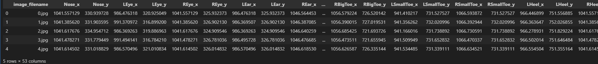

# pandas로 필요없는 특징을 제거해보자
 ```python
 import pandas as pd
filename=['arm_posture_errors',  'chest_and_hip_joint_errors',  'hip_joint_movement_errors', 'normal']
train_file_path = f'../data/train/{filename[0]}/CA01_Motion2-1.csv'
val_file_path = f'../data/val/{filename[0]}/CA02_Motion2-1.csv'

train_df = pd.read_csv(train_file_path)
val_df = pd.read_csv(val_file_path)
```
먼저 csv 파일을 보자
```python
train_df.columns
val_df.columns
```
를 하여 특성들이 뭐가 있는지 보니
```
Index(['image_filename', 'Nose_x', 'Nose_y', 'LEye_x', 'LEye_y', 'REye_x',
       'REye_y', 'LEar_x', 'LEar_y', 'REar_x', 'REar_y', 'LShoulder_x',
       'LShoulder_y', 'RShoulder_x', 'RShoulder_y', 'LElbow_x', 'LElbow_y',
       'RElbow_x', 'RElbow_y', 'LWrist_x', 'LWrist_y', 'RWrist_x', 'RWrist_y',
       'LHip_x', 'LHip_y', 'RHip_x', 'RHip_y', 'LKnee_x', 'LKnee_y', 'RKnee_x',
       'RKnee_y', 'LAnkle_x', 'LAnkle_y', 'RAnkle_x', 'RAnkle_y', 'Head_x',
       'Head_y', 'Neck_x', 'Neck_y', 'Hip_x', 'Hip_y', 'LBigToe_x',
       'LBigToe_y', 'RBigToe_x', 'RBigToe_y', 'LSmallToe_x', 'LSmallToe_y',
       'RSmallToe_x', 'RSmallToe_y', 'LHeel_x', 'LHeel_y', 'RHeel_x',
       'RHeel_y'],
      dtype='object')
```
이런식으로 되어 있다.  
```
image_filename', 'Nose_x', 'Nose_y', 'LEye_x', 'LEye_y', 'REye_x',
'REye_y', 'LEar_x', 'LEar_y', 'REar_x', 'REar_y',
```
운동 자세를 판단하는데 위의 특성은 필요 없다고 판단!  

```python
train_df.head(5)
```
한번 표도 봐주고

```python
print(f'train_df.columns: {len(train_df.columns)}')
print(f'val_df.columns: {len(val_df.columns)}')

print(f'len(train_df): {len(train_df)}')
print(f'len(val_df): {len(val_df)}')
```
특징과 행의 개수도 한번 세어준다
```
train_df.columns: 53
val_df.columns: 53

print(f'len(train_df): {len(train_df)}')
print(f'len(val_df): {len(val_df)}')
```
그럼 이제 본격적으로 해야 할것  
1. 레이블을 csv에 넣기
2. 필요 없는 특징 제거
3. 가까운 관절끼리의 각도 계산 값

를 기억하고 작업에 착수!!  

