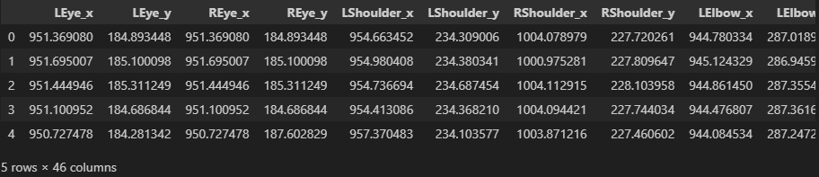
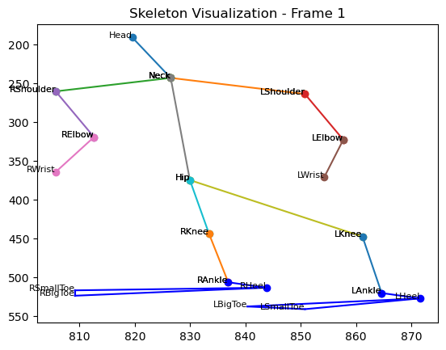
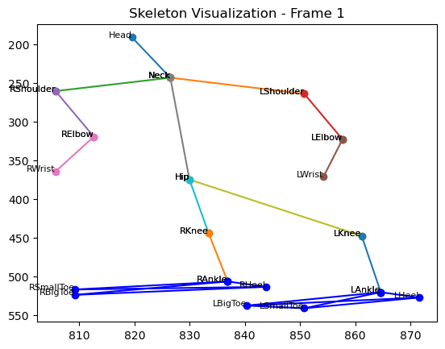

# 관절끼리의 각도 계산 값을 특징으로 넣어보자!(1)

```python
train_data_path = '../data/train'
df = pd.read_csv(f'{train_data_path}/normal@CI09_Motion2-6 - 2of4.csv')
df.head(5)
```


봐도 어찌해야 할지 감이 잘 안잡힌다.
여기서 키 포인트를 이어 스켈레톤을 한번 만들어 보자  

```python
import matplotlib.pyplot as plt


connections = [
    ('Head', 'Neck'), 
    ('Neck', 'LShoulder'), ('Neck', 'RShoulder'),
    ('LShoulder', 'LElbow'), ('RShoulder', 'RElbow'),
    ('LElbow', 'LWrist'), ('RElbow', 'RWrist'),
    ('Neck', 'Hip'),
    ('Hip', 'LKnee'), ('Hip', 'RKnee'),
    ('LKnee', 'LAnkle'), ('RKnee', 'RAnkle')
]

# 삼각형 연결 관계 설정
triangle_connections = [
    ('LBigToe', 'LSmallToe'), ('LSmallToe', 'LHeel'), ('LHeel', 'LBigToe'),
    ('RBigToe', 'RSmallToe'), ('RSmallToe', 'RHeel'), ('RHeel', 'RBigToe')
]


df = pd.read_csv(f'{train_data_path}/normal@CI09_Motion2-3 - 4of4.csv')
i = 0  # 첫 번째 프레임 선택
fig, ax = plt.subplots()

# 각 연결 관계에 따라 선 그리기
for point1, point2 in connections:
    try:
        x_values = [df[f'{point1}_x'][i], df[f'{point2}_x'][i]]
        y_values = [df[f'{point1}_y'][i], df[f'{point2}_y'][i]]
        ax.plot(x_values, y_values, marker='o')
        
        # 각 포인트에 이름 표시
        ax.text(df[f'{point1}_x'][i], df[f'{point1}_y'][i], point1, fontsize=8, ha='right')
        ax.text(df[f'{point2}_x'][i], df[f'{point2}_y'][i], point2, fontsize=8, ha='right')
    except KeyError:
        print(f"'{point1}' or '{point2}' column not found in the data.")
        continue

# 삼각형 그리기 및 Ankle-heel 연결
for side in ['L', 'R']:
    try:
        # 삼각형 꼭짓점 좌표
        big_toe = (df[f'{side}BigToe_x'][i], df[f'{side}BigToe_y'][i])
        small_toe = (df[f'{side}SmallToe_x'][i], df[f'{side}SmallToe_y'][i])
        heel = (df[f'{side}Heel_x'][i], df[f'{side}Heel_y'][i])
        
        # 삼각형 그리기
        ax.plot([big_toe[0], small_toe[0]], [big_toe[1], small_toe[1]], 'b-')
        ax.plot([small_toe[0], heel[0]], [small_toe[1], heel[1]], 'b-')
        ax.plot([heel[0], big_toe[0]], [heel[1], big_toe[1]], 'b-')
        
        # Ankle을 Heel에 연결
        ankle = (df[f'{side}Ankle_x'][i], df[f'{side}Ankle_y'][i])
        ax.plot([ankle[0], heel[0]], [ankle[1], heel[1]], 'b-', marker='o')
        
        # Ankle, BigToe, SmallToe, Heel에 이름 표시
        ax.text(ankle[0], ankle[1], f'{side}Ankle', fontsize=8, ha='right')
        ax.text(big_toe[0], big_toe[1], f'{side}BigToe', fontsize=8, ha='right')
        ax.text(small_toe[0], small_toe[1], f'{side}SmallToe', fontsize=8, ha='right')
        ax.text(heel[0], heel[1], f'{side}Heel', fontsize=8, ha='right')
        
    except KeyError:
        print(f"'{side}BigToe', '{side}SmallToe', '{side}Heel', or '{side}Ankle' column not found in the data.")
        continue

# 그래프 설정
ax.invert_yaxis()  # y축 뒤집기 (시각화 필요에 따라 조정)
plt.title("Skeleton Visualization - Frame 1")
plt.show()
```
왠만하면 직접 만들려 했으나 노가다가 너무 힘들어서 gpt한테 맡겼다.  
근데 보다보니 head 인덱스가 있는데 눈이 필요 없을 듯해 눈도 지워야 겠다.  

발목과 바로 이으니 부자연스러워서 각 꼭짓점에서 발목과 연결하기로 결정

```python
for side in ['L', 'R']:
    try:
        # 삼각형 꼭짓점 좌표
        big_toe = (df[f'{side}BigToe_x'][i], df[f'{side}BigToe_y'][i])
        small_toe = (df[f'{side}SmallToe_x'][i], df[f'{side}SmallToe_y'][i])
        heel = (df[f'{side}Heel_x'][i], df[f'{side}Heel_y'][i])
        
        # 삼각형 그리기
        ax.plot([big_toe[0], small_toe[0]], [big_toe[1], small_toe[1]], 'b-')
        ax.plot([small_toe[0], heel[0]], [small_toe[1], heel[1]], 'b-')
        ax.plot([heel[0], big_toe[0]], [heel[1], big_toe[1]], 'b-')
        
        # Ankle 위치
        ankle = (df[f'{side}Ankle_x'][i], df[f'{side}Ankle_y'][i])
        
        # Ankle을 삼각형의 각 꼭짓점과 연결
        ax.plot([ankle[0], big_toe[0]], [ankle[1], big_toe[1]], 'b-', marker='o')
        ax.plot([ankle[0], small_toe[0]], [ankle[1], small_toe[1]], 'b-', marker='o')
        ax.plot([ankle[0], heel[0]], [ankle[1], heel[1]], 'b-', marker='o')
```


