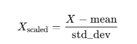

# 파일 단위로 라벨을 붙여 보자
```python
import os
import pandas as pd
import numpy as np
from sklearn.preprocessing import StandardScaler

def load_data(directory):
    data, labels =[], []
    for filename in os.listdir(directory):
        if filename.endswith(".csv"):
            label = filename.split('@')[0]
            df = pd.read_csv(os.path.join(directory, filename))

            file_data = df.values.flatten()
            
            data.append(file_data)
            labels.append(label)
            
    
    data = np.array(data)
    labels = np.array(labels)
    return data, labels


data_dir ='../data/train'
X, y = load_data(data_dir)
```
두근두근두근....  

```
ValueError: setting an array element with a sequence. The requested array has an inhomogeneous shape after 1 dimensions. The detected shape was (1778,) + inhomogeneous part.
```
에엥!?  

이유가 뭔지 살펴보니 np.array를 하기 위해서는 리스트에 있는 각 요소의 길이가 일치해야 한다고 한다.  
내 데이터는 각 파일마다 행의 개수가 자기 멋대로 놓기 때문에 길이를 일정하게 맞춰줘야 한다..  

바로 이 `np.pad`를 이용해서
```python
# np.pad 함수의 기본 형식
np.pad(array, pad_width, mode, **kwargs)
# array: 패딩을 추가할 배열입니다.
# pad_width: 패딩할 길이를 지정합니다. (before, after) 형식으로, 배열의 시작과 끝에 얼마나 패딩을 넣을지 지정합니다.
# mode: 패딩을 채우는 방식입니다. 여기서는 'constant'를 사용해 고정된 값으로 채웁니다.
```
그후 모델의 학습 속도와 성능 향상을 위해 표준화를 해준다.  
<hr>

`StandardScaler`: 표준화의 설정을 초기화하는 도구입니다.   
StandardScaler는 데이터를 평균 0, 표준편차 1로 변환하는 scikit-learn의 스케일러입니다  
StandardScaler는 (샘플 수, 피처 수) 형태의 2차원 배열을 필요로 합니다.  
StandardScaler()만 호출해도 아무 일도 일어나지 않고, fit이나 transform을 통해서만 실제 작업이 수행됩니다.  


<hr>

`fit_transform(X)`: StandardScaler 객체의 메서드로, 데이터를 표준화하려면 반드시 호출해야 합니다.   
1. fit(X): X 데이터의 각 피처에 대해 평균과 표준편차를 계산합니다.  
2. transform(X): 계산된 평균과 표준편차를 사용해 X 데이터를 표준화합니다.  

즉, fit_transform(X)은 데이터를 변환하기 위한 매개변수를 학습하면서 동시에 데이터를 표준화합니다.  
<hr>

그러나!!
```
(crossfit) ➜  src git:(main) ✗ python dataload.py
[1]    6203 killed     python dataload.py
```
cpu를 100% 잡아먹더니 곧 종료되고 마는데?  
모든 파일을 한번에 메모리에 올려서 작업을 하다보니 cpu가 감당할 수 없게 된 것!  
그럼 어쩌냐?  
하나씩 처리해야지 뭐 어째  

