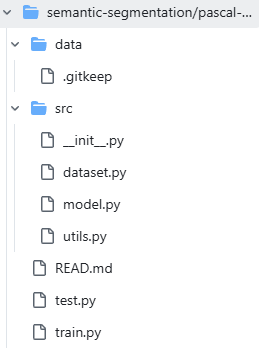
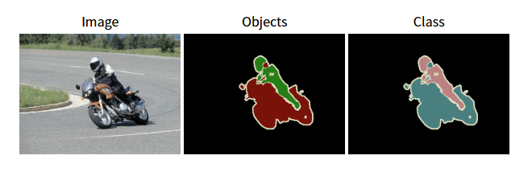

### pytorch로 만든 segmentation

  
먼저 파일의 구조는 이렇게 되어 있다.  

일단 src안에 있는 model이랑 utils 그리고 dataset을 먼저 작성하기로 결정!!
했는데 model을 그냥 불러오기 때문에 따로 작성할 필요는 없을 듯 하다.  
하여 dataset을 열기전에 데이터가 어떻게 생겨먹었는지 부터 파악을 시작하도록 하겠습니당  
```
(segmentation) ➜  data ls -R
.:
VOCdevkit

./VOCdevkit:
VOC2012

./VOCdevkit/VOC2012:
Annotations  ImageSets  JPEGImages  SegmentationClass  SegmentationObject
```

먼저 이런식으로  
Annotations,  ImageSets,  JPEGImages,  SegmentationClass,  SegmentationObject이 존재한다.  

Annotations 안에는 xml 파일이 들어있으며  
ImageSets 에는 Action,  Layout,  Main,  Segmentation 이 들어있다.  
Action에는 클래스에 대한것 같은 txt가 들어있고  
Layout에는 train.txt,  trainval.txt,  val.txt가 들어있다.  
Main에도 클랫에 대한것 같은 txt가 들어있다.
이 둘의 차이가 뭔지는 한번 봐야 할 듯 하다.  
JPEGImages는 jpg가 들어있다.
SegmentationClass에는 png가 들어있다.  
SegmentationObject에도 png가 들어있다.

이걸 하나하나 다 들여보는 것도 힘들고 다 들여본다고 해도 이해가 될지 모르겠다.  
해서 이 파일을 다운 받은 페이지에서 설명을 한번 읽어보도록 하겠다.  
| http://host.robots.ox.ac.uk/pascal/VOC/voc2012/#devkit 

이 블로그를 운영하면서 좋은 점은 긴 글도 곧잘 읽게 된 것이다.  
쓸려면 읽어야 하니...  
(*그리고 나름 글을 쓰는게 재미있다 일기형식으로 써서 그런가?, 요즘 말할 상대가 없어서 그런거일수도 있고...*)

어쨌든 내용을 한번 살펴보도록 하겠다.  

소개
--

voc( visual object classes challenge)는 현실적인 장면에서 여러 시각적 객체 클래스의 객체를 인식하는 것!  
레이블이 지정된 이미지의 훈련 세트가 제공되는 지도 학습 문제다!  

20개의 객체 클래스는 
```
사람: 사람
동물: 새, 고양이, 소, 개, 말, 양
차량: 비행기, 자전거, 보트, 버스, 자동차, 오토바이, 기차
실내: 병, 의자, 식탁, 화분, 소파, TV/모니터
```
가 있다!

세 가지 주요 객체 인식 대회가 있는데 분류, 감지 및 분할, 액션 분류 대회가 있다.  
이것들은 다 **Imagenet**에서 운영하는 대규모 인식 대회라고 하네요  
또한 사람 레이아웃에 대한 **테이스터 대회**가 있다고 합니다.  
대회가 굉장히 많네요, 나중에 한번 찾아봐야 겠어요.  

원래는 내가 해야할 테스크에 대해서만 빡 볼려고 했는데 글이 흥미로우니 계속 읽어볼게요  
(*사실 지금 공부하기 싫음*)

분류/탐지 대회
--

1. 분류: 20개의 클래스 각각에 대해 테스트 이미지에 해당 클래스의 예가 있는지 없는지를 예측합니다.
2. 감지: 테스트 이미지의 20개 대상 클래스에서 각 객체의 경계 상자와 레이블을 예측합니다.

세분화 대회
--
세분화: 각 픽셀에 푯되는 객체의 클래스나 배경을 제공하는 픽셀 단위 세분화를 생성합니다.  


