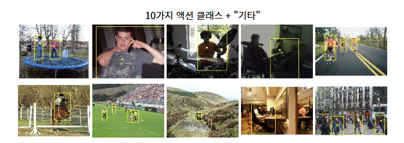
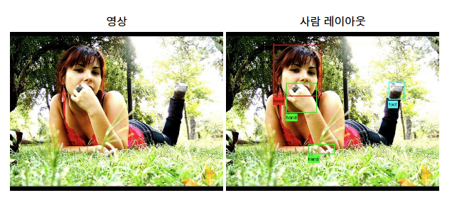

# 데이터 파악

### 액션 분류 대회
  
-동작 분류: 정지 이미지에서 사람이 수행하는 동작을 예측  

### imageNet 대규모 시각 인식 대회
- 이 대회의 목표는 대구모 수작업 레이블이 지정된 imageNet 데이터 세트의 하위 집합을 훈련으로 사용
- 검색 및 자동 주석을 목적으로 사진의 내용 추정
- 테스트 이미지는 초기 주석 없이, 즉 세분화나 레이블 없이 제공 
- 알고리즘은 이미지에 있는 객체를 지정하는 레이블을 생성해야 함

### 사람 레이아웃 테이스터 경연대회
- 사람 레이아웃: 사람의 각 부분의 경계 상자와 레이블을 예측
 

### 데이터 
-제공된 훈련 데이터는 이미지 세트로 구성
- 각 이미지에는 이미지에 있는 20개 클래스 중 하나에 있는 각 객체에 대한 경계 상자와 객체 클래스 레이블을 제공하는 주석 파일이 있음.  
- 여러 클래스의 여러 객체가 동일한 이미지에 존재할 수 있다.
- 이미지의 하위 집합에는 각 객체를 픽셀 단위로 분할하여 주석을 달아 분할 대회 지원
- 액션 분류 작업의 이미지는 분류/탐지/분할 작업의 이미지와 분리되어있음
    - 사람, 경계 상자, 참조점 및 해당 액션이 부분적으로 주석으로 표시됨

세분화 테스터를 위한 교육 예시는 다음과 같습니다. 각각은 다음으로 구성됩니다.

훈련 이미지
객체 분할
픽셀 인덱스는 첫 번째, 두 번째, 세 번째 객체 등에 대응합니다.
클래스 세분화
픽셀 인덱스는 알파벳 순으로 클래스에 대응합니다(1=비행기, 2=자전거, 3=새, 4=보트, 5=병, 6=버스, 7=자동차, 8=고양이, 9=의자, 10=소, 11=식탁, 12=개, 13=말, 14=오토바이, 15=사람, 16=분재 식물, 17=양, 18=소파, 19=기차, 20=TV/모니터)
두 가지 유형의 분할 이미지 모두에서 인덱스 0은 배경에 해당하고 인덱스 255는 '무효' 또는 레이블이 지정되지 않은 것에 해당합니다.

| http://host.robots.ox.ac.uk/pascal/VOC/voc2012/segexamples/index.html
(*세분화 이미지 예시*)  
