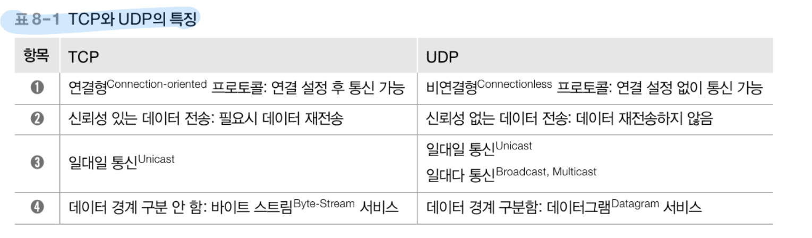
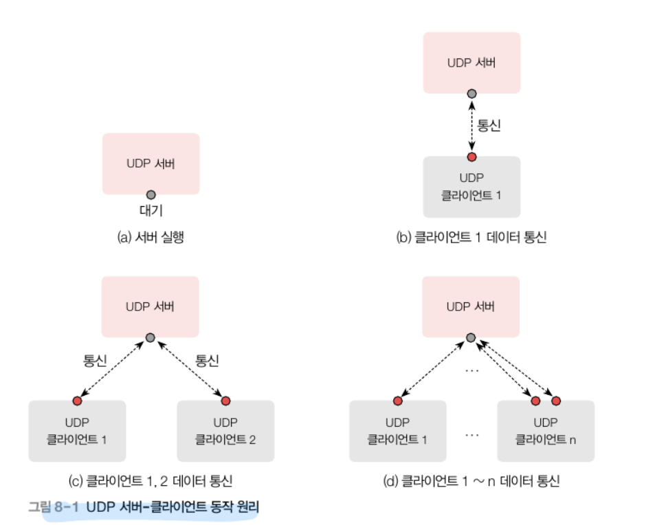
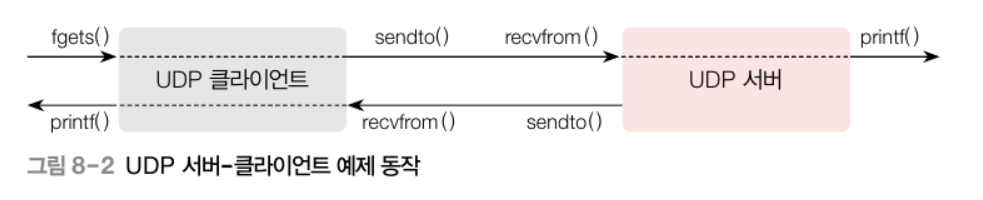

# UDP 프로트콜 개요

### TCP와 UDP의 공통점
- 포트 번호를 이용하여 주소를 지정
- 데이터 오류를 체크
    - TCP와 UDP는 IP 패킷 전송 기반으로 동작한다
    - 헤더와 데이터의 오류 체크
    - IP는 프토토콜 동작에 필수적인 IP 헤더의 오류만 체크하고 데이터는 체크하지 않는다.  

### UDP의 특징
- 연결 설정을 하지 않으므로 connect() 함수를 사용하지 않는다.  
- 프로토콜 수준에서 신뢰성 있는 데이터 전송을 보장하지 않는다.  
- 간단한 소켓 함수 호출 절차만 따르면 다자간 통신을 쉽게 구현할 수 있다.  
- TCP와 달리 응용 프로그램이 데이터 경계 구분을 위한 별도의 작업을 할 필요가 없다.  



### UDP 서버- 클라이언트 동작 원리
UDP 서버는 TCP 서버와 달리 멀티스레드 등의 프로그래밍 기법을 사용하지 않고도 한 소켓으로 여러 클라이언트를 처리할 수 있다.  

  
a. 서버는 소켓을 생성하고 클라이언트가 데이터 보내기를 기다린다.  
b. 첫 번째 클라이언트는 연결 설정 없이 곧바로 서버와 데이터를 주고받는다.  
c. 두 번째 클라이언트도 연결 설정 없이 곧바로 서버와 데이터를 주고 받는다. (*TCP 서버와 달리 UDP 서버는 한 개만 사용한다는 점에 주목한다.*)
d. UDP 서버-클라이언트가 통신하는 일반적인 상황이다. 'UDP 클라이언트  n'처럼 한 클라이언트가 두 개 이상의 소켓을 사용하여 서버와 통신할 수도 있다.  

### UDP 서버-클라이언트 실습  


서버(Echo Server)
1. 클라이언트가 보낸 데이터를 받아서(recvfrom) 이를 문자열로 간주하여 무조건 화면에 출력한다(prinf).  
2. 받은 데이터를 변경 없이 다시 클라이언트에 보낸다(sendto).

클라이언트(Echo Client)
1. 사용자가 키보드로 입력한(fgets)문자열을 서버에 보낸다(sendto).
2. 서버가 데이터를 그대로 돌려보내면, 클라이언트는 이를 받아서(recvform) 화면에 출력한다(pintf).

### UDP서버-클라이언트 작성과 테스트
UDPServer.cpp
```cpp
#include "..\..\Common.h"

#define SERVERPORT 9000
#define BUFSIZE 512

int main(int argc, char *argv[]){
    int retval;

    // 윈속 초기화
    WSADATA wsa;
    if (WSASstartup(MAKEWORD(2, 2), &wsa) !=0 )
        return 1;

    // 소켓 생성
    SOCKET sock = socket(AF_INET , SOCK_DGRAM, 0);
    if (sock == INVALID_SOCKET) err_quit("socket()");

    //bind()
    struct sockaddr_in serveraddr;
    memset(&serveraddr, 0, sizeof(serveraddr));
    serveraddr.sin_family = AF_INET;
    
}
