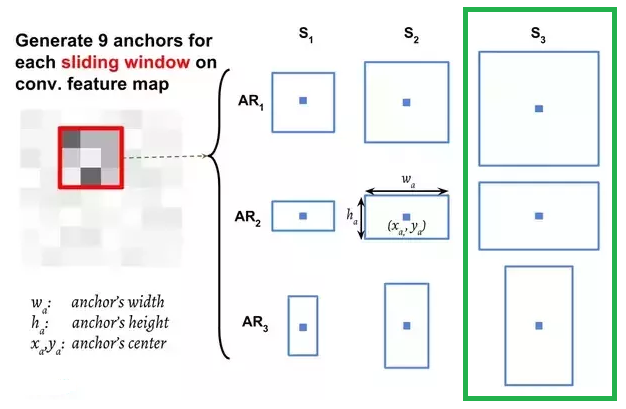
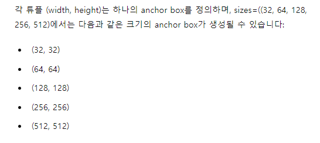

https://github.com/chullhwan-song/Reading-Paper/issues/184

# anchor


anchor(3개짜리)가 각 크기별로 입력값을 훝고 지나감 -> 총 9개가 생성  
이에관한 소스까지 공부하기에는 따로 공부해야 할 것 같아서 패스함


```python
self.anchor_generator = AnchorGenerator(sizes=((32, 64, 128, 256, 512),),
                                        aspect_ratios=((0.5, 1.0, 2.0),))
```
