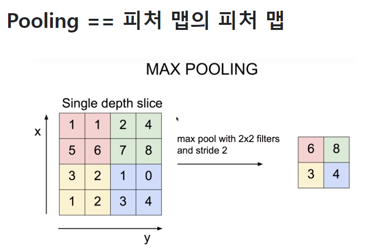

# MultiScaleRoIAlign
- ROI 풀링 수행

```python
self.roi_pooler = torchvision.ops.MultiScaleRoIAlign(featmap_names=['0'],
                                                        output_size=7,
                                                        sampling_ratio=2)
```

<pre>
featmap_names=['0']: ROI를 추출할 특성 맵의 이름입니다. 여기서는 '0'이라는 이름의 특성 맵만 사용합니다.

output_size=7: 생성할 특성 맵의 고정된 크기입니다. 여기서는 7x7 크기의 특성 맵을 생성합니다.

sampling_ratio=2: ROI를 7x7 크기로 변환할 때 사용되는 샘플링 비율입니다. 이는 보다 정확한 특성 맵을 얻기 위해 입력 영역을 얼마나 세밀하게 샘플링할지 결정합니다.
</pre>


### pooing

  


### refinement 
1. region proposal 생성
    - 입력 이미지에서 후보 객체 영역 제안
2. ROI 풀링
    - 후보 객체 영역을 특성 맵에서 추출
    - ROI를 고정된 크기의 특성 맵으로 변환하여 동일한 크기의 입력을 FC레이어에 전달
3. FC레이어
    - 최종 객체 분류와 위치 조정 수행

**ROI는 Region of Interset**
